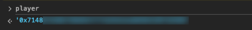
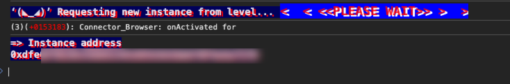

## Level_0.Hello Ethernaut

1. 安装` MetaMask `;
2. ` F12 `中的` Console `，一些指令查看state:

查看自己的钱包地址->` player `:



查看余额->` getBalance(player) `:


查看合约->` ethernaut `:


合约交互,比如查看合约的owner->` ethernaut.owner() `:


3. 从水龙头处获得ETH:(可以[Sepolia PoW Faucet](https://sepolia-faucet.pk910.de/)挖,也可以~~某鱼直接购买~~)

4. 部署合约:点击` Get new instance `即可部署;



5. 查看合约信息:


6. 根据指引往下调用函数:


知道密码的话可以调用验证函数，但不知道密码在哪，查看一下合约信息：


可以看到有一个` password() `函数，输入参数为空，输出的是一个字符串；


成功验证，且提交后会显示源码供分析：

```solidity
// SPDX-License-Identifier: MIT
pragma solidity ^0.8.0;

contract Instance {
    string public password;
    uint8 public infoNum = 42;
    string public theMethodName = "The method name is method7123949.";
    bool private cleared = false;

    // constructor
    constructor(string memory _password) {
        password = _password;
    }

    function info() public pure returns (string memory) {
        return "You will find what you need in info1().";
    }

    function info1() public pure returns (string memory) {
        return 'Try info2(), but with "hello" as a parameter.';
    }

    function info2(string memory param) public pure returns (string memory) {
        if (keccak256(abi.encodePacked(param)) == keccak256(abi.encodePacked("hello"))) {
            return "The property infoNum holds the number of the next info method to call.";
        }
        return "Wrong parameter.";
    }

    function info42() public pure returns (string memory) {
        return "theMethodName is the name of the next method.";
    }

    function method7123949() public pure returns (string memory) {
        return "If you know the password, submit it to authenticate().";
    }

    function authenticate(string memory passkey) public {
        if (keccak256(abi.encodePacked(passkey)) == keccak256(abi.encodePacked(password))) {
            cleared = true;
        }
    }

    function getCleared() public view returns (bool) {
        return cleared;
    }
}
```

