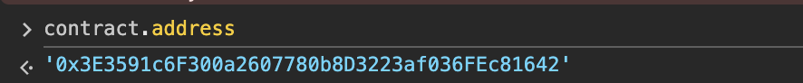
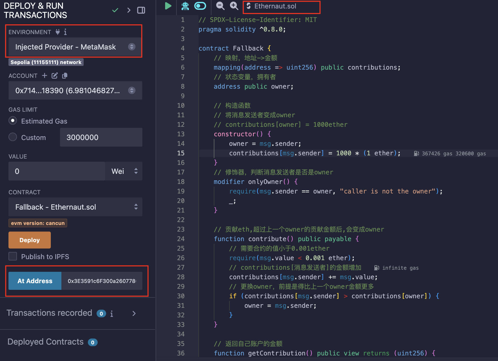
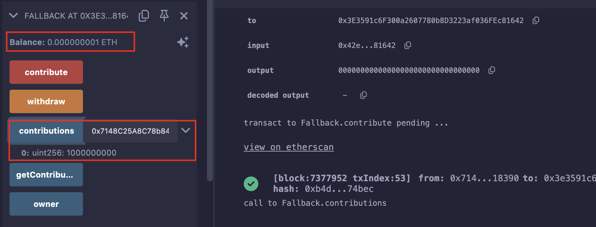
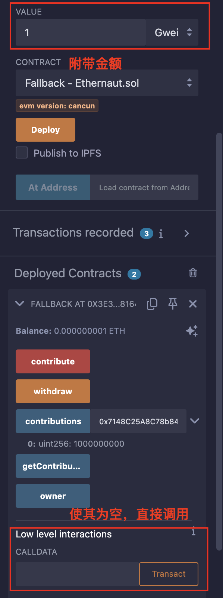
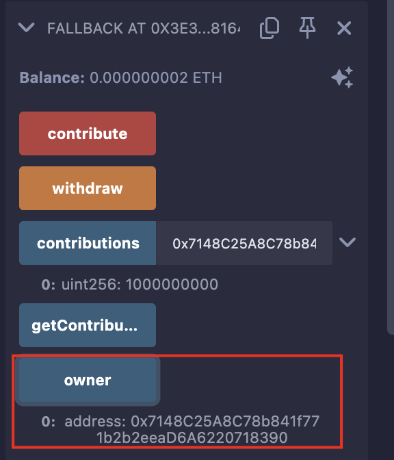
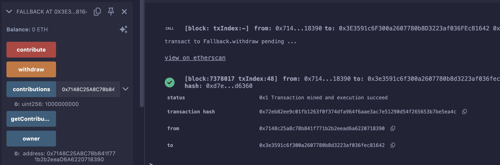
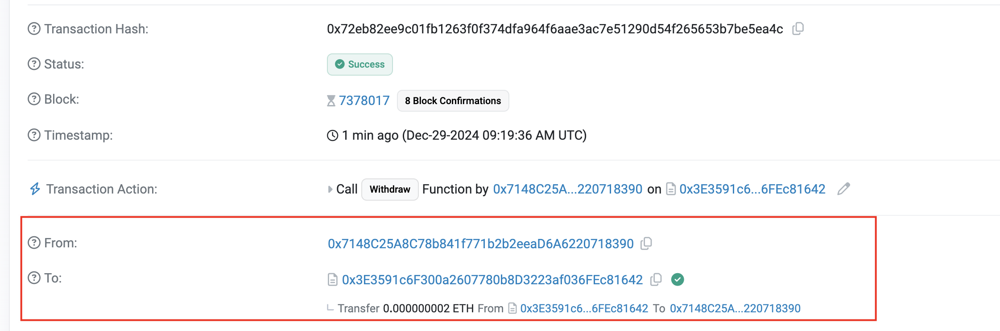

## Level_1.Fallback

要求：

> 1. 将合约所有权归于自己
> 2. 将合约余额减少到0

合约：

```solidity
// SPDX-License-Identifier: MIT
pragma solidity ^0.8.0;

contract Fallback {
    // 映射，地址->金额
    mapping(address => uint256) public contributions;
    // 状态变量，拥有者
    address public owner;

    // 构造函数
    // 将消息发送者变成owner
    // contributions[owner] = 1000ether
    constructor() {
        owner = msg.sender;
        contributions[msg.sender] = 1000 * (1 ether);
    }
    // 修饰器，判断消息发送者是否是owner
    modifier onlyOwner() {
        require(msg.sender == owner, "caller is not the owner");
        _;
    }

    // 贡献eth,超过上一个owner的贡献金额后,会变成owner
    function contribute() public payable {
        // 需要合约的值小于0.001ether
        require(msg.value < 0.001 ether);
        // contributions[消息发送者]的金额增加
        contributions[msg.sender] += msg.value;
        // 更换owner，前提是得比上一个owner金额更多
        if (contributions[msg.sender] > contributions[owner]) {
            owner = msg.sender;
        }
    }

    // 返回自己账户的金额
    function getContribution() public view returns (uint256) {
        return contributions[msg.sender];
    }

    // owner取回自己的钱
    function withdraw() public onlyOwner {
        // 接收方.transfer(ETH数额)
        payable(owner).transfer(address(this).balance);
    }

    // 收到ETH时触发
    // 一个合约最多有一个receive
    receive() external payable {
        // 需要当前携带的金额大于0 且 发送者的余额大于0
        require(msg.value > 0 && contributions[msg.sender] > 0);
        // 变更owner
        owner = msg.sender;
    }
}
```

### 分析

` contribute() `函数表示，只要贡献次数大于1000000次，就可以成为` owner `，这显然是不现实的；

还有一个地方可以变更` owner `，那就是` receive() `函数，需要我的贡献额度大于0，且携带一点金额，就可以把` owner `变更成我；

那思路还是挺清晰的：

1. 贡献一次；
2. 调用` receive() `函数,并且` msg.data `要为空；

> 触发fallback() 还是 receive()?
>         接收ETH
>            |
>       msg.data是空？
>          /  \
>        是    否
>        /      \
> receive()存在?   fallback()
>      / \
>     是  否
>    /     \
> receive()   fallback()

3. 当成为` owner `后，调用` withdraw() `取出所有余额；

### 攻击

首先部署一下题目获得地址：



复制一下合约内容到Remix中，将环境调成` Injected Provider-MetaMask `，然后使用` At Address `来交互：



开始第一步，先贡献` 1Gwei `到合约中(发送` 1wei `会失败，可能未达到交易的最低额度)：



调用` receive() `，并且` msg.data `要为空：



此时` owner `已经是我们的了：



最后，调用` withdraw `，提款跑路：





