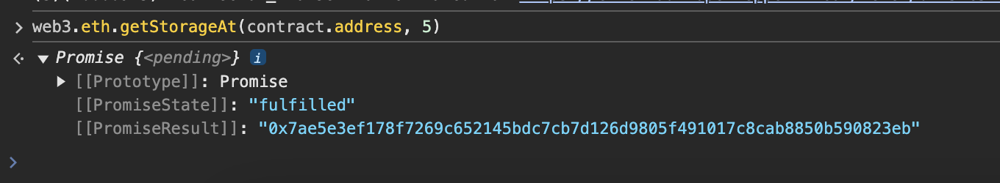
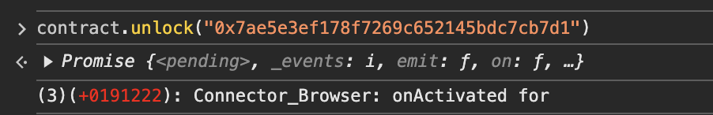

## Level_12.Privacy

要求：

> 解锁合约；

合约：

```solidity
// SPDX-License-Identifier: MIT
pragma solidity ^0.8.0;

contract Privacy {
    bool public locked = true;
    uint256 public ID = block.timestamp;
    uint8 private flattening = 10;
    uint8 private denomination = 255;
    uint16 private awkwardness = uint16(block.timestamp);
    bytes32[3] private data;

    constructor(bytes32[3] memory _data) {
        data = _data;
    }

    function unlock(bytes16 _key) public {
        require(_key == bytes16(data[2]));
        locked = false;
    }

    /*
    A bunch of super advanced solidity algorithms...

      ,*'^`*.,*'^`*.,*'^`*.,*'^`*.,*'^`*.,*'^`
      .,*'^`*.,*'^`*.,*'^`*.,*'^`*.,*'^`*.,*'^`*.,
      *.,*'^`*.,*'^`*.,*'^`*.,*'^`*.,*'^`*.,*'^`*.,*'^         ,---/V\
      `*.,*'^`*.,*'^`*.,*'^`*.,*'^`*.,*'^`*.,*'^`*.,*'^`*.    ~|__(o.o)
      ^`*.,*'^`*.,*'^`*.,*'^`*.,*'^`*.,*'^`*.,*'^`*.,*'^`*.,*'  UU  UU
    */
}
```

### 分析

很像` Level_8.Vault `，都是获取泄漏的状态变量值来通关；直接计算每个数据该在哪个` slot `；

| slot0(256位) |                            locked                            |
| :----------: | :----------------------------------------------------------: |
| slot1(256位) |                              ID                              |
| slot2(256位) | (按在内存中的顺序)awkwardness(128位)\|denomination(64位)\|flattening(64位) |
| slot3(256位) |                          bytes32[0]                          |
| slot4(256位) |                          bytes32[1]                          |
| slot5(256位) |                          bytes32[2]                          |

` unlock `函数中显示我们要找` data[2] `，并且将其转化为` bytes16 `；

写个demo看看转成` bytes16 `是取前半还是后半：


所以我们只需查看` slot5 `，然后截取前128位(32个16进制)即可；


### 攻击

查看` slot5 `中的值：



截取数据：

```solidity
// 0x7ae5e3ef178f7269c652145bdc7cb7d126d9805f491017c8cab8850b590823eb
// |
// |
// 0x7ae5e3ef178f7269c652145bdc7cb7d1
```

解锁：



