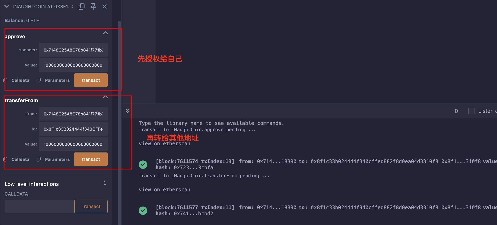

## Level_15.Naught Coin

要求：

> 使账户的tokens余额为0；

合约：

```solidity
// SPDX-License-Identifier: MIT
pragma solidity ^0.8.0;

import "openzeppelin-contracts-08/token/ERC20/ERC20.sol";

contract NaughtCoin is ERC20 {
    // string public constant name = 'NaughtCoin';
    // string public constant symbol = '0x0';
    // uint public constant decimals = 18;
    uint256 public timeLock = block.timestamp + 10 * 365 days;
    uint256 public INITIAL_SUPPLY;
    address public player;

    constructor(address _player) ERC20("NaughtCoin", "0x0") {
        player = _player;
        INITIAL_SUPPLY = 1000000 * (10 ** uint256(decimals()));
        // _totalSupply = INITIAL_SUPPLY;
        // _balances[player] = INITIAL_SUPPLY;
        _mint(player, INITIAL_SUPPLY);
        emit Transfer(address(0), player, INITIAL_SUPPLY);
    }

    function transfer(address _to, uint256 _value) public override lockTokens returns (bool) {
        super.transfer(_to, _value);
    }

    // Prevent the initial owner from transferring tokens until the timelock has passed
    modifier lockTokens() {
        if (msg.sender == player) {
            require(block.timestamp > timeLock);
            _;
        } else {
            _;
        }
    }
}
```

### 分析

该合约提供了一个` ERC20 `代币，但锁定了十年后才能转账；

从[ERC20.sol](https://github.com/OpenZeppelin/openzeppelin-contracts/blob/master/contracts/token/ERC20/ERC20.sol)中可以注意到转账相关的函数如下：

```solidity
function transfer(address to, uint256 value) public virtual returns (bool) {
    address owner = _msgSender();
    _transfer(owner, to, value);
    return true;
}

function transferFrom(address from, address to, uint256 value) public virtual returns (bool) {
    address spender = _msgSender();
    _spendAllowance(from, spender, value);
    _transfer(from, to, value);
    return true;
}

function approve(address spender, uint256 value) public virtual returns (bool) {
    address owner = _msgSender();
    _approve(owner, spender, value);
    return true;
}
```

其中` transfer(address to, uint256 value) `被重写了，但是我们还能用` transferFrom(address from, address to, uint256 value) `这个函数；

使用` transferFrom `这个函数时需要注意，查询的是映射` allowances `，需要先` approve `一下，之后扣款是扣当前账户的余额；

所以只需先授权给自己，然后转给其他人即可；


### 攻击

为了简单的调用函数，直接实现一个接口，通过Remix的` At Address `来调用：

```solidity
// SPDX-License-Identifier: MIT
pragma solidity ^0.8.0;

interface INaughtCoin {
    function transferFrom(address from, address to, uint256 value) external virtual returns (bool);
    function approve(address spender, uint256 value) external virtual returns (bool);
}
```



