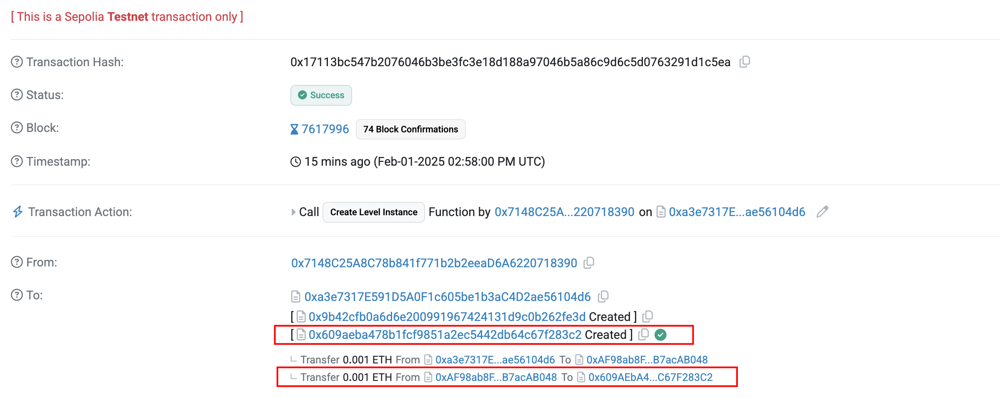
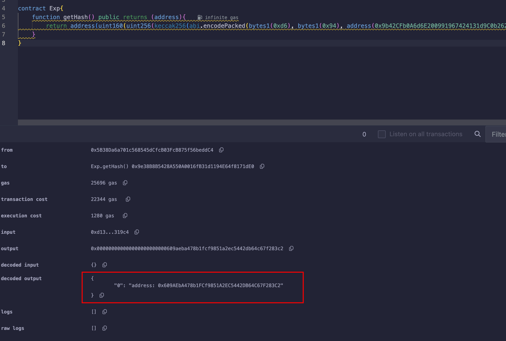
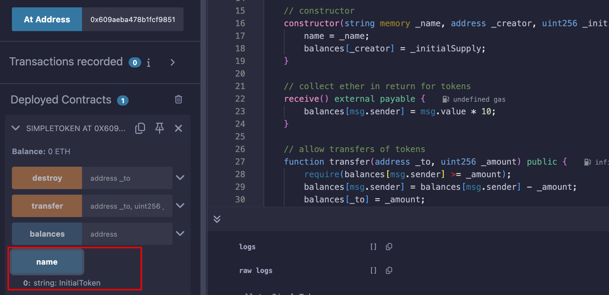
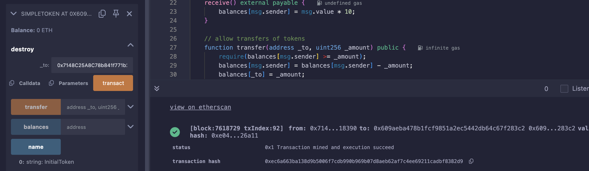

## Level_17.Recovery

要求：

> 从失去地址的合约中获得0.001ETH；

合约：

```solidity
// SPDX-License-Identifier: MIT
pragma solidity ^0.8.0;

contract Recovery {
    //generate tokens
    function generateToken(string memory _name, uint256 _initialSupply) public {
        new SimpleToken(_name, msg.sender, _initialSupply);
    }
}

contract SimpleToken {
    string public name;
    mapping(address => uint256) public balances;

    // constructor
    constructor(string memory _name, address _creator, uint256 _initialSupply) {
        name = _name;
        balances[_creator] = _initialSupply;
    }

    // collect ether in return for tokens
    receive() external payable {
        balances[msg.sender] = msg.value * 10;
    }

    // allow transfers of tokens
    function transfer(address _to, uint256 _amount) public {
        require(balances[msg.sender] >= _amount);
        balances[msg.sender] = balances[msg.sender] - _amount;
        balances[_to] = _amount;
    }

    // clean up after ourselves
    function destroy(address payable _to) public {
        selfdestruct(_to);
    }
}
```

### 分析

该合约是个工厂合约，只有` Recovery `的地址，但生成的Token合约地址却不知道，需要找回丢失的ETH；

找回丢失的ETH简单，只需要知道生成的Token合约地址，然后调用` destroy `即可，问题是不清楚合约地址；

首先有个简单的方法就是查询交易，其中有生成的Token合约地址：



还有一种方法是计算，之前学Solidity时，创建合约时，地址是可以预测的；

这边是` Create `（没有` salt `），所以其[生成地址的方法](https://ethereum.stackexchange.com/questions/760/how-is-the-address-of-an-ethereum-contract-computed)是` Keccak256(RLP.encode(Creator_address, nonce)) `；

**RLP编码**

> [RLP Encode-Ethereum Docs](https://ethereum.org/en/developers/docs/data-structures-and-encoding/rlp/)：
>
> * 单个String
>     * 0 ~ 55 bytes long
>         * bytes1(0x80 + string_length) + string
>         * WZM
>         * [0x80 + 3] + [string]
>     * more than 55 bytes long
>         * bytes1(0xB7 + len(string_length)) + string_length + string
>         * 一个1024字节的string
>         * [0xB7 + 2(后面的0x0400长度为2)] + [0x0400] + [string]
> * 单个字节
>     * 直接编码
>     * the byte '\x0f' = [ 0x0f ]
> * 单个正整数
>     * 编码成字节码，然后根据上面两个转换
>     * 12 --> '\x0c' --> [ 0x0C ]
>     * 1024 --> '\x04\x00' --> [0x80 + 2, 0x04, 0x00]
>
> 
>
> * total payload
>     * 0 ~ 55 bytes long
>         * bytes1(0xC0 + payload_length) + payload
>         * [ "cat", "dog" ]
>         * [ 0xc8(后面一共8个), 0x83(cat长度为3), 'c', 'a', 't', 0x83(dog长度为3), 'd', 'o', 'g' ]
>     * more than 55 bytes long
>         * bytes1(0xF7 + len(payload_length)) + payload_length + payload

这边的` nonce `是创建者的交易数目，这边创建时应该为0x1（之前有一个创建自身的交易为0x0）；

这边的RLP构造为：

> 0xC0 + hex(1 + 20 + 1) --> 1 byte --> payload总长度
>
> 0x80 + hex(20) --> 1 byte --> 地址string的长度
>
> address() --> 20 byte --> 地址
>
> 0x01 --> 1 byte --> 当前nonce

所以生成的地址用solidity应该这么写：

```solidity
// SPDX-License-Identifier: MIT
pragma solidity ^0.8.0;

contract Exp{
    function getHash() public returns (address){
        return address(uint160(uint256(keccak256(abi.encodePacked(bytes1(0xd6), bytes1(0x94), address(0x9b42CFb0A6d6E200991967424131d9C0b262Fe3D), bytes1(0x01))))));
    }
}
```



和交易记录中的哈希一样；


### 攻击

得到地址后直接调用` destroy `取回ETH即可；



有名字，地址没错；

取回：



