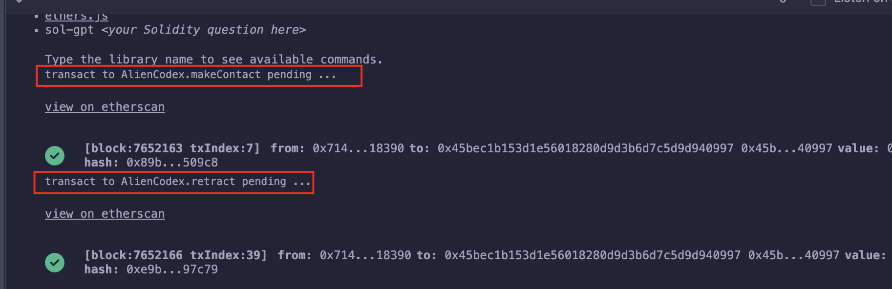
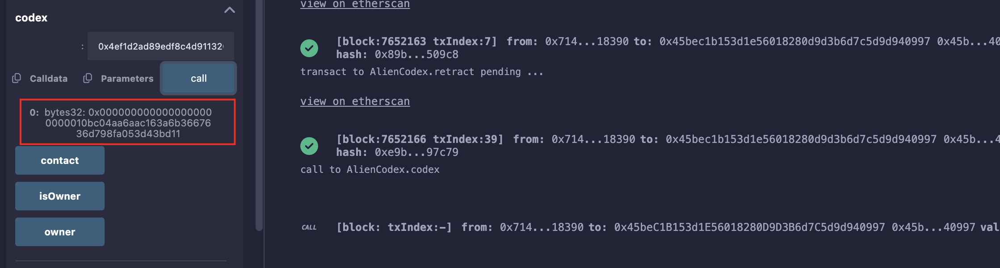
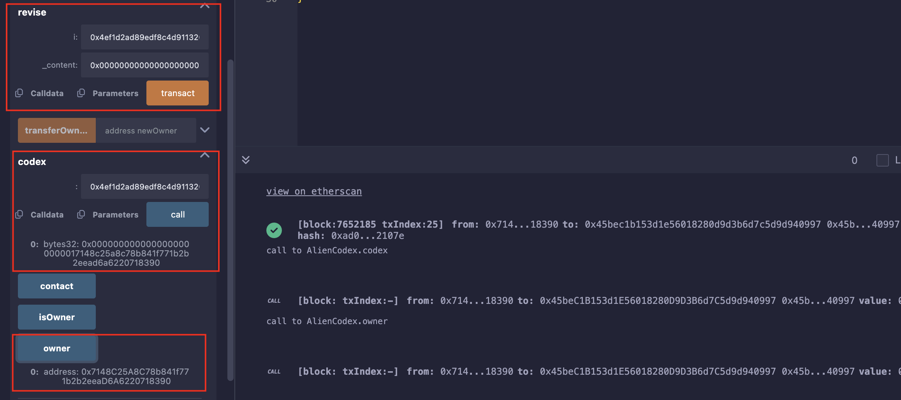

## Level_19.Alien Codex

要求：

> 获得合约的所有权；

合约：

```solidity
/**
 * @dev Contract module which provides a basic access control mechanism, where
 * there is an account (an owner) that can be granted exclusive access to
 * specific functions.
 *
 * This module is used through inheritance. It will make available the modifier
 * `onlyOwner`, which can be applied to your functions to restrict their use to
 * the owner.
 */
contract Ownable {
    address private _owner;

    event OwnershipTransferred(address indexed previousOwner, address indexed newOwner);

    /**
     * @dev Initializes the contract setting the deployer as the initial owner.
     */
    constructor() internal {
        _owner = msg.sender;
    }

    /**
     * @dev Returns the address of the current owner.
     */
    function owner() public view returns (address) {
        return _owner;
    }

    /**
     * @dev Throws if called by any account other than the owner.
     */
    modifier onlyOwner() {
        require(isOwner(), "Ownable: caller is not the owner");
        _;
    }

    /**
     * @dev Returns true if the caller is the current owner.
     */
    function isOwner() public view returns (bool) {
        return msg.sender == _owner;
    }

    /**
     * @dev Leaves the contract without owner. It will not be possible to call
     * `onlyOwner` functions anymore. Can only be called by the current owner.
     *
     * > Note: Renouncing ownership will leave the contract without an owner,
     * thereby removing any functionality that is only available to the owner.
     */
    function renounceOwnership() public onlyOwner {
        emit OwnershipTransferred(_owner, address(0));
        _owner = address(0);
    }

    /**
     * @dev Transfers ownership of the contract to a new account (`newOwner`).
     * Can only be called by the current owner.
     */
    function transferOwnership(address newOwner) public onlyOwner {
        _transferOwnership(newOwner);
    }

    /**
     * @dev Transfers ownership of the contract to a new account (`newOwner`).
     */
    function _transferOwnership(address newOwner) internal {
        require(newOwner != address(0), "Ownable: new owner is the zero address");
        emit OwnershipTransferred(_owner, newOwner);
        _owner = newOwner;
    }
}

// SPDX-License-Identifier: MIT
pragma solidity ^0.5.0;

import "../helpers/Ownable-05.sol";

contract AlienCodex is Ownable {
    bool public contact;
    bytes32[] public codex;

    modifier contacted() {
        assert(contact);
        _;
    }

    function makeContact() public {
        contact = true;
    }

    function record(bytes32 _content) public contacted {
        codex.push(_content);
    }

    function retract() public contacted {
        codex.length--;
    }

    function revise(uint256 i, bytes32 _content) public contacted {
        codex[i] = _content;
    }
}
```

### 分析

题目提示需要了解[动态数组在Storage中的存储](https://www.cnblogs.com/WZM1230/p/18684806#12-dynamic-arrays--mapping)，并且该合约继承了一个` Owner `合约，` Owner `合约有个私有状态变量存储` owner `；

写一个简单的demo就可以发现该题目的Storage布局如下：

|        Slot序号        |             内容             |
| :--------------------: | :--------------------------: |
|         Slot0          | bool(contact),address(Owner) |
|         Slot1          |    bytes32[] codex的长度     |
|          ...           |             ...              |
|   Slot(Keccak256(1))   |           codex[0]           |
| Slot(Keccak256(1)) + 1 |           codex[1]           |
|          ...           |             ...              |
|     Slot(0xFF..FF)     |             ...              |

而且注意到编译版本是` 0.5 `，那时候动态数组的长度还不是只读的，可以修改；

所以我们只需先` makeContact() `一下，然后直接调用` retract() `使数组长度` 0 - 1 `变成` 0xFF..FF `，最后计算得到` Owner `的位置，调用` revise() `修改即可；

> 比如Data[]有4个Data，D0，D1，D2，D3；
>
> 起始是在D2，则D0是第3个，即Data[2]；
>
> 计算：` 4(总元素) - 2(起始元素下标) = 2(需要元素下标) `；
>
> 所以，Slot0的下标就为：` 0x100..00(64个0) - keccak256(abi.encodePacked(uint256(1)) `；
>
> 计算出来为0x4ef1d2ad89edf8c4d91132028e8195cdf30bb4b5053d4f8cd260341d4805f30a；


### 攻击



看看上面计算的地址是不是存放` Owner `的位置：



修改为自己的地址：` 0x000000000000000000000001 + 7148C25A8C78b841f771b2b2eeaD6A6220718390 `，前半是contact，后半是自己地址；



