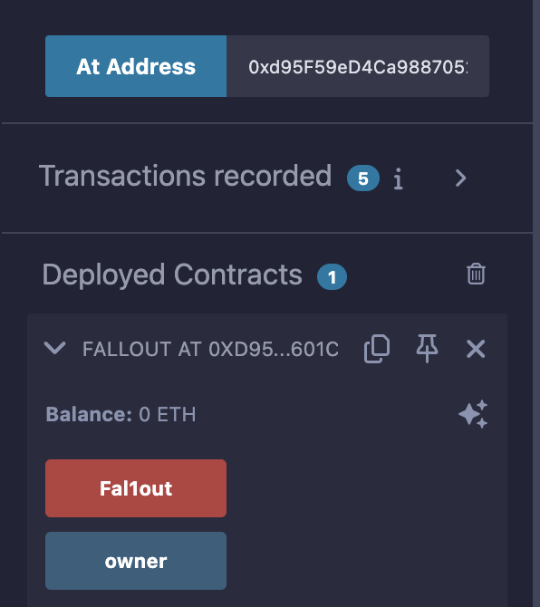
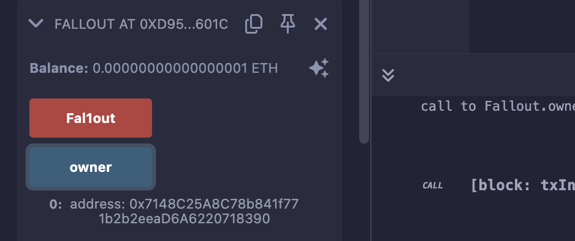

## Level_2.Fallout

要求：

> 获取合约的所有权

合约：

```solidity
// SPDX-License-Identifier: MIT
pragma solidity ^0.6.0;

import "openzeppelin-contracts-06/math/SafeMath.sol";

contract Fallout {
    // 为uint256使用SafeMath包
    using SafeMath for uint256;

    // 映射，地址=>金额
    mapping(address => uint256) allocations;
    // 所有者
    address payable public owner;
    
    // 构造函数
    function Fal1out() public payable {
        // 消息发送者为合约所有者
        owner = msg.sender;
        // allocations[owner] = 附带的金额
        allocations[owner] = msg.value;
    }

    // 修饰器，只有owner才能执行
    modifier onlyOwner() {
        require(msg.sender == owner, "caller is not the owner");
        _;
    }

    function allocate() public payable {
        // allocations[消息发送者] + value
        allocations[msg.sender] = allocations[msg.sender].add(msg.value);
    }

    // 将allocator的全部金额转回给他
    function sendAllocation(address payable allocator) public {
        require(allocations[allocator] > 0);
        allocator.transfer(allocations[allocator]);
    }

    // 给消息发送者转账该合约全部金额，只有owner可以调用
    function collectAllocations() public onlyOwner {
        msg.sender.transfer(address(this).balance);
    }

    // 查看allocator的金额
    function allocatorBalance(address allocator) public view returns (uint256) {
        return allocations[allocator];
    }
}
```

### 分析

题目要我们获取合约所有权，整个合约就一个地方有变更` owner `的：

```solidity
// 构造函数
function Fal1out() public payable {
    // 消息发送者为合约所有者
    owner = msg.sender;
    // allocations[owner] = 附带的金额
    allocations[owner] = msg.value;
}
```

但看版本是` 0.6 `，构造函数根本不是这么写的：

```solidity
// 0.4.22版本以下，构造函数是使用合约同名函数
contract AAA{
    function AAA(){
        // 构造函数
    }
}
// 0.4.22版本以上，构造函数必须使用constructor关键字
contract BBB{
    constructor(){
        // 构造函数
    }
}
```

仔细看会发现合约名是` Fallout `，函数名是` Fal1out `；

那直接用咱们的钱包调用` Fal1out `函数，附带一点金额就行了；

### 攻击

直接将整个合约拷贝到` Remix `中是会直接报错的，需要解决很长时间；

这里我们直接写抽象函数即可，因为我们就是想快捷地向合约发送` ABI `才来使用` Remix `的，将需要调用的函数声明一下即可：

```solidity
// SPDX-License-Identifier: MIT
pragma solidity ^0.8.26;

contract Fallout {
    // owner状态变量
    address payable public owner;
    // Fal1out函数
    function Fal1out() public payable {}
}
```



附带金额并调用：


查看现在的` owner `，是自己的钱包：



