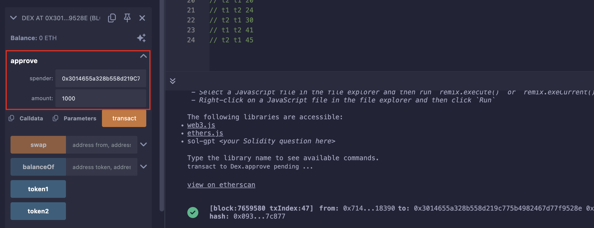

## Level_22.Dex

要求：

> 操纵价格获得所有的Token1或Token2；

合约：

```solidity
// SPDX-License-Identifier: MIT
pragma solidity ^0.8.0;

import "openzeppelin-contracts-08/token/ERC20/IERC20.sol";
import "openzeppelin-contracts-08/token/ERC20/ERC20.sol";
import "openzeppelin-contracts-08/access/Ownable.sol";

contract Dex is Ownable {
    address public token1;
    address public token2;

    constructor() {}

    function setTokens(address _token1, address _token2) public onlyOwner {
        token1 = _token1;
        token2 = _token2;
    }

    function addLiquidity(address token_address, uint256 amount) public onlyOwner {
        IERC20(token_address).transferFrom(msg.sender, address(this), amount);
    }

    function swap(address from, address to, uint256 amount) public {
        require((from == token1 && to == token2) || (from == token2 && to == token1), "Invalid tokens");
        require(IERC20(from).balanceOf(msg.sender) >= amount, "Not enough to swap");
        uint256 swapAmount = getSwapPrice(from, to, amount);
        IERC20(from).transferFrom(msg.sender, address(this), amount);
        IERC20(to).approve(address(this), swapAmount);
        IERC20(to).transferFrom(address(this), msg.sender, swapAmount);
    }

    function getSwapPrice(address from, address to, uint256 amount) public view returns (uint256) {
        return ((amount * IERC20(to).balanceOf(address(this))) / IERC20(from).balanceOf(address(this)));
    }

    function approve(address spender, uint256 amount) public {
        SwappableToken(token1).approve(msg.sender, spender, amount);
        SwappableToken(token2).approve(msg.sender, spender, amount);
    }

    function balanceOf(address token, address account) public view returns (uint256) {
        return IERC20(token).balanceOf(account);
    }
}

contract SwappableToken is ERC20 {
    address private _dex;

    constructor(address dexInstance, string memory name, string memory symbol, uint256 initialSupply)
        ERC20(name, symbol)
    {
        _mint(msg.sender, initialSupply);
        _dex = dexInstance;
    }

    function approve(address owner, address spender, uint256 amount) public {
        require(owner != _dex, "InvalidApprover");
        super._approve(owner, spender, amount);
    }
}
```

### 分析

我们各有10个Token1和Token2，需要获得DEX中所有的Token1和Token2；

其余函数都挺正常，只有从` getSwapPrice() `下手；

计算交换价格的方式可以理解为：` 数额 * 交易所当前另一个币的数量 / 交易所当前该币数量 `；

>  就比如，当前交易所有10个` A `和10个` B `，我手中有5个` A `，我想换成` B `，交换价格为` 5 * 10 / 10 = 5 `，则交易所只需给我5个` B `即可；
>
>  但当我又想换手中的` B `为` A `时，此时的交换价格为` 5 * 15 / 5 = 15 `，即我从交易所那获得了15个` A `；
>
>  这样一交换，我赚了10个` A `；

通过上面这个例子，我们就可以以相同的手法来置换出交易所中的所有币；

|        当前操作        | 用户Token1数量 | 用户Token2数量 | 交易所Token1数量 | 交易所Token2数量 |      置换数量       |
| :--------------------: | :------------: | :------------: | :--------------: | :--------------: | :-----------------: |
|                        |       10       |       10       |       100        |       100        |                     |
|    swap(t1, t2, 10)    |  10 - 10 = 0   |  10 + 10 = 20  |  100 + 10 = 110  |  100 - 10 = 90   | 10 * 100 / 100 = 10 |
|    swap(t2, t1, 20)    |  0 + 24 = 24   |  20 - 20 = 0   |  110 - 24 = 86   |  90 + 20 = 110   | 20 * 110 / 90 = 24  |
|    swap(t1, t2, 24)    |  24 - 24 = 0   |  0 + 30 = 30   |  86 + 24 = 110   |  110 - 30 = 80   | 24 * 110 / 86 = 30  |
|    swap(t2, t1, 30)    |  0 + 41 = 41   |  30 - 30 = 0   |  110 - 41 = 69   |  80 + 30 = 110   | 30 * 110 / 80 = 41  |
|    swap(t1, t2, 41)    |  41 - 41 = 0   |  0 + 65 = 65   |  69 + 41 = 110   |  110 - 65 = 45   | 41 * 110 / 69 = 65  |
| swap(t2, t1, 65)(舍弃) | 0 + 158(上溢)  |  65 - 65 = 0   | 110 - 158(下溢)  |  45 + 65 = 110   | 65 * 110 / 45 = 158 |
|    swap(t2, t1, 45)    | 0 + 110 = 110  |  65 - 45 = 20  |  110 - 110 = 0   |   45 + 45 = 90   | 45 * 110 / 45 = 110 |

可以看出，通过上面6步，可以仅通过45个Token2置换出所有Token1；


### 攻击

由于我们是通过题目合约进行操作，所以我们得先approve合约足够的allowance：



之后按照上面一点一点置换，最后查询余额：


