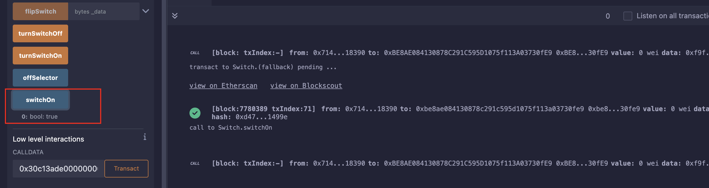

## Level_29.Switch

要求：

> 翻转开关；

合约：

```solidity
// SPDX-License-Identifier: MIT
pragma solidity ^0.8.0;

contract Switch {
    bool public switchOn; // switch is off
    bytes4 public offSelector = bytes4(keccak256("turnSwitchOff()"));

    modifier onlyThis() {
        require(msg.sender == address(this), "Only the contract can call this");
        _;
    }

    modifier onlyOff() {
        // we use a complex data type to put in memory
        bytes32[1] memory selector;
        // check that the calldata at position 68 (location of _data)
        assembly {
            calldatacopy(selector, 68, 4) // grab function selector from calldata
        }
        require(selector[0] == offSelector, "Can only call the turnOffSwitch function");
        _;
    }

    function flipSwitch(bytes memory _data) public onlyOff {
        (bool success,) = address(this).call(_data);
        require(success, "call failed :(");
    }

    function turnSwitchOn() public onlyThis {
        switchOn = true;
    }

    function turnSwitchOff() public onlyThis {
        switchOn = false;
    }
}
```

#### 分析

此题需要我们将开关翻转为开，也就是需要调用` turnSwitchOn() `函数；

修饰器` onlyThis() `意味着我们只能调用` flipSwitch() `函数，且不能通过钱包调用，而是利用合约自身发出calldata来，这样` msg.sender `才是合约本身；

修饰器` onlyOff() `中有检测指定位置(在calldata的68偏移处)是否有` offSelector `，所以calldata中还需要有` turnSwitchOff() `；

所以calldata中至少得有` flipSwitch() `，` turnSwitchOff() `，` turnSwitchOn() `，下面开始构造：

| 偏移 |        数据         |                             备注                             |
| :--: | :-----------------: | :----------------------------------------------------------: |
| 0x00 |      30c13ade       |                 flipSwitch(bytes)的selector                  |
| 0x04 | 0x00...0044(32字节) | bytes memory数据的偏移，0x20(自身) + 0x20(全0) + 0x4(off) = 0x44 |
| 0x24 | 0x00...0000(32字节) |                      填充数据，随便什么                      |
| 0x44 |      20606e15       |            turnSwitchOff()的selector，必须是该值             |
| 0x48 | 0x00...0004(32字节) |     bytes memory数据的长度，由于只需调用函数，所以4字节      |
| 0x68 |      76227e12       |           turnSwitchOn()的selector，真正调用的函数           |
| 0x6c |  0x00..00(24字节)   |        填充数据，需要使除了selector外为32字节的整数倍        |


#### 攻击

发送calldata时，会出现：


此时我们只需自己添加一个` fallback `即可；



