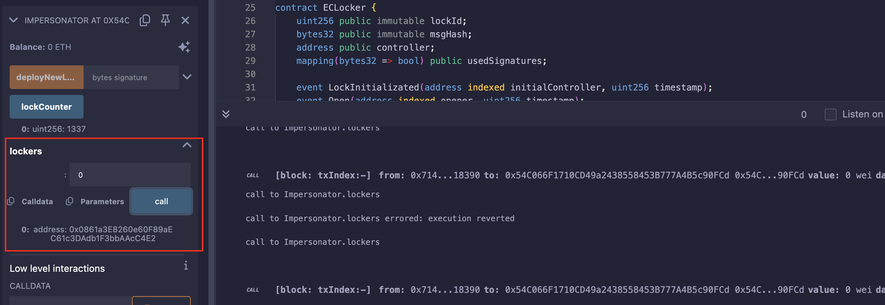
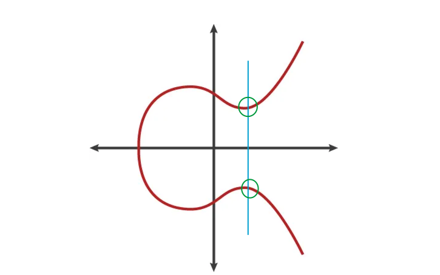
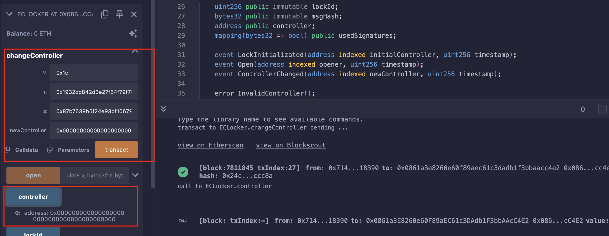

## Level_32.Impersonator

要求：

> 使任何人可以打开门；

合约：

```solidity
// SPDX-License-Identifier: MIT
pragma solidity ^0.8.28;

import "openzeppelin-contracts-08/access/Ownable.sol";

// SlockDotIt ECLocker factory
contract Impersonator is Ownable {
    uint256 public lockCounter;
    ECLocker[] public lockers;

    event NewLock(address indexed lockAddress, uint256 lockId, uint256 timestamp, bytes signature);

    constructor(uint256 _lockCounter) {
        lockCounter = _lockCounter;
    }

    function deployNewLock(bytes memory signature) public onlyOwner {
        // Deploy a new lock
        ECLocker newLock = new ECLocker(++lockCounter, signature);
        lockers.push(newLock);
        emit NewLock(address(newLock), lockCounter, block.timestamp, signature);
    }
}

contract ECLocker {
    uint256 public immutable lockId;
    bytes32 public immutable msgHash;
    address public controller;
    mapping(bytes32 => bool) public usedSignatures;

    event LockInitializated(address indexed initialController, uint256 timestamp);
    event Open(address indexed opener, uint256 timestamp);
    event ControllerChanged(address indexed newController, uint256 timestamp);

    error InvalidController();
    error SignatureAlreadyUsed();

    /// @notice Initializes the contract the lock
    /// @param _lockId uinique lock id set by SlockDotIt's factory
    /// @param _signature the signature of the initial controller
    constructor(uint256 _lockId, bytes memory _signature) {
        // Set lockId
        lockId = _lockId;

        // Compute msgHash
        bytes32 _msgHash;
        assembly {
            mstore(0x00, "\x19Ethereum Signed Message:\n32") // 28 bytes
            mstore(0x1C, _lockId) // 32 bytes
            _msgHash := keccak256(0x00, 0x3c) //28 + 32 = 60 bytes
        }
        msgHash = _msgHash;

        // Recover the initial controller from the signature
        address initialController = address(1);
        assembly {
            let ptr := mload(0x40)
            mstore(ptr, _msgHash) // 32 bytes
            mstore(add(ptr, 32), mload(add(_signature, 0x60))) // 32 byte v
            mstore(add(ptr, 64), mload(add(_signature, 0x20))) // 32 bytes r
            mstore(add(ptr, 96), mload(add(_signature, 0x40))) // 32 bytes s
            pop(
                staticcall(
                    gas(), // Amount of gas left for the transaction.
                    initialController, // Address of `ecrecover`.
                    ptr, // Start of input.
                    0x80, // Size of input.
                    0x00, // Start of output.
                    0x20 // Size of output.
                )
            )
            if iszero(returndatasize()) {
                mstore(0x00, 0x8baa579f) // `InvalidSignature()`.
                revert(0x1c, 0x04)
            }
            initialController := mload(0x00)
            mstore(0x40, add(ptr, 128))
        }

        // Invalidate signature
        usedSignatures[keccak256(_signature)] = true;

        // Set the controller
        controller = initialController;

        // emit LockInitializated
        emit LockInitializated(initialController, block.timestamp);
    }

    /// @notice Opens the lock
    /// @dev Emits Open event
    /// @param v the recovery id
    /// @param r the r value of the signature
    /// @param s the s value of the signature
    function open(uint8 v, bytes32 r, bytes32 s) external {
        address add = _isValidSignature(v, r, s);
        emit Open(add, block.timestamp);
    }

    /// @notice Changes the controller of the lock
    /// @dev Updates the controller storage variable
    /// @dev Emits ControllerChanged event
    /// @param v the recovery id
    /// @param r the r value of the signature
    /// @param s the s value of the signature
    /// @param newController the new controller address
    function changeController(uint8 v, bytes32 r, bytes32 s, address newController) external {
        _isValidSignature(v, r, s);
        controller = newController;
        emit ControllerChanged(newController, block.timestamp);
    }

    function _isValidSignature(uint8 v, bytes32 r, bytes32 s) internal returns (address) {
        address _address = ecrecover(msgHash, v, r, s);
        require (_address == controller, InvalidController());

        bytes32 signatureHash = keccak256(abi.encode([uint256(r), uint256(s), uint256(v)]));
        require (!usedSignatures[signatureHash], SignatureAlreadyUsed());

        usedSignatures[signatureHash] = true;

        return _address;
    }
}
```

#### 分析

我们拿到手的是一个` Impersonator `合约，该合约类似一个工厂合约，可以批量生产` ECLocker `合约，并将其存在` lockers `数组中，释放` NewLock() `事件；

部署到Remix上时发现` lockers `数组中已经有了题目给我们的一个lock：



为了看到更多的信息，可以直接查看区块浏览器上的Events：


` lockAddress `：0x0000000000000000000000000861a3e8260e60f89aec61c3dadb1f3bbaacc4e2（在topic1中，因为有indexed修饰）

` lockId `：0x539

` timestamp `：0x67c2b8bc

` signature `：0x1932cb...00001b（第3行的` 0x60 `代表的是在整个bytes中的偏移，第4行的` 0x60 `代表的是长度）

先记录下来，后面可能有用，但给的这个合约貌似不能使任何人都能开门，下面来分析` ECLocker `合约；

先看构造函数，很复杂：

```solidity
// Set lockId
lockId = _lockId;
```

设置` lockid `；

```solidity
// Compute msgHash
bytes32 _msgHash;
assembly {
    mstore(0x00, "\x19Ethereum Signed Message:\n32") // 28 bytes
    mstore(0x1C, _lockId) // 32 bytes
    _msgHash := keccak256(0x00, 0x3c) //28 + 32 = 60 bytes
}
msgHash = _msgHash;
```

计算` msgHash `，将` \x19Ethereum Signed Message:\n32 `一共28字节存储在内存` 0x00 `开始的位置（和[EIP-191](https://eips.ethereum.org/EIPS/eip-191)一样）；然后将` lockid `一共32个字节接着存在后面，因为` 0x1c `就是` 28 `，之后将整个数据计算keccak，存在` msgHash `中；

```solidity
// Recover the initial controller from the signature
address initialController = address(1);
```

初始化` initialController `为地址` 0x1 `；

```solidity
assembly {
    let ptr := mload(0x40)
    mstore(ptr, _msgHash) // 32 bytes
    mstore(add(ptr, 32), mload(add(_signature, 0x60))) // 32 byte v
    mstore(add(ptr, 64), mload(add(_signature, 0x20))) // 32 bytes r
    mstore(add(ptr, 96), mload(add(_signature, 0x40))) // 32 bytes s
    pop(
        staticcall(
            gas(), // Amount of gas left for the transaction.
            initialController, // Address of `ecrecover`.
            ptr, // Start of input.
            0x80, // Size of input.
            0x00, // Start of output.
            0x20 // Size of output.
        )
    )
    if iszero(returndatasize()) {
        mstore(0x00, 0x8baa579f) // `InvalidSignature()`.
        revert(0x1c, 0x04)
    }
    initialController := mload(0x00)
    mstore(0x40, add(ptr, 128))
}
```

指针` ptr `指向内存偏移` 0x40 `处，将` _msgHash `存入其中，然后分别在后面的3个32字节的偏移处存放` v `、` r `、` s `；

此时的内存图：

| 偏移 |                             数据                             |
| :--: | :----------------------------------------------------------: |
| 0x00 |         "\x19Ethereum Signed Message:\n32" + lockId          |
| 0x20 |                 上面0x00-0x1f中未存下的数据                  |
| 0x40 | msgHash = keccak("\x19Ethereum Signed Message:\n32" + lockId) |
| 0x60 |                              v                               |
| 0x80 |                              r                               |
| 0xa0 |                              s                               |

```solidity
assembly {
    pop(
        staticcall(
            gas(), // Amount of gas left for the transaction.
            initialController, // Address of `ecrecover`.
            ptr, // Start of input.
            0x80, // Size of input.
            0x00, // Start of output.
            0x20 // Size of output.
        )
    )
}
```

使用` pop() `将call的结果从栈中取出，调用的函数是` ecrecover `，输入参数开始的偏移是` ptr `，也就是内存` 0x40 `开始，大小是` 0x80 `，返回值开始的偏移是` 0x00 `，大小是` 0x20 `，此时的内存图：

| 偏移 |                             数据                             |      备注      |
| :--: | :----------------------------------------------------------: | :------------: |
| 0x00 |         "\x19Ethereum Signed Message:\n32" + lockId          | 会被返回值覆盖 |
| 0x20 |                 上面0x00-0x1f中未存下的数据                  |                |
| 0x40 | msgHash = keccak("\x19Ethereum Signed Message:\n32" + lockId) |    输入参数    |
| 0x60 |                              v                               |    输入参数    |
| 0x80 |                              r                               |    输入参数    |
| 0xa0 |                              s                               |    输入参数    |

```solidity
assembly {
    if iszero(returndatasize()) {
        mstore(0x00, 0x8baa579f) // `InvalidSignature()`.
        revert(0x1c, 0x04)
    }
    initialController := mload(0x00)
    mstore(0x40, add(ptr, 128))
}
```

检查返回值是0的话直接报错` InvalidSignature() `，不是0的话则将返回值赋值给` initialController `，然后将` msgHash `清零（因为` ptr + 128 `处并未有值）；

```solidity
// Invalidate signature
usedSignatures[keccak256(_signature)] = true;

// Set the controller
controller = initialController;

// emit LockInitializated
emit LockInitializated(initialController, block.timestamp);
```

最后就是设置已经使用过该签名、设置` controller `，释放` LockInitializated `；

但这边好像也没什么能够使任何人能够开门，我们根本控制不了这边，继续往下分析函数；

` open() `函数验证签名，并打开门；

` changeController() `函数验证签名，改变` controller `；

` _isValidSignature() `内部函数检查控制者和签名是否使用过；

我们发现` open() `和` changeController() `都会使用` _isValidSignature() `，且不知道正确签名的人该函数会返回null，也就是全0，那么我们只需调用` changeController() `函数将其设置为` 0x00...00 `即可；

由题目所知，计算哈希的方法是` ECDSA-椭圆曲线签名算法 `（此处就不展开说），它是基于椭圆曲线的，关于x轴对称，也就是说，一个x值会对应两个y值：



一个签名对应的一对` (v, r, s) `，同时也会有另一对` (v', r, s') `；接下来我们要做的，就是根据现有的` (v, r, s) `找出` (v', r, s') `；

[以太坊底层签名与校验技术](https://learnblockchain.cn/books/geth/part3/sign-and-valid.html)；

首先就是` v `，以太坊中` v `的值是0或1，但需要加上27，也就是，` v `只能是27或28；

其次是` s `，有公式` s' = -s mod n `，也就是` s' = n - s `，并且以太坊中的n是一个固定的质数：

` 0xFFFFFFFFFFFFFFFFFFFFFFFFFFFFFFFEBAAEDCE6AF48A03BBFD25E8CD0364141 `；

下面就用到了之前事件中的值：

` v `（偏移0x60）：0x000000000000000000000000000000000000000000000000000000000000001b

` r `（偏移0x20）：0x1932cb842d3e27f54f79f7be0289437381ba2410fdefbae36850bee9c41e3b91

` s `（偏移0x40）：0x78489c64a0db16c40ef986beccc8f069ad5041e5b992d76fe76bba057d9abff2

按照上面的分析来计算：

` v' `：0x000000000000000000000000000000000000000000000000000000000000001c

` r `：0x1932cb842d3e27f54f79f7be0289437381ba2410fdefbae36850bee9c41e3b91

` s' `：0x87b7639b5f24e93bf106794133370f950d5e9b00f5b5c8cbd866a487529b814f

所以我们只需调用` changeController() `函数，输入正确的(v', r, s')，将` controller `变更为` 0x0000000000000000000000000000000000000000 `即可；


#### 攻击



