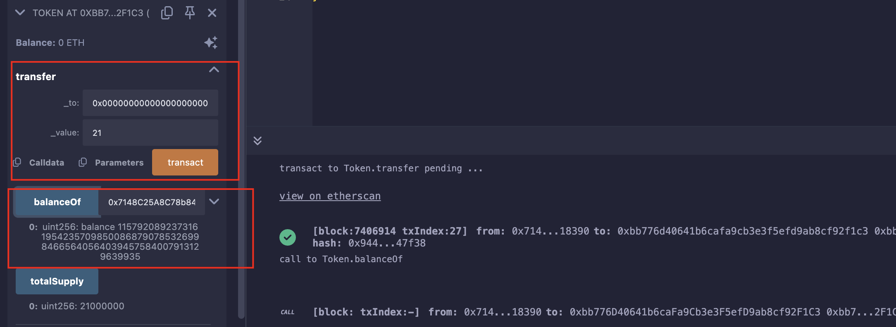

## Level_5.Token

要求：

> 获得更多的tokens；

合约：

```solidity
// SPDX-License-Identifier: MIT
pragma solidity ^0.6.0;

contract Token {
    mapping(address => uint256) balances;
    uint256 public totalSupply;

    // 初始供应量 = 总供应量 = 合约拥有者的余额
    constructor(uint256 _initialSupply) public {
        balances[msg.sender] = totalSupply = _initialSupply;
    }

    // 转账
    function transfer(address _to, uint256 _value) public returns (bool) {
        require(balances[msg.sender] - _value >= 0);
        balances[msg.sender] -= _value;
        balances[_to] += _value;
        return true;
    }

    function balanceOf(address _owner) public view returns (uint256 balance) {
        return balances[_owner];
    }
}
```

### 分析

要求我们获得更多的tokens，唯一方法就是在` transfer `函数中，看到版本是` 0.6 `，该版本中有整数溢出问题（到` 0.8 `就被修复了）；

` uint256 `的最大值是` 2^256 - 1 `，也就是32位比特全部填满1；

接下来举4个比特的例子：

```solidity
0 - 1 -> 0000 - 0001 (由于进位) --> 1111 = 7

7 + 1 -> 1111 + 0001 (由于进位) --> 0000 = 0
```

所以，这道题我们就得利用` 0 - 1 `这个下溢漏洞，使我们的余额变大；

由于` msg.sender `是我们自己的钱包，所以` _value `要比` balance[msg.sender] `大，大` 1 `可以获得最大收益，使其为21；

至于这个` _to `，可以是任意地址，这边就使其为全0；

所以我们只需调用函数` transfer(0x0000000000000000000000000000000000000000, 21) `即可；

### 攻击



