## Level_8.Vault

要求：

> 解锁合约；

合约：

```solidity
// SPDX-License-Identifier: MIT
pragma solidity ^0.8.0;

contract Vault {
     bool public locked;
     bytes32 private password;

     constructor(bytes32 _password) {
        locked = true;
        password = _password;
     }

     // 输入正确的密码解锁
     function unlock(bytes32 _password) public {
          if (password == _password) {
               locked = false;
          }
     }
}
```

### 分析

合约内容很简单，构造函数设置了一个密码，只需要猜中正确的密码，合约即可解锁；

` password `是一个状态变量，要是` public `类型的，我们直接能在Remix上看到是什么，可是它是一个` private `的变量；

#### 逆向角度

首先看看部署合约时，是否泄漏了该变量的赋值，先搞个demo试试看：

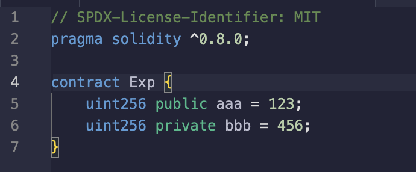

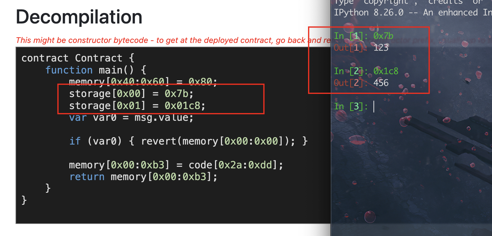

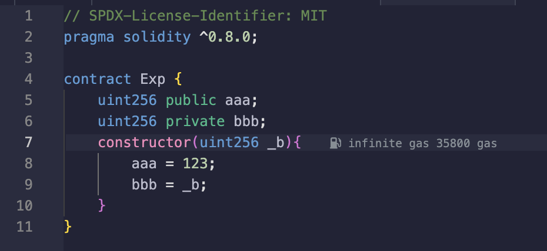

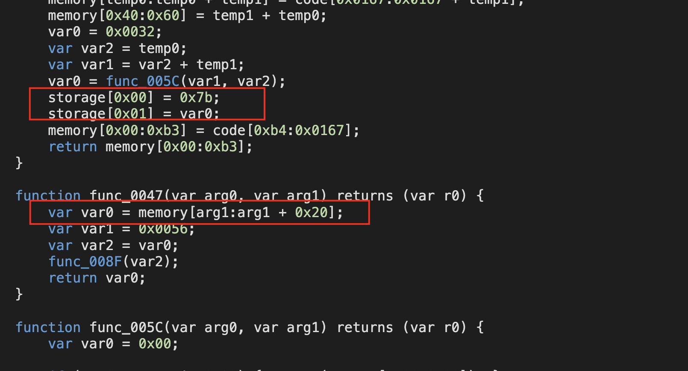

可以看到部署合约中有对它们的赋值，也就是说，找到部署题目的合约，反编译一下应该能拿到` password `的初始值；

直接去题目合约地址查看:[Contract-Code](https://sepolia.etherscan.io/address/0xB7257D8Ba61BD1b3Fb7249DCd9330a023a5F3670#code)(查询交易哈希发现` Logs `中有3个地址，其中` instance `代码反编译看了一下是负责生成、提交题目的，就只剩` level `了)；

反编译后发现好像和其他的都不太一样，首先是整个合约就一个状态变量，然后很多函数，但其中有一个` CreateInstance `非常值得注意：

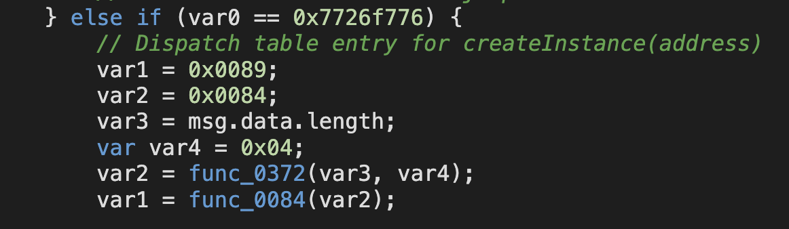

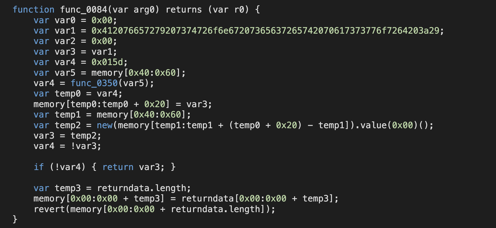

和平时我们自己声明的不太一样，有点像是工厂合约，自己整一个demo：

```solidity
// SPDX-License-Identifier: MIT
pragma solidity ^0.8.0;

contract Exp {
    uint256 public aaa;
    uint256 private bbb;
    constructor(uint256 _b){
        aaa = 123;
        bbb = _b;
    }
}
contract Demo {
    function CreateExp() public returns (address) {
        Exp exp = new Exp(456);
        return address(exp);
    }
}
```

反编译一下瞬间感觉熟悉了：

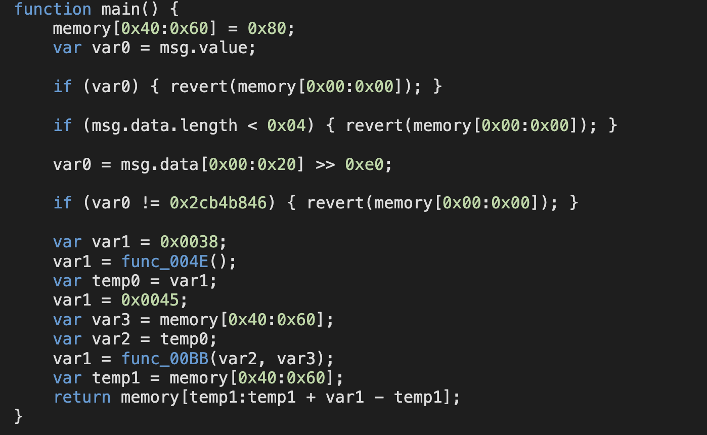

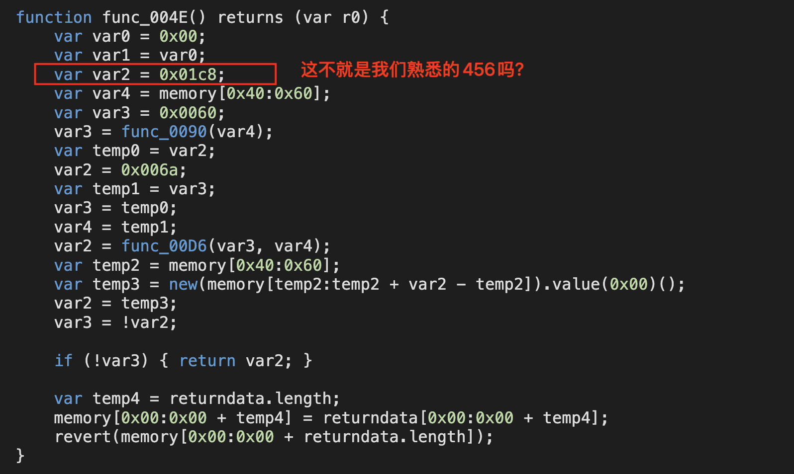

再细致对比一下，` private `的值最终去哪了：

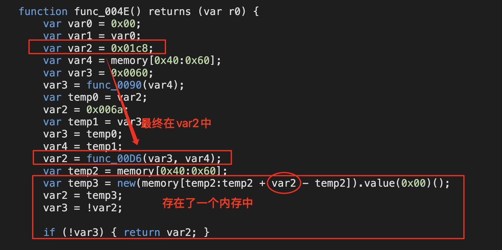

反过来看看目标合约：

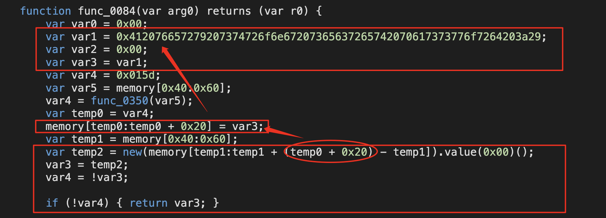

所以` var1 `中的内容就是` password `；

> 看这两个会更加清晰，可以先看` Decompiled `的，再看` Decompiled yul `的；
>
> Vault合约：https://app.dedaub.com/decompile?md5=8105cca6be44ba8109c4052582f7d48b
>
> Demo合约：https://app.dedaub.com/decompile?md5=b57b973643be2b523aad92b508579553

#### 数据存储角度

所有状态变量都是存在链上的，包括私有数据，所以知道数据在哪，就可以直接查看；

合约中状态变量都是存在一个个的` slot `中，每个` slot `长度都是256位且是` key-value `配对的；

存储的位置是按照声明顺序来的:

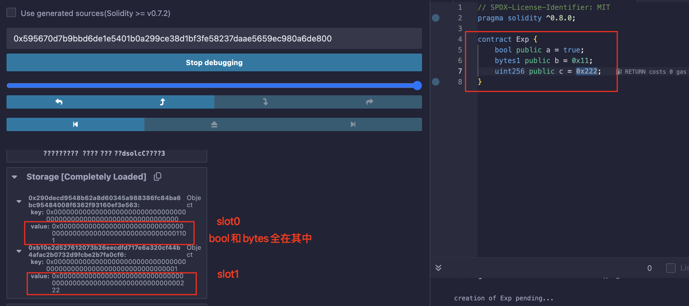

该题目的合约：

```solidity
bool public locked;
bytes32 private password;
```

显然是在` slot1 `的位置；控制台中直接输入：` web3.eth.getStorageAt(contract.address, 1) `；

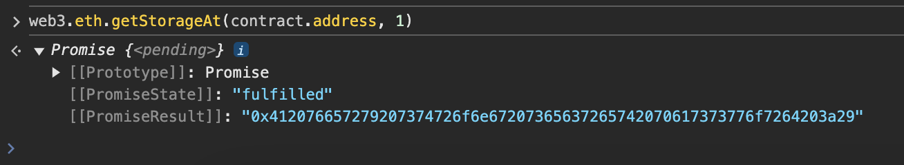

同样的答案；


### 攻击

为了简单，直接控制台输入指令执行合约了：` contract.unlock("0x412076657279207374726f6e67207365637265742070617373776f7264203a29") `；

